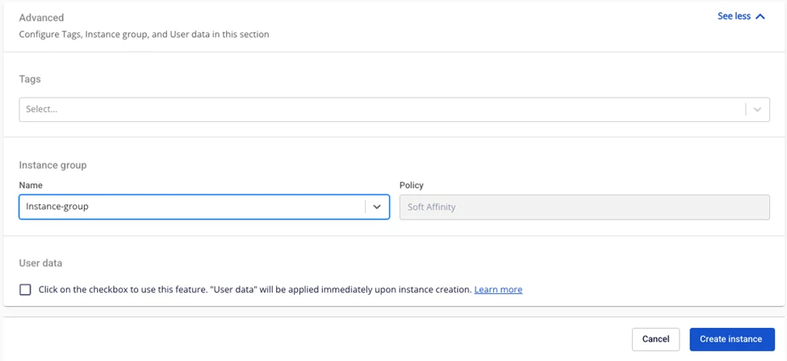
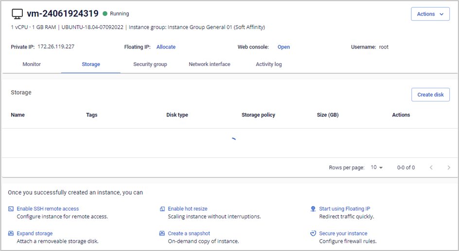

仮想マシンをInstance Groupにアタッチする

_この機能はGeneralおよびSpecificサービスタイプを使用するユーザーに適用されます。_

ユーザーが仮想マシンを起動する際、希望するポリシーに従って仮想マシンを配置するためのヒントとして、Instance Groupの情報を渡すことができます。

これを行うには、以下の簡単な手順に従ってください。

**注意：各Instance GroupにアタッチできるInstanceは最大10件です。**

**ステップ1**: メニューで**Instance Management** > **Create instance**を選択します。**Instance Group**セクションで、仮想マシンを配置したいInstance Groupの**Name**を選択します。

**ステップ2**: **Create instance**をクリックします。システムが初期化を行い、結果を通知します。

成功した場合、Instance Groupの情報がInstance Detailページに表示されます。

