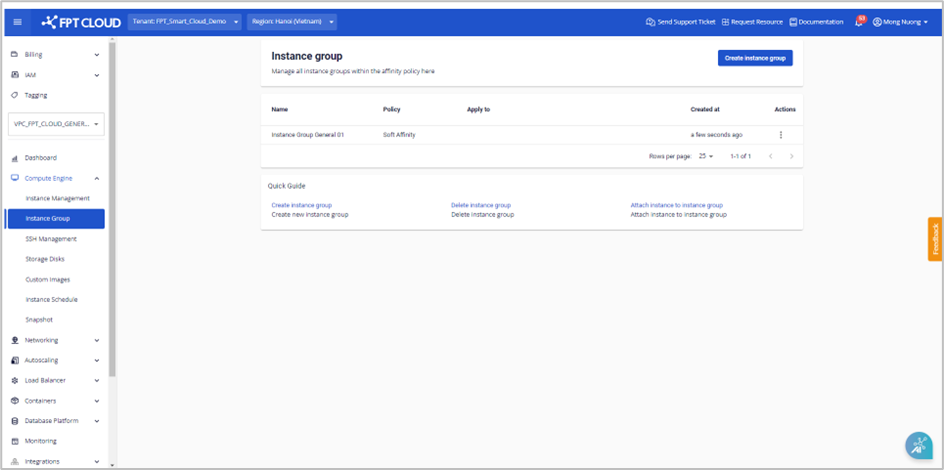

新しいInstance Groupの作成

### Generalリソースタイプを使用するユーザー向け
以下の手順で新しいInstance Groupを作成できます。

**ステップ1**: メニューで**Compute Engine** > **Instance Group**を選択し、**Create instance group**をクリックします。

**ステップ2**: 必要な情報を入力します。

  * **Name**: Instance Groupの名前。

  * **Policy**: 作成するInstance GroupにSoft AffinityまたはSoft Anti-Affinityポリシーを選択して適用します。

**注意：システムは最大10件のInstance Groupの作成をサポートし、各Instance Groupには最大10件のInstanceをアタッチできます。**

**ステップ3**: **Create instance group**をクリックします。システムが初期化を行い、結果を通知します。

成功した場合、新しいInstance Groupが**Instance Group**ページに表示されます。

**注意：Generalリソースでのinstance groupの編集はサポートされておらず、削除して新しいinstance groupを再作成することのみサポートされています。**

### Specificリソースタイプを使用するユーザー向け
Specificリソースタイプの場合、以下の手順でInstance Groupを作成します。

**ステップ1**: メニューで**Compute Engine** > **Instance Group**を選択し、**Create instance group**をクリックします。

**ステップ2**: 必要な情報を入力します。

  * **Name**: Instance Groupの名前。

  * **Policy**: 作成するInstance GroupにSoft AffinityまたはSoft Anti-Affinityポリシーを選択して適用します。

  * **Instances**: Instance Groupを作成するには、少なくとも2つのInstanceを選択する必要があります。

**注意：**

  * Instanceリストには、Running、Stoppedのステータスの仮想マシンのみが表示されます。

  * 各VPCには最大10件のInstance Groupを作成でき、各Instance Groupには最大10件のInstanceを設定できます。
