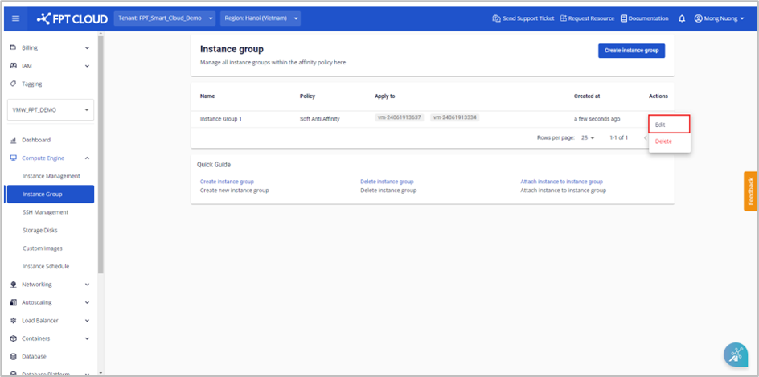

Instance Group の編集

_この機能は Specific サービスタイプのユーザーにのみ適用されます。_

**ステップ 1**. メニューで **Compute Engine** > **Instance Group** を選択し、対象の Instance Group の **Edit** をクリックします。

**ステップ 2**. Instance Group の情報を編集します。**Update** をクリックして変更を保存します。

  * **Name**: Instance 名を変更します

  * **Policy**: デフォルトでは、ユーザーは Policy を編集できません

  * **Instances**: リストから Instance を変更します

**注意:**

  * **ユーザーはポリシー情報を編集できません**

  * **Instance Group の Instance を変更することはできますが、グループ内に常に最低 2 つの Instance が存在する必要があります**
