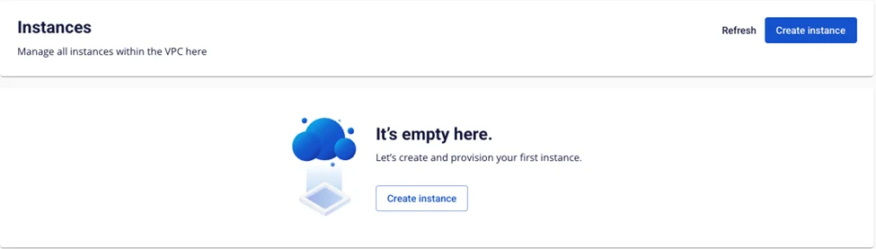
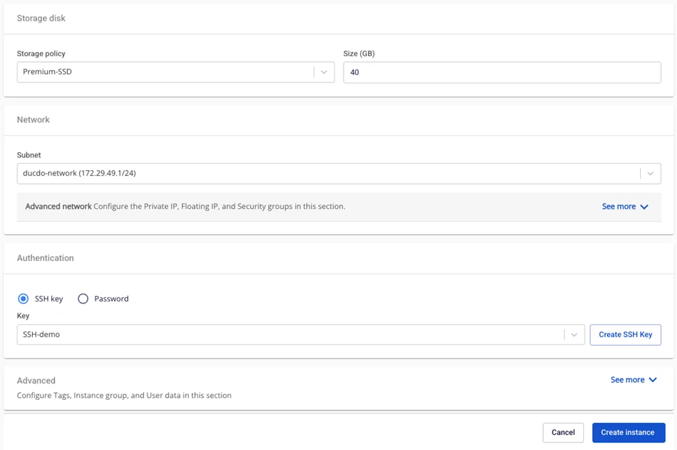
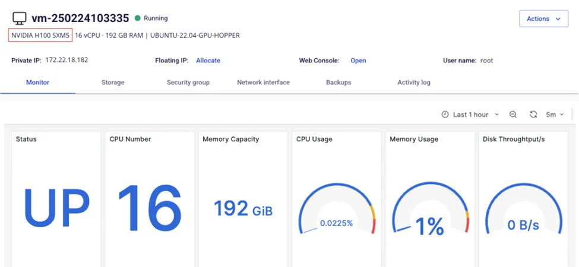

コンソールポータルでのGPU管理

## 1\. GPUを持つ仮想マシンの作成
ユーザーはGPUを搭載した仮想マシンを作成できます。

**ステップ1**: **Instance Management**画面で**Create instance**を選択します。

**ステップ2**: GPUおよび使用するGPUカードの種類を選択します。

**ステップ3**: インスタンスのその他の情報を入力します。

**ステップ4**: **Create Instance**をクリックします。

**ステップ5**: 情報を確認します。情報はInstance detail画面に更新されます。

## 2\. Instance ManagementでインスタンスにGPUを追加する
**ステップ1**: **Instance management**画面で、GPUを追加したい仮想マシンを選択します。
:::warning
* GPUを追加する前に、仮想マシンを**Power off**する必要があります（ステータスが「Stopped」であること）。
:::

  * 「Running」や「Pending」などの他の状態にあるマシンでは、この機能は**無効**になります。

**ステップ2**: **Actions**を選択し、**Add GPU**を選択します。

**ステップ3**: インスタンスに追加する**GPUタイプ**を選択します。

  * システムは選択可能な互換性のある**GPUタイプ**の一覧を表示します。

    * **Current**: 現在のインスタンス設定

    * **Type**: GPUリソースタイプのみ選択可能（標準設定はリストに表示されません）

**ステップ4**: **Add GPU**ボタンをクリックします。

  * システムが情報を更新し、インスタンスにGPUを追加します。

**ステップ5**: 情報を確認します。情報はInstance detail画面に更新されます。

## 3\. 仮想マシンからGPUを取り外す
**ステップ1**: **Instance management**画面で、GPUを取り外したい仮想マシンを選択します。
:::warning
* GPUを取り外す前に、仮想マシンを**power off**する必要があります（ステータスが「Stopped」であること）。
:::

  * 「Running」や「Pending」などの他の状態にあるマシンでは、この機能は**無効**になります。

**ステップ2**: **Remove GPU**ボタンをクリックします。

**ステップ3**: **リソースタイプ**を選択します：

  * **Current**: 現在のGPUインスタンス設定

  * **Type**: 標準リソースタイプのみ選択可能（GPU設定はリストに表示されません）

**ステップ4**: **Remove GPU**ボタンをクリックします。

**ステップ5**: システムはGPUを取り外し、インスタンスを選択したリソースタイプに変換します。インスタンスの新しい設定情報は**Instance management**画面に更新されます。

## 4\. インスタンスのGPUパラメーターをリサイズする
**ステップ1**: **Instance management**画面で、GPUをリサイズしたい仮想マシンを選択します。
:::warning
* GPUをリサイズする前に、仮想マシンを**power off**する必要があります（ステータスが「Stopped」であること）。
:::

  * 「Running」や「Pending」などの他の状態にあるマシンでは、この機能は**無効**になります。

**ステップ2**: **Resize**ボタンをクリックします。

**ステップ3**: **テンプレート**と**リソースタイプ**を選択します（インスタンスがGPUインスタンスの場合はGPUタイプにのみリサイズ可能、標準インスタンスの場合は標準タイプにのみリサイズ可能です）。

  * GPUを搭載したインスタンスは、GPUタイプにのみリサイズできます。

  * GPUを搭載していないインスタンスは、非GPUタイプにのみリサイズできます。GPUタイプにリサイズしたい場合は、代わりにAdd GPU機能を使用してください。

**ステップ4**: **Resize Instance**ボタンをクリックします。

**ステップ5**: 情報を確認します。情報は**Instance Management**一覧画面および**Instance**詳細ページに更新されます。
