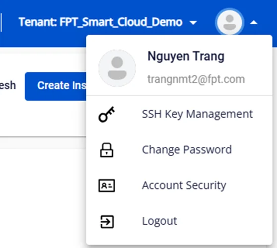
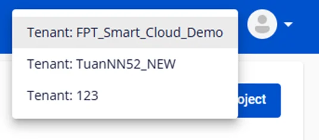

ヘッダーインターフェースの変更

権限: 現在 VPC へのアクセス権を持つユーザーは、その VPC を含むリストを表示できます。

### 1\. ユーザー名情報を非表示にする — ユーザーはドロップダウンアイコンをクリックして個人情報を確認できます

### 2\. テナントフィルターを左上から右上のユーザーアバターの隣に移動します。

### 3\. サポートメニューをアイコンのリストとして表示します — アイコンにマウスオーバーすると情報が表示されます

### 4\. プロジェクトフィルターの追加
  * デフォルトでは、システムはすべてのプロジェクトを表示します

  * ユーザーはプロジェクトを選択して、下に表示される VPC をフィルタリングできます

注意: VPC が存在しないプロジェクトはヘッダーのリストに表示されません
