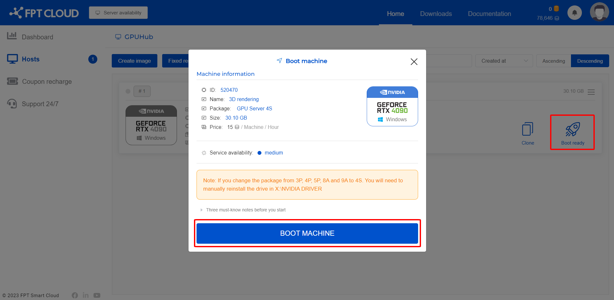

クイックスタートガイド

HPC PortalでGPU Serverを初期化して使用するには、以下の手順に従ってください。

**ステップ 1**: ログイン

HPC Portalにログインしてマシンを作成するには、管理者に連絡してアカウントへの権限付与とリソース割り当てを依頼してください。

リソースが割り当てられたら、<https://hpc.fptcloud.com> の [HPC Portal](<https://hpc.fptcloud.com/>) にアクセスし、FPT IDアカウントでログインします。

**ステップ 2**: イメージの作成

Hosts > Create image に移動して、新しいGPUマシンのイメージを作成します。

次に、使用したいサーバー構成を選択し、名前を入力し、WindowsまたはLinuxのOSを選択してから、**Continue** > **Create Image** をクリックします。

**ステップ 3**: リモートマシンの起動

イメージの作成が完了したら、**Boot ready** をクリックし、**BOOT MACHINE** を選択して、マシンが起動するまで10〜15分お待ちください。

起動時間はイメージサイズ（Image Size — サーバーにインストールされたすべてのもの）によって異なります。

**ステップ 4**: リモートマシンへの接続

作成・起動したマシンへの接続方法は2つあります。

**方法 1**: 以下の認証情報でSSH接続します。

– ユーザー名: administrator

– パスワード: ユーザーが設定した第2パスワード

**方法 2**: リモートデスクトップを使用する

マシンの起動が成功すると、以下の画面のようにユーザーインターフェースに **Connect** ボタンが表示されます。

:::warning
Connectボタンがインターフェースに表示された時点から課金が開始されます。Shutdownボタンをクリックすると課金が停止します。
:::

マシンに接続するには、Connectボタンをクリックしてリモートデスクトップ接続ファイル（.RDP）をダウンロードし、RDPファイルを開いてアカウントのパスワードを入力してログインします。

macOSをご使用の場合は、.RDPファイルを開くために [Microsoft Remote Desktop](<https://apps.apple.com/vn/app/microsoft-remote-desktop-10/id1295203466?l=vi&mt=12>) をインストールする必要があります。

**ステップ 5**: マシンへのデータ転送と結果の取得

Google Drive、Dropboxなどのオンラインファイル転送ツールを使用して、処理が必要なデータをマシンに転送できます。

次に、必要なソフトウェアをマシンにインストールし、オンラインファイル転送ツールを使用して結果ファイルを個人のパソコンに取得します。

**注意:** ソフトウェアのインストールは**1度だけ**行えば十分です。HPCシステムはシャットダウンのたびに作業環境を保存するため、次回以降は再インストールは不要です。

**ステップ 6**: マシンのシャットダウン

マシンの使用が完了し、結果ファイルを個人のパソコンに転送したら、課金を停止するためにマシンをシャットダウンする必要があります。

シャットダウンするには、HPC Portalの Shutdown ボタンをクリックします。システムはシャットダウン後にすべてのマシン設定を保存します。

将来の特定の時刻にサーバーをシャットダウンするようにスケジュールしたい場合は、**Schedule** ボタンをクリックしてシャットダウン時刻を設定します。

:::warning
サーバー使用中にアカウントの残高が不足しないようにしてください。残高が不足するとサーバーが自動的にシャットダウンされ、特にビデオのレンダリング中は作業結果に影響が出る可能性があります。
:::
