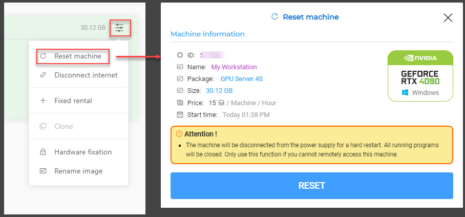

マシンの再起動

マシンを起動した後、Remote Desktop Connection ファイル（RDPファイル）を使用してマシンに接続します。しかし、使用中にブラックスクリーン、リモートサーバーへの接続不可、またはサーバーの応答停止などの問題が発生することがあります。この場合の対処法は、2〜3分待ってから再接続することです。それでも問題が解決しない場合は、マシンをリセットして使用を継続する必要があります。

マシンをリセットするには、以下の手順に従ってください：

  1. HPCポータルのHostsスクリーンで、イメージを選択し > Reset machineを選択します

確認ダイアログが表示されます。Resetを選択してマシンの再起動を開始します。

  2. マシンのリセットが成功した後、数分待ってからRDPファイルを再度ダウンロードし、マシンへの接続を再試行してください。

:::warning
– Reset machine機能は、マシンが応答しない場合に物理サーバーの再起動ボタンを押すことと同等です。
:::

– この機能は、マシンの起動に成功した直後にリモート接続できない場合に役立ちます。マシンのリセット後も再接続できない場合は、すぐにサポートを受けるために管理者にご連絡ください。

– マシンの使用中にこの機能を使用するとデータが失われる可能性があるため、使用前に十分に検討してください。
