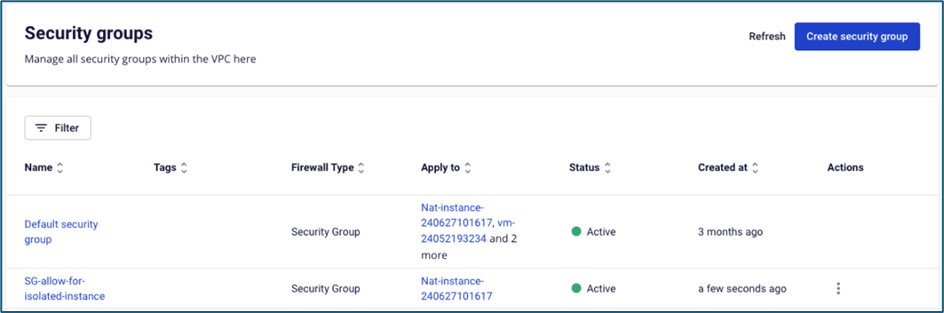
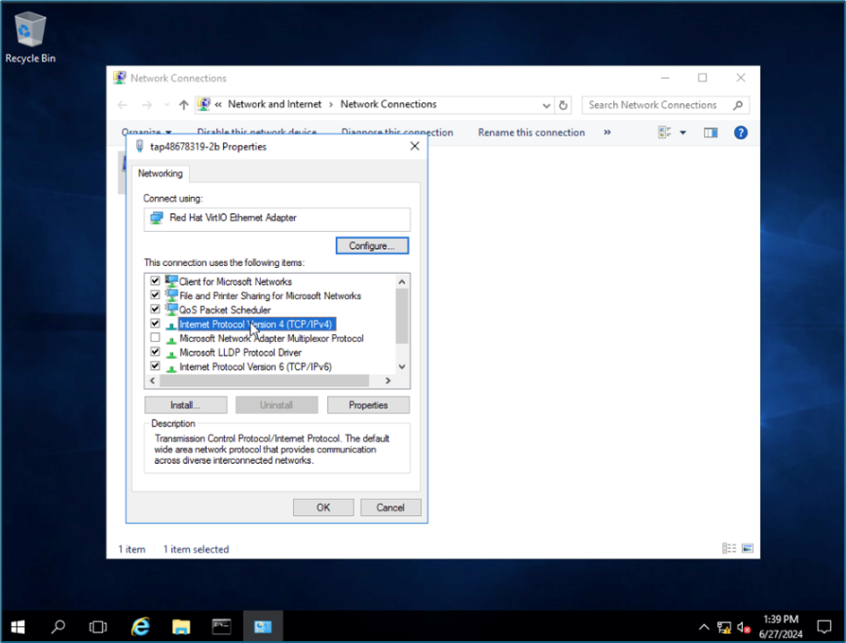
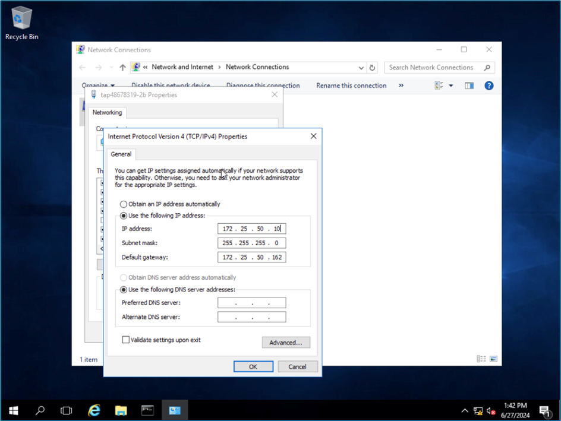
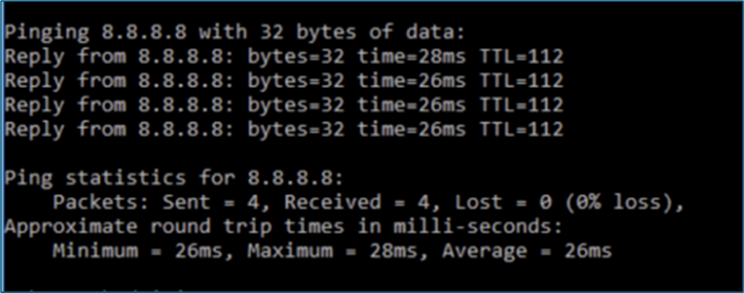

NAT Instance

この機能は、隔離されたネットワーク（isolated network）内のInstanceが、ソフトウェアのインストールやオンプレミス環境への接続など、外部のインターネットシステムにアクセスできるようにするものです。

NAT Instanceの設定手順は以下の通りです：

**ステップ1**：FCIが提供するイメージからNAT Instanceを作成します。

**注意：subnetフィールドでは、インターネットにアクセスできるSubnetを選択してください。**

**ステップ2**：NAT InstanceにFloating IPを割り当てます。初期化ステップでInstanceにすでにFloating IPが割り当てられている場合は、この操作は不要です。

**ステップ3**：NAT Instanceにsecurity groupを割り当てます。隔離されたネットワーク内のInstanceがインターネットにアクセスするために必要なルールを開いてください（pingテスト用にICMPポートを追加で開くこともできます）。初期化ステップでInstanceがすでにsecurity groupに割り当てられている場合は、この操作は不要です。

**ステップ4**：インターネットアクセスが必要なInstanceの隔離されたSubnetと同じSubnetに属するNetwork Interface Card（NIC）を追加します。

**ステップ5**：隔離されたネットワークに属するNICに対してアドレスペア0.0.0.0/0を許可します。

**ステップ6**：隔離されたネットワーク内のInstanceにアクセスし、ゲートウェイをNAT InstanceのNICのIPに変更します。この例では、FCIはWindows OSのInstanceを使用しています。

")
