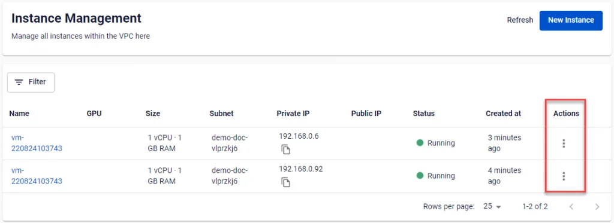
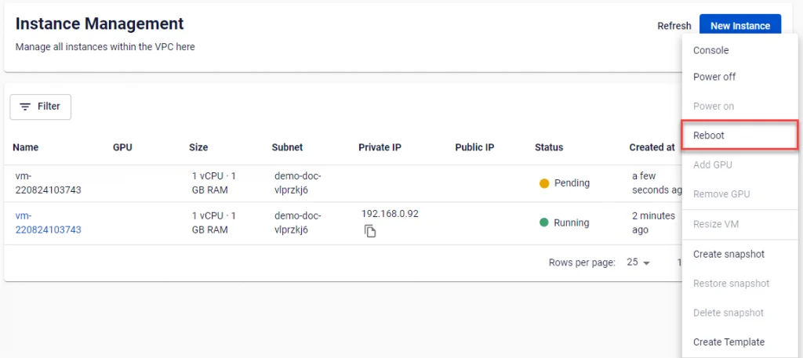

仮想マシンの再起動

**Reboot（再起動）** とは、サーバーの動作状態を改善するためにシステムを再起動する操作です。

仮想マシンの稼働中、何らかの原因でプログラムにエラーが発生することがあります。これらのエラーが頻繁に発生すると、システムが正常に動作しなくなり、処理が遅くなることがあります。そのような場合は、マシンを再起動してプログラムを再起動し、仮想マシンが正常に動作するよう回復させる必要があります。

**FPT Cloud** では、**FPT Portal** インターフェースから直接仮想マシンを再起動できます。この機能を使用するには、以下の手順に従ってください。

**ステップ 1**: **Instance Management** ダッシュボードで、再起動したいサーバーの行末にある **Action** を選択します。

**ステップ 2**: **Reboot** 機能を選択します。システムが再起動を実行し、処理状況を通知します。

