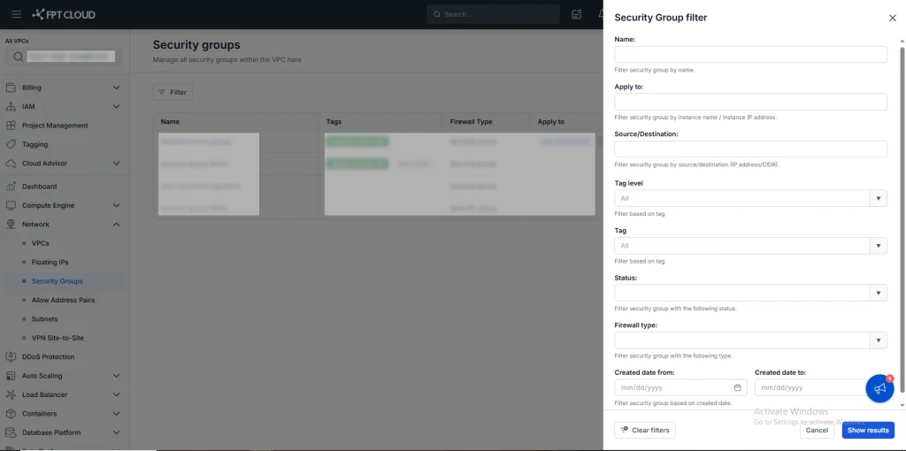

Filter Security Group

# はじめに

Filter Security Group機能を使用すると、名前、タグ、IPアドレス、ステータス、ファイアウォールタイプ、作成日などのさまざまな条件でSecurity Groupリストをすばやく検索・絞り込むことができます。

# フィルターフィールドの説明

フィールド | 説明
---|---
Name | Security Groupの名前または名前の一部を入力します。システムは入力した文字列でフィルタリングします。例: 「sec」と入力すると「security-group-9609」、「security-group-6688」などが見つかります。
Tag level | タグレベルを選択するドロップダウンです。レベルでデータタグをフィルタリングするために使用します。すべてを表示するにはAllを選択します。
Tag | 特定のタグを選択して、そのタグが割り当てられたSecurity Groupをフィルタリングします。ドロップダウンには既存のタグリストが表示されます。例: タグ「tagging-prod」を選択すると、本番環境のSecurity Groupが表示されます。
Apply to | Security Groupが適用されているInstanceの名前またはIPアドレスでフィルタリングします。例: 10.10.5.21と入力すると、そのIPに適用されているSecurity Groupが見つかります。
Source/Destination | 入力したソースまたはデスティネーションに関連するルールを持つSecurity Groupをフィルタリングします。入力可能な値: 単一IP（例: 192.168.10.5）またはCIDR範囲（例: 10.0.0.0/24）。
Status | Security Groupのステータスでフィルタリングします。値: Creating、Active、Deleting。
Firewall type | ファイアウォールタイプでフィルタリングします。対象: Distributed Firewall（DFW）およびSecurity Group。
Create date from - Create date to | 作成日の範囲でSecurity Groupをフィルタリングします。

# 使用方法

**ステップ 1:** フィルターウィンドウを開く

  * Security Group画面でFilterをクリックします。

**ステップ 2:** フィルター条件を入力する

  * 1つまたは複数の条件を同時に入力できます。

  * 組み合わせ例:

    * Name: prod

    * Tag: tagging-prod

    * Status: Active

→ システムは、タグ「tagging-prod」を持ち、名前に「prod」が含まれるアクティブなSecurity Groupのみを表示します。

**ステップ 3**: Show resultボタンをクリックしてフィルターを適用します。

**ステップ 4:** フィルターをクリアする

  * Clearをクリックしてすべてのフィルター条件を削除します。

  * 各フィールドのXをクリックして、その条件を個別に削除します。

# 重要な注意事項

フィルターはSecurity Groupを変更しません。検索目的のみに使用します。

Security Groupに対応するデータがない場合（例: タグが空）、一部のフィールドが表示されないことがあります。

リストに結果が表示されない場合は、フィルター条件を多く入力しすぎていないか確認してください。
