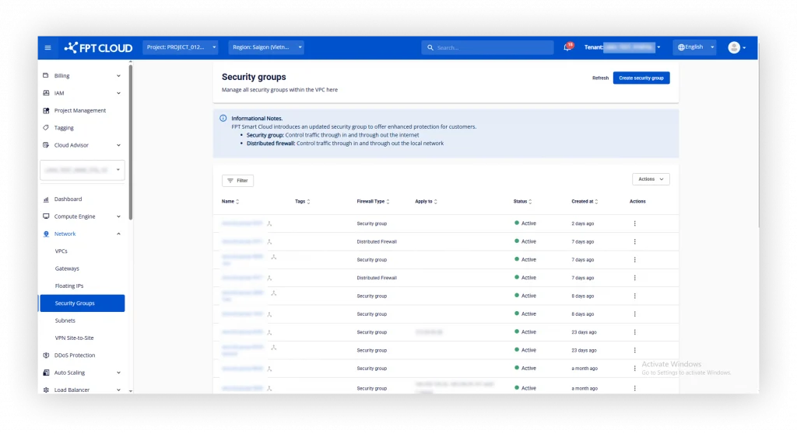
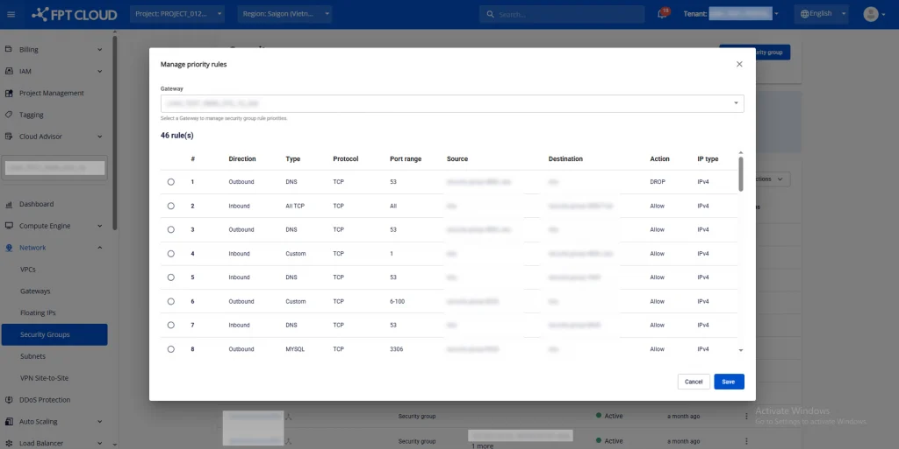
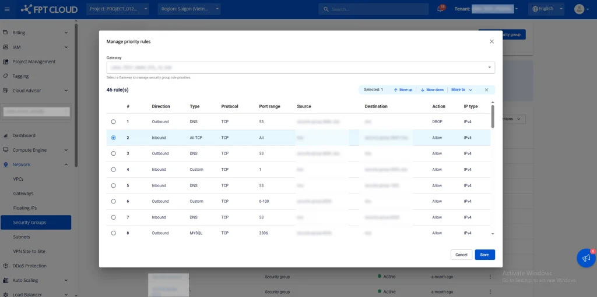

Security Group の Priority Rule を管理する

**注意:** この機能は、特別な構成を持つ一部のテナントのみが使用できます。サポートについてはお問い合わせください。

# はじめに

この機能を使用すると、ネットワークトラフィックを制御するルール（ファイアウォールルール）を設定できます。Priority（優先度）はルールの実行順序を決定し、トラフィックのAllowまたはDenyに直接影響します。

「Priority管理」機能は以下のことに役立ちます。

  * 重要度の順にルールを並び替える
  * 詳細なルールが一般的なルールより先に処理されるようにする
  * ルールの位置が誤っていることによるファイアウォールの競合や誤動作を防ぐ

# システムのルール処理方法

各ルールにはPriority値が割り当てられます。Priority番号が小さいほど、ルールは早く処理されます。トラフィックが通過する際、システムは以下を実行します。

  * 優先度の低い順から高い順にルールを読み込む
  * トラフィックに最初にマッチしたルールを適用する
  * 停止し、それ以降のルールを評価しない

例:

  * Rule Allow SSH (priority 01)
  * Rule Deny All (priority 02) ⇒ rule 01がrule 02より先に評価されるため、SSHトラフィックはAllowされます。

# 使用方法

**ステップ 1**: Security Groupにアクセスする

  * FPT Cloud Portalにログインします

  * Networkを選択します

  * Security Groupsを選択します

**ステップ 2:** ルールリストを開く  

  * Actionsボタン > Manage priority ruleをクリックします

  * システムはゲートウェイごとのルールリストを表示するモーダルを表示します（VPCに複数のゲートウェイがある場合、システムは自動的に最初のGatewayを選択し、そのGateway内のSecurity Groupのルールリストを読み込みます）

  * ルールリストには以下が表示されます。

    * 列 #: ルールの優先順位
    * Direction（Inbound/Outbound）
    * Type
    * Protocol
    * Port range
    * Source / Destination
    * Action（Allow/Deny）
    * Source / Destination
    * IP Type（IPv4/IPv6）

**ステップ 3:** Priorityを変更する  

  * 並び替えたいルールをクリックします
  * Move up / Move downをクリックして、ルールを目的の位置に上下に移動します。または、Move toを使用してルールリスト内の任意の位置に移動します
  * システムは新しい位置に応じてPriority値を自動的に更新します

**ステップ 4:** 設定を保存する

  * 並び替えが完了したら、SaveまたはApply Changesをクリックします

  * ルールは即座に適用されます

# よくある質問

Priorityを変更するとダウンタイムが発生しますか？ => いいえ。ルールはリアルタイムで適用されるため、VMのアップタイムには影響しません。

複数のルールに同じPriorityを設定できますか？ => いいえ。
