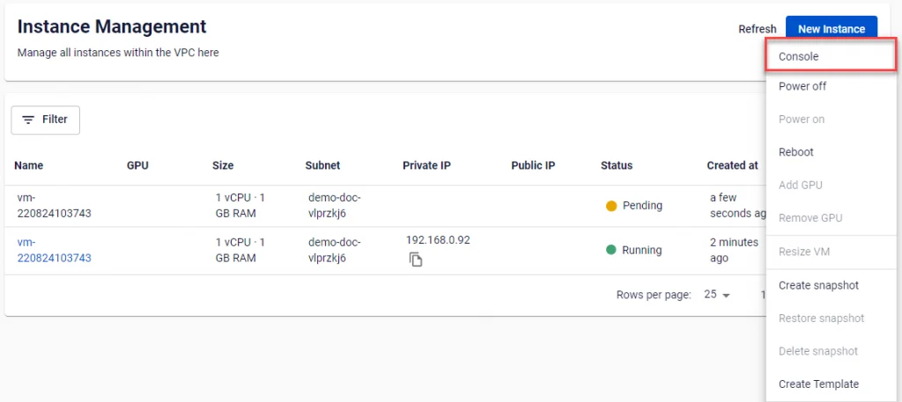
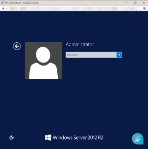
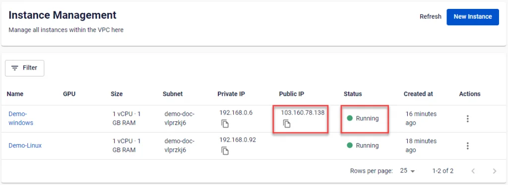
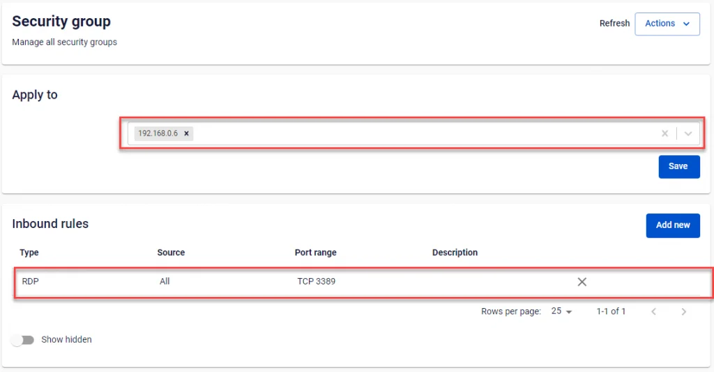
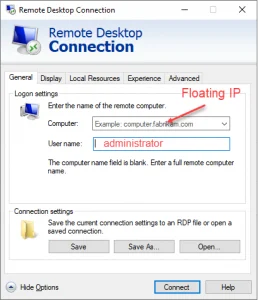

Windows仮想マシンへの接続

**Windows**仮想マシンが**FPT Portal**で正常に作成されると、ユーザーはデフォルトで組み込みの**Web Console**を使用してアクセスできます。また、サーバーにPublic IPが割り当てられている場合は、**Remote Desktop Connection**を使用して外部からログインすることもできます。

## Web ConsoleでWindows仮想マシンに接続する
**Web Console**は、**Public IP**が割り当てられていない仮想マシンを含む、**FPT Cloud**上のすべての**Windows**仮想マシンの制御をサポートします。

メニューで**Instance Management**を選択します。接続する仮想マシンの**Actions**セクションで、**Console**を選択します。

ブラウザはすぐにサーバーの画面を表示する新しいウィンドウを開きます。この画面から、ユーザーは接続されたサーバーを完全に制御して操作することができます。

## Remote Desktop ConnectionでWindowsサーバーに接続する
**RDC**（**Remote Desktop Connection**）で接続するには、仮想マシンに**Floating IP**が割り当てられており、RDP接続のためにポート3389が開いている必要があります。**FPT Cloud**は**Security Group**を割り当てることで仮想マシンのポートを開くことをサポートしています。

**接続を設定するには、以下の手順に従ってください：**

**ステップ1**: **Windows** OSの仮想マシンを作成し、[**インスタンスへのFloating IPの割り当て**](<https://fptcloud.com/documents/cloud-server/?doc=quan-ly-floating-ip>)の手順に従って**Floating IP**を割り当て、起動します。

**ステップ2**: RDPポート3389が開いている**Security Group**を仮想マシンに割り当てます。そのような**Security Group**が存在しない場合は、[**Security Groupの管理**](<https://fptcloud.com/documents/cloud-server/?doc=quan-ly-security-group>)の手順に従って新規作成できます。

**ステップ3**: 設定が完了したら、以下のパラメータを使用してRemote Desktop Connectionで仮想マシンに接続できます：

**Remote Desktop Connection**で接続できないと報告された場合、ユーザーは仮想マシンが起動していることを確認し、**Floating IP**が正しいかどうかを確認し、[**Security Groupの管理**](<https://fptcloud.com/documents/cloud-server/?doc=quan-ly-security-group>)の手順に従ってポート3389を再度開いてください。
