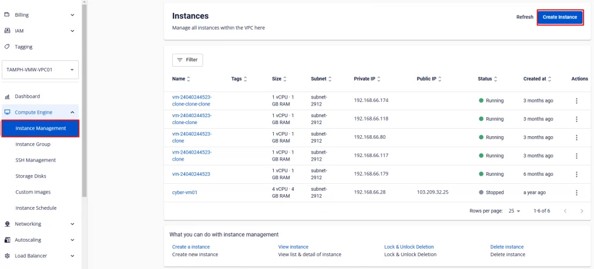
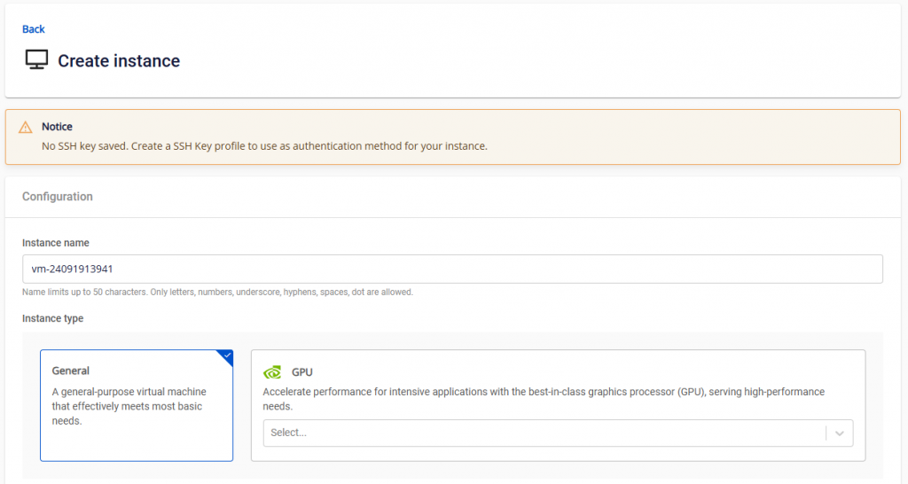
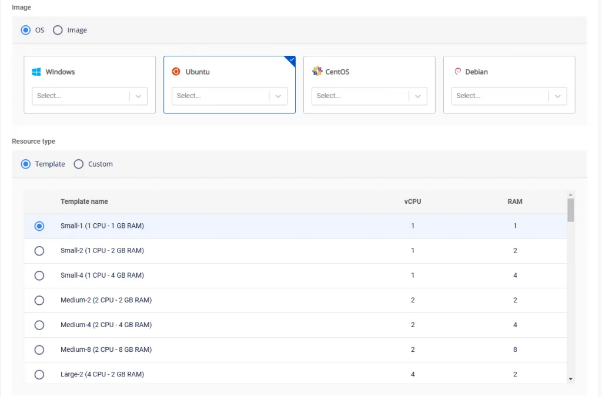
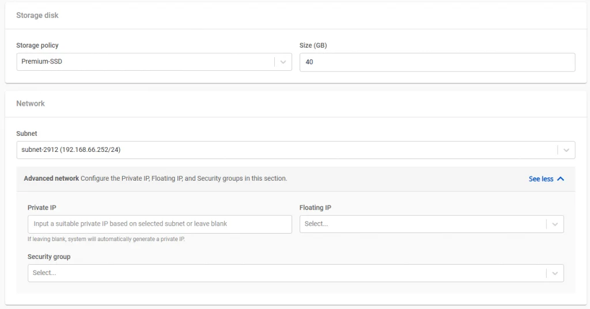
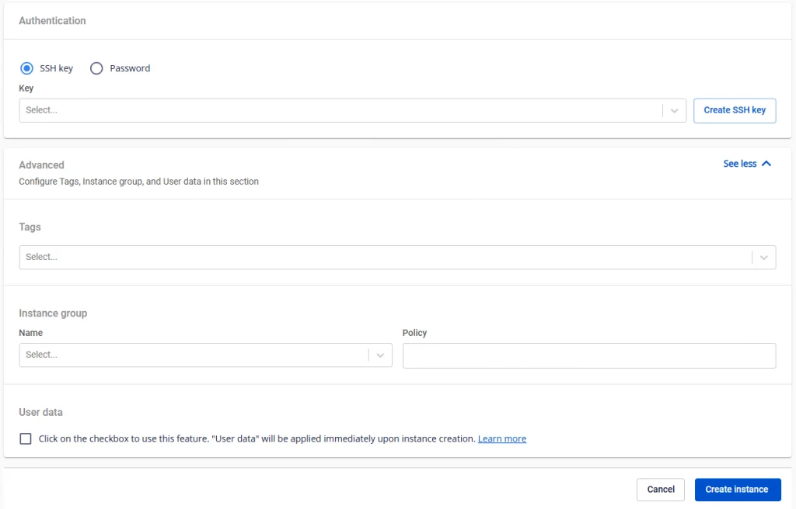
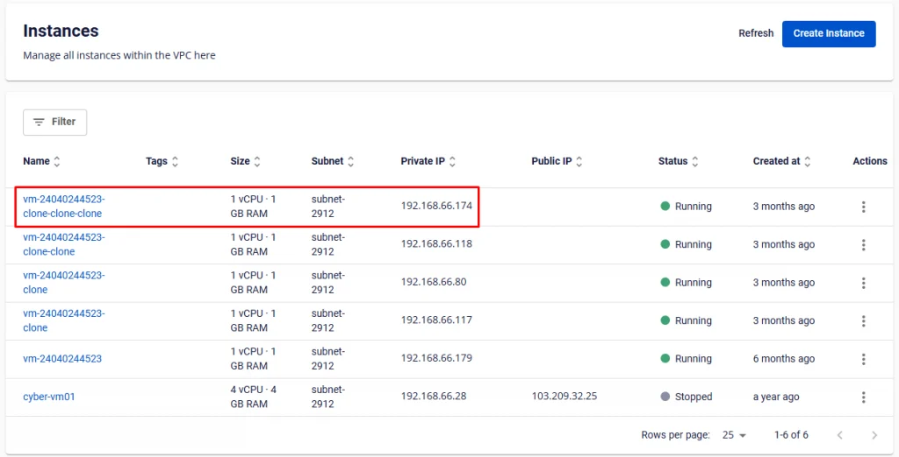
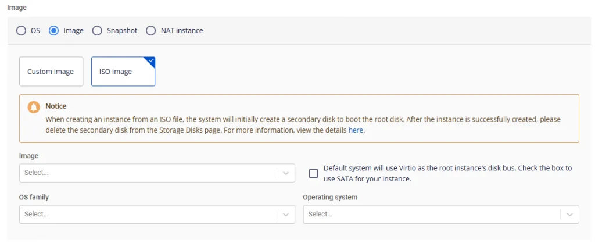

新しい仮想マシンを作成する

**ステップ 1**: メニューで **Compute Engine** > **Instance Management** を選択し、**Create instance** をクリックします。

**ステップ 2**: 以下のオプションで必要に応じて仮想マシンを設定します。

  * **Instance Type**: ユーザーはニーズに最も適したマシンタイプを選択できます。現在、GeneralとGPUの2つの一般的なタイプがあります。

    * **General** は基本的なニーズに対応するマシンタイプです。
    * **GPU** は高性能コンピューティング（High Performance Computing）、Machine Learningなどのニーズに対応します。
  * **Image:** ニーズに合ったメインOSを選択します。各OSグループには異なるバージョンが含まれます。デフォルトは最新バージョンです。独自のISOファイルをアップロードするか、以前に初期化したテンプレートから仮想マシンを作成することでカスタマイズできます。

  * **Resource type**: マシンタイプごとにCPUとRAMの設定が異なります。カスタム設定を作成することもできます。

  * **Storage**: 仮想マシンにアタッチされるStorageには以下が含まれます。

    * **Storage Policy**: Storageの種類

    * **Size**: Storageのサイズ

  * **Instance group**: 物理ホスト上での仮想マシンの配置を設定するために、Instance groupをオプションで選択できます。

  * **Subnet & Private IP**: 仮想マシンが動作に必要なリソースとネットワークサービスに接続できるようにネットワークを選択します。これにより、仮想マシンはネットワーク上の他のデバイスと通信し、インターネットなどの外部リソースにアクセスできます。仮想マシンのプライベートIPアドレスを入力するか、このフィールドを空白のままにすると選択したSubnetに基づいてシステムが自動生成します。

  * **Security Group**: 仮想マシンへのトラフィックを制御するためにSecurity Groupを選択します。このフィールドは空白のままにして後で設定することもできます。

  * **Instance name**: 管理しやすい仮想マシン名を入力します。これは仮想マシンのホスト名にもなります。

  * **Authentication type**: **Standard**（Username/Password）または **SSH key**。

    * SSH Keyを選択した場合、システムは最新のSSH keyを使用します（変更可能）。

    * Standardメソッドを使用する場合、ユーザーはパスワードを安全な場所に記憶・保管してください。

  * **User data**: [**cloud-init script**](<https://cloudinit.readthedocs.io/en/latest/reference/examples.html>) を含む場所です。仮想マシンの起動時にcloud-initはクラウドから提供されたメタデータを読み込み、それに基づいてシステムを初期化します。cloud-initは通常、ネットワーク、ストレージ、SSH keys、およびシステムの他の部分のセットアップに使用されます。注意: WindowsオペレーティングシステムでInitializeした仮想マシンの場合、cloud-initのスクリプトを実行するには再起動が必要です。

**cloud-init scriptのサンプル**: このサンプルスクリプトで、システムはユーザー「testcloudinit」をパスワード「Abc123」で、ユーザー「testcloudinit2」をパスワード「abc@123Abc123」で自動作成します。
[code]
    Copy#cloud-config
    users:
    - name: testcloudinit
      sudo: ALL=(ALL) NOPASSWD:ALL
      lock_passwd: false
      shell: /bin/bash
      passwd: $6$rounds=4096$V6anciWl30$xKbcljqks1gUkMiM80pyKzhvyhn7U1n.jXcGCUfkUlX.rnllUWKUrmDEzekhhhP8aERSylRuC7gfDhJ32Xv0A1
    - name: testcloudinit2
      groups: sudo
      lock_passwd: false
      shell: /bin/bash
      plain_text_passwd: abc@123Abc123
    - hostname: testcloudinit

[/code]

**Windowsの注意: Cloud base initスクリプト形式を使用します。サンプルスクリプト:**
[code]
    Copy#cloud-config
    users:
    - name: testcloudinit
      primary_group: Administrators
      groups: Administrators
      passwd: abc@123Abc123
[/code]

   

**ステップ 3**: **Create Instance** をクリックして仮想マシンを作成します。システムは確認を表示し、リソースを確認して、選択した設定に基づいて新しい仮想マシンの初期化処理を進めます。

初期化が成功すると、新しく作成した仮想マシンを確認し、管理ダッシュボードで情報を確認できます。各仮想マシンには名前、設定（RAM、CPU、Storage）、IPアドレス、動作状態（オフ/オン/Suspended）が一覧に表示されます。

## ISOファイルから仮想マシンを作成する際の注意事項
Unify Portalシステムは現在、ISOファイルから仮想マシンを作成することをサポートしています。

**1) ISOファイルから仮想マシンを作成する際の注意事項**

  * ISOファイルから仮想マシンを作成する場合、システムはRootボリューム用の起動ディスクを自動的に追加作成します。仮想マシンの作成中にこのディスクを削除しないでください。

  * ディスクの容量はISOファイルのサイズ以上にする必要があります。システムは整数単位に切り上げます（例: 0.5 GBのファイルには1 GB必要、1.5 GBのファイルには2 GB必要、2 GBのファイルには最低2 GB必要）。

**注意: ISOファイルからマシンを作成した後、一時ディスクを削除してください**

  * マシンの作成が成功した後、起動ディスクを削除してください。（削除前に仮想マシンからディスクをアンマウントする必要があります）

**2) Rootボリュームに対するSATAディスクバスのサポート**

  * システムはデフォルトでRootボリュームにVirtioディスクバスを使用します。ただし、Virtioがサポートしていない一部の古いISOファイルの場合は、対応するチェックボックスをオンにしてSATAモードに切り替える必要があります。

  * SATAディスクバスを使用するとディスクのパフォーマンスが低下する可能性があるため、ISOファイルがVirtioと互換性がない場合にのみこの機能を使用してください。適切なモードを選択するには、メーカーのドキュメントを参照してください。

