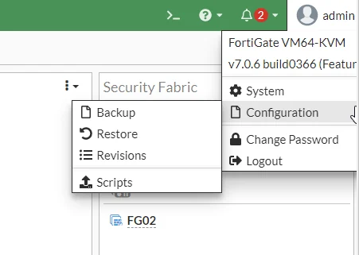

FAQ

## 1\. FortiGateとは何ですか？

FortiGate（Fortinet Firewall）は、Fortinetが提供する次世代多層セキュリティアプライアンスです。FortiGateは、あらゆる規模の企業・組織における情報セキュリティと内部ネットワークシステムの保護に対して包括的なソリューションを提供するために、トップクラスの機能を統合しています。
Fortinet Firewallは、高速なセキュリティ機能、ウイルス防止、データセンターおよびネットワークシステムへの脅威をブロックする機能をユーザーに提供します。FortiGateはWebフィルタリングもサポートしており、ネットワーク内のデバイス間で交換されるパケットを継続的に検査し、管理者が不正な侵入を容易に監視、検出、迅速に対処できるよう可視性を提供します。

## 2\. なぜFortiGateを使用すべきなのですか？

一般的なファイアウォールアプライアンスと比較したFortiGate製品の優れた機能を確認し、「なぜFortiGateを使用すべきなのか」という質問への答えを見つけましょう。

  * **包括的な可視性と保護：** FortiGateは、ランサムウェアおよびCommand & Control防止、安全な暗号化のためのSSLテクノロジー（TLS 1.3を含む）、自動脅威保護などの機能を統合しています。
  * **FortiGuardサポート：** FortiGateはFortiGuardによってサポートされており、IPS、Webおよびビデオフィルタリング、DNSセキュリティサービスを統合して同時に実行し、コストを削減してすべてのリスクを管理する機能を提供します。
  * **プロキシ統合：** FortiGateは、Zero Trust Network Access（ZTNA）機能により、従業員のデバイスにシームレスなユーザーエクスペリエンスと安全な保護を提供します。
  * **高度なセキュリティ：** 高度なセキュリティソリューションにより、不正アクセスの防止、アクセスのセグメント化、明確なパケットフィルタリングが可能です。
  * **自動化されたネットワーク管理：** ネットワークトラフィックの可視性でコントロールを維持し、詳細かつ直感的なポリシー制御により、セキュリティとネットワーク管理能力の拡張を支援します。

## 3\. Firewallの設定をバックアップおよびリストアするにはどうすればよいですか？

**FortiGate**はシンプルで便利な設定のバックアップとリストアをサポートしています。
システムにログインし、**System configuration**を選択します。

現在のシステム設定を保存するには、**Backup**を選択します。

保存済みの設定をリストアするには、**Restore**ボタンをクリックします。Browseをクリックして設定ファイルの保存場所に移動し、**OK**を押します。リストア後はシステムを再起動することをお勧めします。

## 4\. 追加の設定ガイドはどこで確認できますか？

<https://docs.fortinet.com/> にある**Fortinet**のDocuments Libraryにアクセスして、FortiGateの追加ドキュメントをご覧ください。
[参考ドキュメント](<https://docs.fortinet.com/document/fortigate/7.0.6/administration-guide/954635>)
