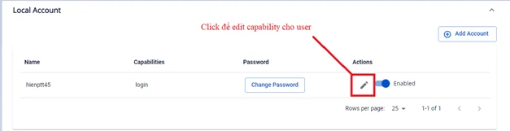

# Capabilitiesの編集

FPT Cloudでは、アカウントのcapabilitiesを設定できます：

- **login** — ユーザーがArgoCDにログインすることを許可します。
- **apiKey** — ユーザーがAPI経由でアクセスするための認証トークンを作成することを許可します。このオプションにより、CI/CDパイプラインやArgoCDのAPIと連携する必要がある自動化プロセスとの統合が可能になります。

1. **Security & Access** → **Local Account**画面で、**Edit Account**を選択します。

2. Capabilitiesのチェックを追加または解除します。

:::note
ユーザーには少なくとも1つのcapabilities（apiKeyまたはlogin）を選択する必要があります。
:::

3. **Edit**をクリックして完了します。

編集後の結果：

