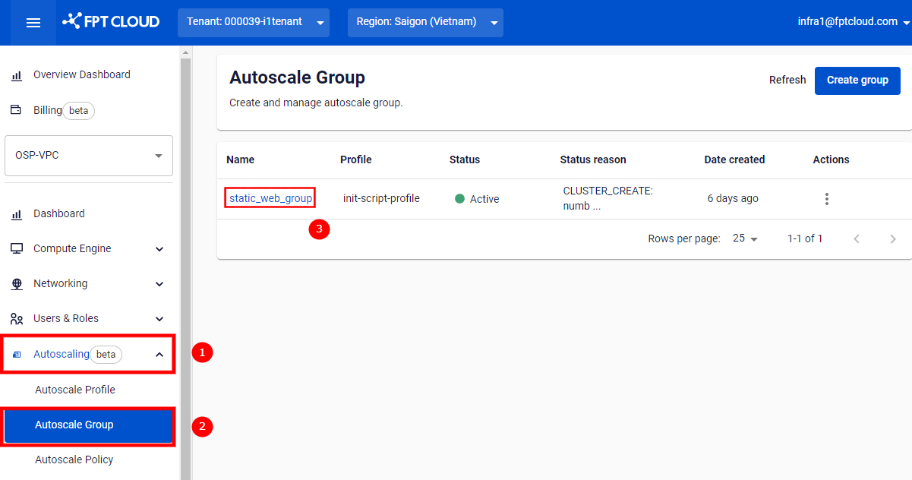
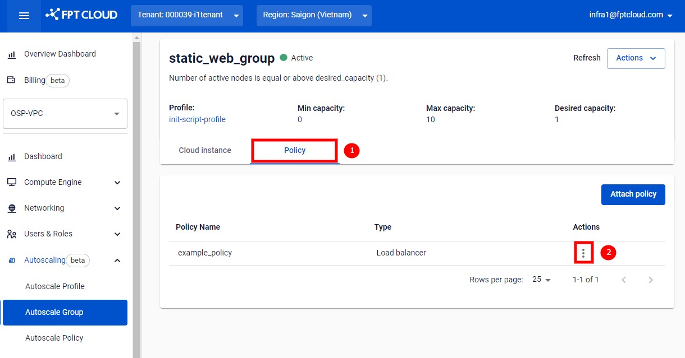
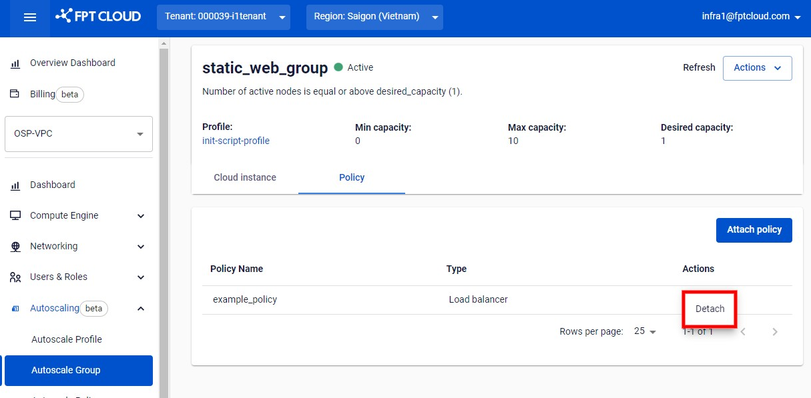

グループからのポリシーのデタッチ

## **ステップ 1:** **Autoscaling > Autoscale Group** ページにアクセスします。ポリシーをデタッチするグループの名前をクリックします。

## **ステップ 2:** **Policy** タブに切り替えます。デタッチするポリシーの行にある **Action menu** アイコンをクリックします。

## **ステップ 3:** メニューから **Detach** を選択します。

## **ステップ 4:** 確認ダイアログが表示されます。**Detach** をクリックして確定します。
