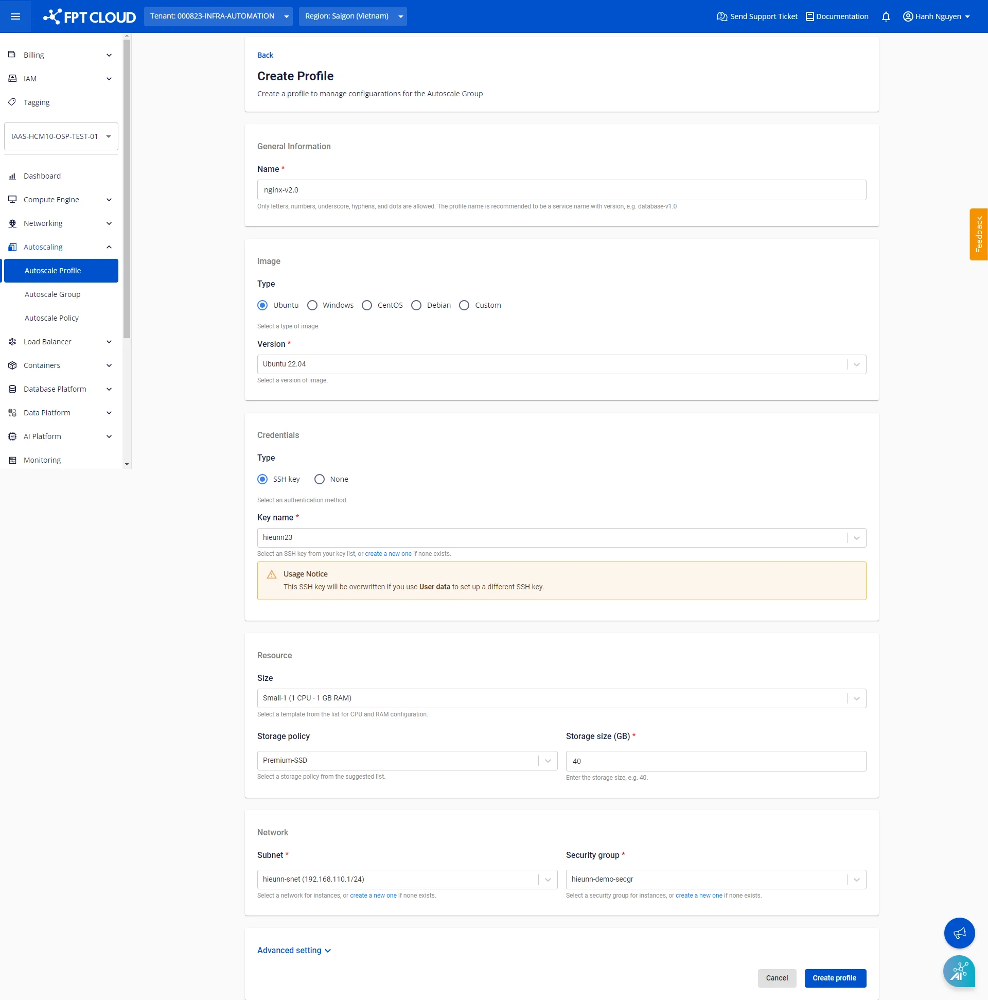
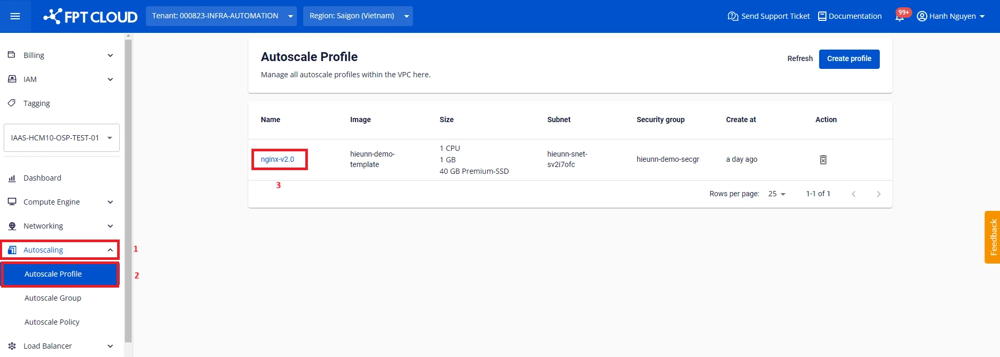
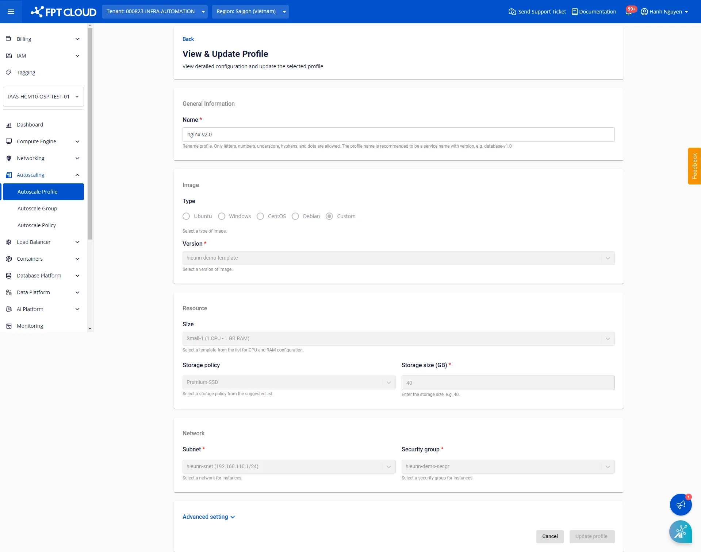

プロファイルの作成

## **ステップ1**: **Autoscaling > Autoscale Profile**ページにアクセスし、**Create profile**をクリックします。

## **ステップ2**: 技術パラメーターを設定します。

**General Information**

管理しやすいプロファイル名を入力します。名前は80文字以内で、ラテン文字、数字、アンダースコア、ハイフン、ドットを使用できます。

**Image**

現在提供されているOSファミリーには、Ubuntu、Windows、CentOS、Debianが含まれます。各OSグループには複数のディストリビューションがあります。

**Custom**グループは最も優先して使用されるグループで、ユーザー自身がカスタマイズおよびアプリケーション設定を行ったイメージが含まれています。このグループのイメージは以下の方法で取得できます。

  * ローカルマシンからファイルをアップロード（[詳細はこちら](<https://fptcloud.com/documents/cloud-server/?doc=tai-len-custom-image> "カスタムイメージのアップロード")）
  * 既存サーバーからInstance Templateを作成（[詳細はこちら](<https://fptcloud.com/documents/cloud-server/?doc=tutorials-quan-ly-instance-template> "Instance Templateの管理")）

**Credentials**

サポートされている認証方式は以下のとおりです。

  * **SSH：** VPC内でSSHキーを事前に作成しておく必要があります（[詳細はこちら](<https://fptcloud.com/documents/cloud-server/?doc=profile-ssh-key> "Profile SSH Key")）。
  * **Password。**
  * **None：** アクセスや認証が不要な場合は、_None_を選択して認証をスキップします。

選択したイメージがCustomグループに属する場合、認証方式はすでにイメージ内に設定されているものとみなされ、追加の変更は不要です。

**Resource**

CPU & RAM：提供されているインスタンスタイプから、用途に合った仕様を選択します。

Storage：用途に合ったディスクタイプと容量を選択します。デフォルトはPremium-SSDで、最小40 GBです。

:::warning
最小容量は選択したイメージの要件に基づいて提案されます。イメージの最小要件を下回るディスク容量を設定すると、予期しないエラーが発生する可能性があります。
:::

**Network**

VPC内の適切なSubnetとSecurity Groupを選択します。SubnetとSecurity Groupは事前に作成しておく必要があります。まだ作成していない場合は、先に作成してください。

  * Subnet（[詳細はこちら](<https://fptcloud.com/documents/cloud-server/?doc=Qu%E1%BA%A3n%20l%C3%BD%20Subnets> "Subnetの管理")）
  * Security Group（[詳細はこちら](<https://fptcloud.com/documents/cloud-server/?doc=quan-ly-security-group> "Security Groupの管理")）

**Advanced setting**

必要に応じて[cloud-init](<https://cloudinit.readthedocs.io/en/latest/topics/examples.html> "Cloud config examples")スクリプトを入力します。ノードが起動すると、cloud-initはクラウドから提供されたメタデータを読み取り、それに基づいてシステムを初期化します。cloud-initは主にネットワーク、ストレージ、SSH公開鍵などのシステムコンポーネントの設定に使用されます。

例：以下のサンプルスクリプトを使用すると、グループ内のノードは必要なパッケージをインストールし、GitHubから静的ウェブサイトをクローンし、nginxサーバーを起動します。結果を確認するには、ノードにFloating IPを割り当て、そのFloating IPを通じてウェブサイトにアクセスします。
[code]
    Copy
    # Update apt database on first boot (run 'apt-get update').
    # Note, if packages are given, or package_upgrade is true, then
    # update will be done independent of this setting.
    package_update: true

    # if packages are specified, this package_update will be set to true
    # packages may be supplied as a single package name or as a list
    # with the format [, ] wherein the specific
    # package version will be installed.
    packages:
    - nginx
    - git

    # runcmd contains a list of either lists or a string
    # each item will be executed in order at rc.local like level with
    # output to the console
    # - runcmd only runs during the first boot
    # - if the item is a list, the items will be properly executed as if
    # passed to execve(3) (with the first arg as the command).
    # - if the item is a string, it will be simply written to the file and
    # will be interpreted by 'sh'
    runcmd:
    - systemctl enable nginx
    - systemctl start nginx
    - git clone https://github.com/cloudacademy/static-website-example.git
    - cp -r ./static-website-example/* /var/www/html/
    - rm -r ./static-website-example
[/code]

:::warning
パスワード、トークン、シークレットキー、個人情報などの機密情報をスクリプトに含めないようにしてください。
:::

## **ステップ3**: **Create profile**をクリックして確認します。

作成が完了すると、プロファイルが既存のプロファイル一覧に表示されます。

一覧のプロファイル名をクリックすることで、プロファイルの詳細情報を確認できます。

## 注意事項

現時点では、プロファイルの技術パラメーターの変更はサポートされていません。これはプロファイル参照時の設定の一貫性を確保するためです。ただし、プロファイルの名前は変更できます。
