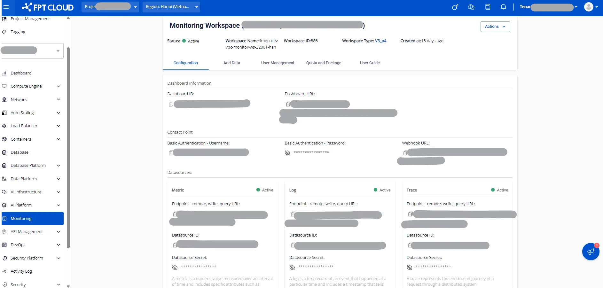

3.3. Add data タブ

インフラストラクチャサービス（Infrastructure services）、アプリケーション、モニターエンドポイントの統合に関する包括的なガイドを提供します。

**ステップ 1**: FPT Cloud Portal（**<https://console.fptcloud.com>**）にログインします。

**ステップ 2**: FPT Cloud Portal のメニューで **Monitoring** をクリックし、ワークスペースの一覧を表示します。

**ステップ 3**: ワークスペース名をクリックして詳細を確認します。そのワークスペースの詳細情報画面が表示されます。

**ステップ 4**: **「Add data」** タブをクリックします。

