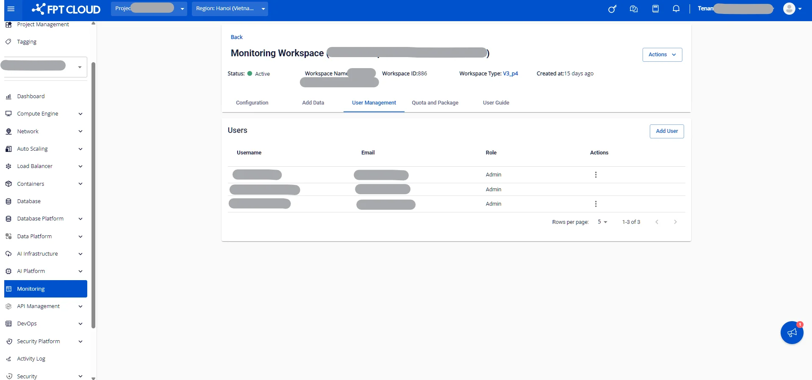

User Guide タブ

サービスの使用、設定、統合に関するユーザーガイドを提供します。

**手順 1**: FPT Cloud ポータル **<https://console.fptcloud.com>** にログインします。

**手順 2**: FPT Cloud Portal のメニューで **Monitoring** をクリックすると、ワークスペースの一覧が表示されます。

**手順 3**: ワークスペース名をクリックして詳細を確認します。そのワークスペースの詳細情報画面が表示されます。

**手順 4**: **「User guide」** タブをクリックします。

