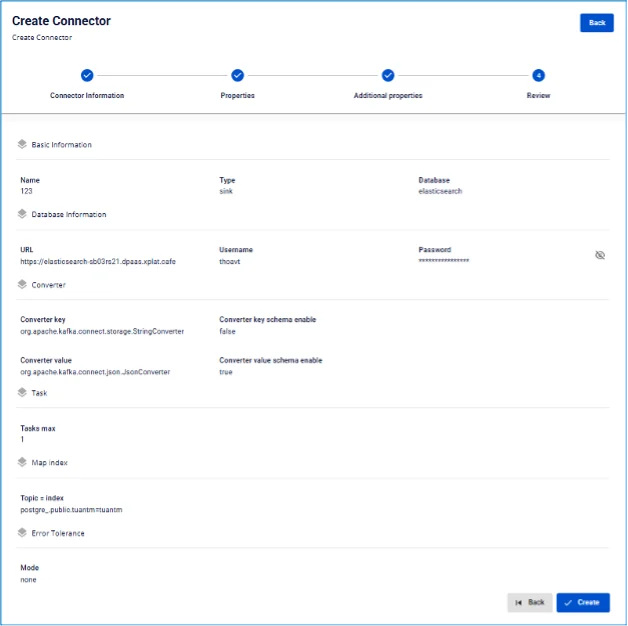

# Elasticsearch Sink Connector

**Type が sink、Database が Elasticsearch の connector を作成します**

**前提条件:** CDC service のステータスが Healthy であること

## connector 作成手順:

**ステップ 1:** メニューバーから **Data Platform** を選択 > **Workspace Management** を選択 > **Workspace name** を選択

**ステップ 2:** **My services** セクションで **CDC service** を選択

**ステップ 3:** **CDC service** の詳細画面 > **Connectors** タブを選択 > **Create a connector** をクリック

**ステップ 4:** **Connector Information** 画面に情報を入力します:

  * **Name** (必須): connector 名

注意: connector 名には半角英小文字 a-z または数字 0-9 を使用できます。スペースは使用できません。スペースの代わりに「-」を使用してください。

  * **Type** (必須): **sink** を選択

  * **Database** (必須): **Elasticsearch** を選択 

**ステップ 5:** 画面右上の **Next** をクリックして **Properties** 画面に進みます

  * **Database Information**

**Database** 情報を入力します

    * **URL**: アクセス URL

    * **Username**: ユーザー名

    * **Password**: パスワード

**Test Connection** をクリックして、Workspace から入力した Elasticsearch への接続を確認します

  * **Converter**

    * **Converter key**: converter の key 値を選択

    * **Converter key schema enable**: Converter key で schema を使用するかどうかを選択

    * **Converter value**: converter の value を選択

    * **Converter value schema enable**: Converter value で schema を使用するかどうかを選択

  * **Kafka topic**

    * 「+」ボタンをクリックして topic 情報を取得します

    * 注意: 最大 100 topic までに制限されます 

**ステップ 6**: **Next** をクリックして **Additional Properties** 画面に進みます

  * **Task:**

    * **Number of tasks**: 並列実行できる最大タスク数
  * **Map table**: topic とターゲット database のデータテーブルをマッピングします

    * **Create new**: 新しいテーブルを作成するか、ターゲット database の既存テーブルから選択するかを選びます

    * Index: 新規 index を作成しない場合は index を選択し、新規作成する場合は index 名を入力します

  * **Error Tolerance**:

    * **Mode**:
    * **None**: エラーが発生した場合、Connector は処理を停止します 

**ステップ 7**: 画面右上の **Next** をクリックして **Review** 画面に進みます 

**ステップ 8**: 情報を確認し、**Create** をクリックして connector の作成を完了します
