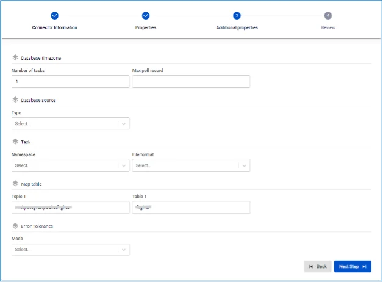

# Iceberg Sink Connector

**Type が sink、Database が Iceberg の connector を作成します**

**前提条件:** CDC service のステータスが healthy であること

## connector 作成手順:

**ステップ 1:** メニューバーから **Data Platform** を選択 > **Workspace Management** を選択 > **Workspace name** を選択

**ステップ 2:** **My services** セクションで **CDC service** を選択

**ステップ 3:** **CDC service** の詳細画面 > **Connectors** タブを選択 > **Create a connector** をクリック 

**ステップ 4:** **Connector Information** 画面に情報を入力します:

  * **Name** (必須): connector 名

注意: connector 名には半角英小文字 a-z または数字 0-9 を使用できます。スペースは使用できません。スペースの代わりに「-」を使用してください。

  * **Type** (必須): **sink** を選択

  * **Database** (必須): **Iceberg** を選択 

**ステップ 5**: **Next** をクリックして **Properties** 画面に進みます

以下の情報を入力します:

  * **Catalog type** (必須): catalog の種類を選択

  * **URL** (必須): URL パスを入力

  * **Catalog Name** (必須): catalog 名

  * **Endpoint** (必須): S3 へのエンドポイントアドレス

  * **Access key** (必須): アクセスキー

  * **Secret** (必須): エンドポイントへの接続パスワード

  * **Root directory** (必須): S3 内のルートディレクトリ

  * **Topics** (必須): source connector から送信されるデータの topic を選択 

**Test connection** をクリックして、Workspace から入力した Database への接続を確認します

  * **Converter**

    * **Converter key**: converter の key 値を選択

    * **Converter key schema enable**: Converter key で schema を使用するかどうかを選択

    * **Converter value**: converter の value を選択

    * **Converter value schema enable**: Converter value で schema を使用するかどうかを選択

**ステップ 6:** **Next** をクリックして **Additional Properties** 画面に進みます

以下の情報を入力します:

  * **Number of tasks**: 並列実行できる最大タスク数

  * **Max poll record**: 最大 poll レコード数

  * **Type**: DB source の種類を選択

  * **Namespace**: namespace を選択

  * **File format**: ファイル形式を選択

  * **Topic 1**: Connector が consume してターゲット database にデータを sink する topic のリスト。「,」で区切ります

  * **Table 1**: Database 内のテーブル名

  * **Mode**: メッセージを処理できない場合の Connector の動作

    * **None**: Connector は Iceberg に sink できないメッセージをスキップします

    * **All**: エラーメッセージは指定した topic に送信されます 

**ステップ 7:** **Next** をクリックして **Review** 画面に進みます 

**ステップ 8:** 情報を確認し、**Create** をクリックして connector の作成を完了します
