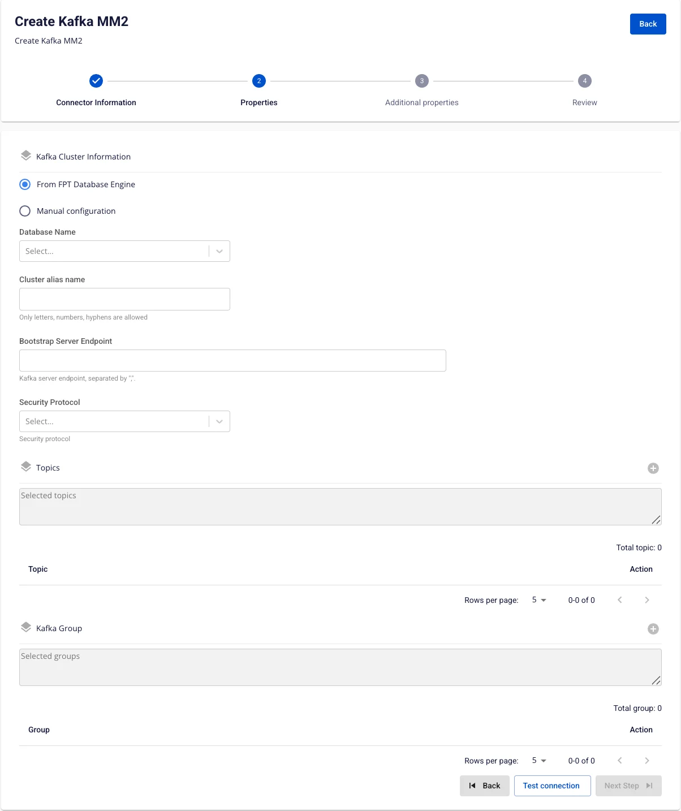
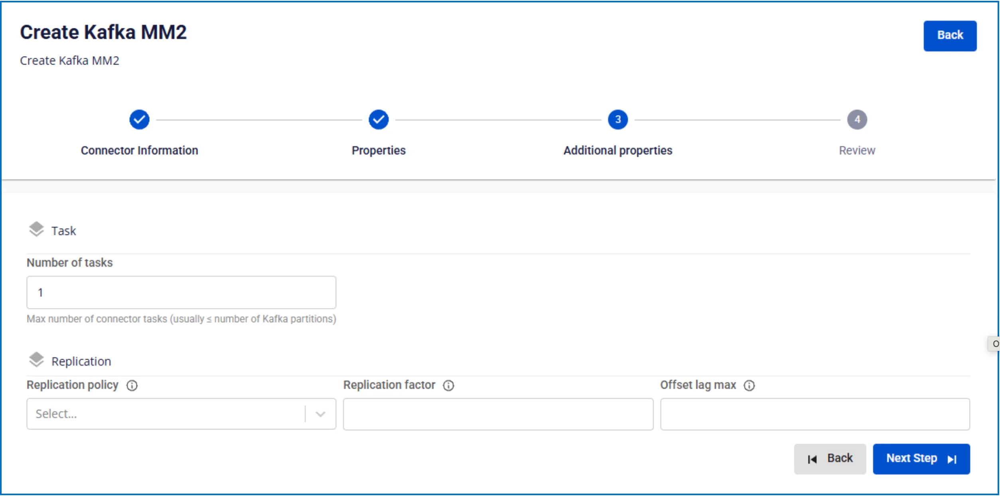
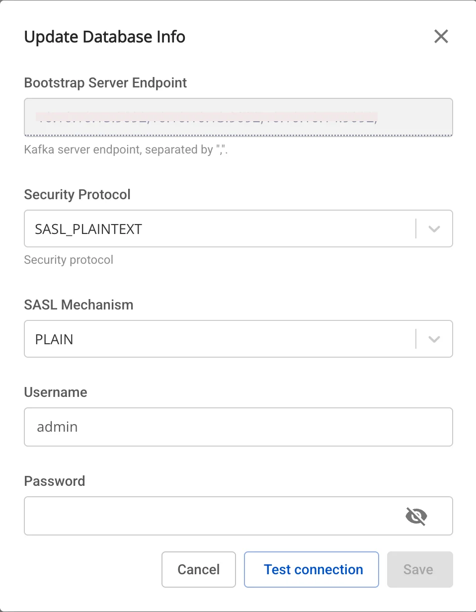

# Kafka MM2

**Kafka MM2 (MirrorMaker 2)** は、**異なる Kafka クラスター間でデータを同期する**ためのツールです（マルチクラスターレプリケーション）

### 1\. Kafka MM2 source の作成

Kafka MM2 を作成する場合、Type は source です

前提条件: CDC service のステータスが healthy であること

**ステップ 1:** メニューバーから **Data Platform** を選択 > **Workspace Management** を選択 > **Workspace name** を選択

**ステップ 2:** **My services** セクションで **CDC service** を選択

**ステップ 3:** **CDC service** の詳細画面 > **Kafka MM2** タブを選択 > **Create a Kafka MM2** をクリック

**ステップ 4:** **Connector Information** 画面に情報を入力します:

  * **Name** (必須): connector 名

注意: connector 名には半角英小文字 a-z または数字 0-9 を使用できます。スペースは使用できません。スペースの代わりに「-」を使用してください。

  * **Type** (必須): **source** を選択

**ステップ 5**: **Next** をクリックして **Properties** 画面に進みます

以下の情報を入力します:

  * **Kafka cluster information**

    * **Cluster alias name** (必須): クラスターの識別名を入力

    * **Bootstrap server endpoint** (必須): Kafka の接続アドレスを入力

    * **Security protocol** (必須): セキュリティプロトコルを選択

    * **SASL Mechanism** (任意): 選択したセキュリティプロトコルによって異なります

    * **Username** (必須): ユーザー名

    * **Password** (必須): パスワード

**Test connection** をクリックして、Workspace から入力した **Cluster** への接続を確認します

  * **Topics**

    * **Topic** (必須): 上記の Kafka source からデータ topic を選択
  * **Group**

    * **Group** (必須): レプリケーションする consumer group を選択

**ステップ 6:** **Next** をクリックして **Additional Properties** 画面に進みます

以下の情報を入力します:

  * **Number of tasks**: 並列実行できる最大タスク数

  * **Replication policy**: レプリケーション後に topic 名の先頭にプレフィックスを付けるか、元の topic 名を保持するかを選択

  * **Replication factor**: レプリケーション後の各 topic のレプリカ数

  * **Offset lag max**: source と target 間の最大 offset ラグ

**ステップ 7:** **Next** をクリックして **Review** 画面に進みます

**ステップ 8:** 情報を確認し、**Create** をクリックして Kafka MM2 source の作成を完了します

### 2\. Kafka MM2 source の編集

**Kafka MM2 source** を編集するには、以下の手順を実行します:

**ステップ 1:** メニューバーから **Data Platform** を選択 > **Workspace Management** を選択 > **Workspace name** を選択

**ステップ 2:** **My services** セクションで **CDC service** を選択

**ステップ 3:** **CDC service** の詳細画面 > **Kafka MM2 source** タブを選択 > **Kafka MM2 name** を選択

**ステップ 4**: **Kafka MM2 source 情報の編集**

  * **Kafka Cluster Information**

    * Kafka MM2 の詳細画面で、Kafka Cluster Information セクションの編集アイコンをクリックします。

    * Update Database Info ポップアップが表示され、以下を変更できます:

    * **Security protocol** (必須): セキュリティプロトコルを選択

    * **SASL Mechanism** (任意): 選択したセキュリティプロトコルによって異なります

    * **Username** (必須): ユーザー名

    * **Password** (必須): パスワード

    * Test connection をクリックして接続を確認します。

    * OK の場合 → Save をクリックして保存します。

    * 終了する場合 → Cancel をクリックします。

  * **Task**

    * Kafka MM2 の詳細画面で、Task セクションの編集アイコンをクリックします。

    * Update Number of Tasks ポップアップが表示され、以下を変更できます:

    * **Number of tasks**: 並列実行できる最大タスク数

    * OK の場合 → Save をクリックして保存します。

    * 終了する場合 → Cancel をクリックします。

  * **Replication**

    * Kafka MM2 の詳細画面で、Replication セクションの編集アイコンをクリックします。

    * Update Replication ポップアップが表示され、以下を変更できます:

    * **Replication policy**: レプリケーション後に topic 名の先頭にプレフィックスを付けるか、元の topic 名を保持するかを選択

    * **Replication factor**: レプリケーション後の各 topic のレプリカ数

    * **Offset lag max**: source と target 間の最大 offset ラグ

    * OK の場合 → Save をクリックして保存します。

    * 終了する場合 → Cancel をクリックします。

### 3\. Kafka MM2 source の削除

**Kafka MM2 source** を削除するには、以下の手順を実行します:

**ステップ 1:** メニューバーから **Data Platform** を選択 > **Workspace Management** を選択 > **Workspace name** を選択

**ステップ 2:** **My services** セクションで **CDC service** を選択

**ステップ 3:** **CDC service** の詳細画面 > **Kafka MM2 source** タブを選択 > **Kafka MM2 name** を選択 > **Action** を選択 > **Delete** を選択

**ステップ 4:** **Delete Kafka MM2** ダイアログが表示されます > Delete と入力 > **Confirm** をクリックして **Kafka MM2 source** を削除します。操作をキャンセルする場合は **Cancel** を選択します。 
