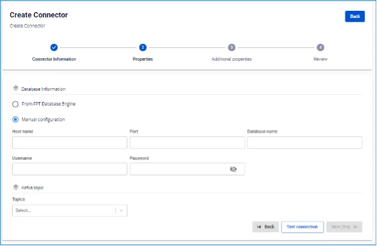
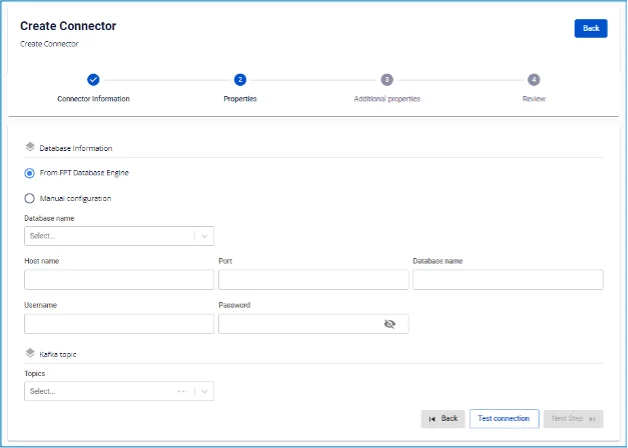
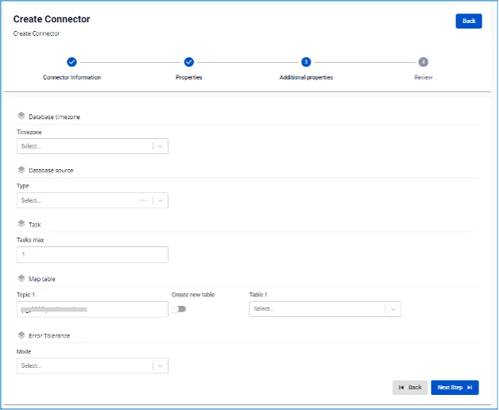
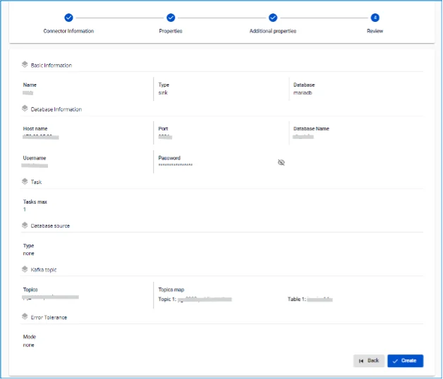

# MariaDB Sink Connector

**Type が sink、Database が MariaDB の connector を作成します**

**前提条件:** CDC service のステータスが healthy であること

## connector 作成手順:

**ステップ 1:** メニューバーから **Data Platform** を選択 > **Workspace Management** を選択 > **Workspace name** を選択

**ステップ 2:** **My services** セクションで **CDC service** を選択

**ステップ 3:** **CDC service** の詳細画面 > **Connectors** タブを選択 > **Create a connector** をクリック 

**ステップ 4:** **Connector Information** 画面に情報を入力します:

  * **Name** (必須): connector 名

注意: connector 名には半角英小文字 a-z または数字 0-9 を使用できます。スペースは使用できません。スペースの代わりに「-」を使用してください。

  * **Type** (必須): **sink** を選択

  * **Database** (必須): **MariaDB** を選択 

**ステップ 5**: **Next** をクリックして **Properties** 画面に進みます

**Properties** 画面の情報を入力します

  * **Manual configuration** を選択した場合 — 以下を入力:

    * **Host Name** (必須): MariaDB のホスト名または IP アドレス

    * **Port** (必須): MariaDB サーバーポート、デフォルト: `3306`

    * **Database name** (必須): Connector がデータを sink するターゲット database

    * **Username** (必須): Connector が使用する Username

    * **Password** (必須): Connector が使用する Password

    * **Topics** (必須): Connector が consume してターゲット database にデータを sink する topic のリスト。「,」で区切ります 

  * **From Database Engine** を選択した場合 — 以下を入力:

    * **Database name** (必須): Database 名

    * **Host Name** (必須): MariaDB のホスト名または IP アドレス

    * **Port** (必須): MariaDB サーバーポート、デフォルト: `3306`

    * **Database name** (必須): Connector がデータを sink するターゲット database

    * **Username** (必須): Connector が使用する Username

    * **Password** (必須): Connector が使用する Password

    * **Topics** (必須): Connector が consume してターゲット database にデータを sink する topic のリスト。「,」で区切ります 

  * **Test connection** をクリックして、Workspace から入力した Database への接続を確認します

  * **Converter**

    * **Converter key**: converter の key 値を選択

    * **Converter key schema enable**: Converter key で schema を使用するかどうかを選択

    * **Converter value**: converter の value を選択

    * **Converter value schema enable**: Converter value で schema を使用するかどうかを選択

**ステップ 6:** **Next** をクリックして **Additional Properties** 画面に進みます

  * 以下の情報を入力します:

    * **Timezone:** source database のデータに合った timezone を選択

    * **Task max:** 同時に処理するタスク数

    * **Type:** Database source の種類を選択

    * **Name**: schema 名

    * **Topic 1**: source connector から監視する topic 名

    * **Table 1:** source connector からのデータ変更を監視するテーブル名

    * **Mode (必須):** メッセージを処理できない場合の Connector の動作

    * **None**: Connector は database に sink できないメッセージをスキップします

    * **All**: エラーメッセージは指定した topic に送信されます 

**ステップ 7**: **Next** をクリックして **Review** 画面に進みます 

**ステップ 8:** 情報を確認し、**Create** ボタンをクリックして connector の作成を完了します
