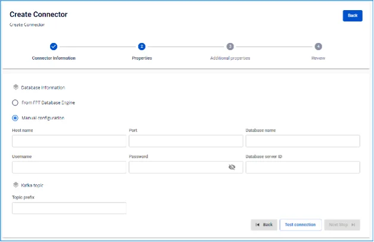
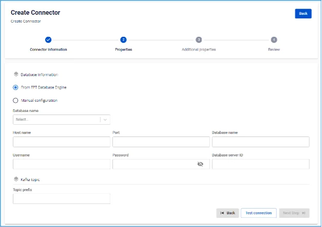
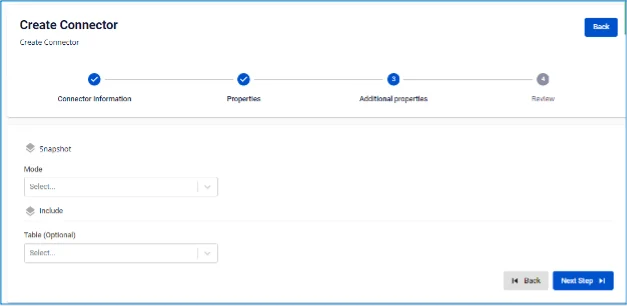

# MariaDB Source Connector

**Type が source、Database が MariaDB の connector を作成します**

**前提条件:** CDC service のステータス: _healthy_

MariaDB Source connector は MariaDB のバイナリログを使用して CDC を実行します。ただし、MariaDB は一定期間後に binlog を削除するように設定されています。そのため、MariaDB connector が初期化されると、データの一貫性を確保するために binlog からの読み取りを開始する前に initial consistent snapshot を実行します。サポートされる MariaDB トポロジー

  * **1.** **Standalone:** 事前に binlog を有効にする必要があります。

  * **2.** **Primary and replica:** いずれかのサーバーから binlog を読み取ることをサポートします（binlog が有効な場合）が、connector はそのサーバー上の変更のみを検出できます。

  * **3.** **High available**

## MariaDB の設定

**1.** **MariaDB ユーザー**を作成します:

```
CREATE USER '<USERNAME>'@'%' IDENTIFIED BY '<PASSWORD>';
```

**2.** MariaDB source connector には以下のパーミッションが必要です

```
SHOW DATABASES: GLOBAL PRIVILEGES
```

```
SELECT: DATABASES PRIVILEGES
```

```
RELOAD: GLOBAL PRIVILEGES
```

```
REPLICATION SLAVE: GLOBAL PRIVILEGES
```

```
REPLICATION CLIENT: GLOBAL PRIVILEGES
```

  * すべての database にパーミッションを付与する場合:

```
GRANT SELECT, RELOAD, SHOW DATABASES, REPLICATION SLAVE, REPLICATION CLIENT ON *.* TO '<USERNAME>'@'%';
          FLUSH PRIVILEGES;
```

  * または特定の database に対して:

```
GRANT SHOW DATABSASES, RELOAD, REPLICATION SLAVE, REPLICATION CLIENT ON *.* TO '<USERNAME>'@'%';
          GRANT SELECT ON <DATABASE-NAME>.* TO '<USERNAME>'@'%';
          FLUSH PRIVILEGES;
```

**3.** binlog を有効にする: 注意: FPTCloud のサービスでは、これらの作業は不要です。

  * binlog がすでに有効かどうか確認します:

```
SELECT variable_value as "BINARY LOGGING STATUS (log-bin) ::"
          FROM performance_schema.global_variables WHERE
          variable_name='log_bin';
```

  * または

```
SHOW GLOBAL VARIABLES LIKE "log_bin";
```

  * log_bin が OFF の場合は、設定ファイルから値を変更してください:

```
server-id = <CHANGE_ME> #result of query SHOW VARIABLES LIKE "server_id";
          log_bin = MariaDB-bin
          binlog_format               = ROW
          binlog_row_image            = FULL
          binlog_expire_logs_seconds  = 864000
```

  * または:

```
SET @@global.binlog_format="ROW";
          SET @@global.binlog_row_image="FULL";
          SET @@global.binlog_expire_logs_seconds=864000;
```

**4.** GTID を有効にする:

注意: FPTCloud のサービスでは、これらの作業は不要です。

  * gtid_mode がすでに有効かどうか確認します

```
SHOW GLOBAL VARIABLES LIKE "gtid_mode";
```

  * enforce_gtid_consistency がすでに有効かどうか確認します

```
SHOW GLOBAL VARIABLES LIKE "enforce_gtid_consistency";
```

  * gtid_mode と enforce_gtid_consistency がいずれも OFF の場合は、設定ファイルから値を変更してください:

```
gtid_mode                   = ON
        enforce_gtid_consistency    = ON
```

    * または

```
SET @@global.gtid_mode="ON";
          SET @@global.enforce_gtid_consistency="ON";
```

**5.** connector が UPDATE イベントを監視できるように `binlog_row_value_options` を設定します:

注意: FPTCloud のサービスでは、これらの作業は不要です。

  * binlog_row_value_options の値を確認します

```
SHOW GLOBAL VARIABLES LIKE "binlog_row_value_options";
```

  * binlog_row_value_options の値を "" に変更します

```
SET @@global.binlog_row_value_options="" ;
```

## connector 作成手順:

connector を作成するには、以下の手順を実行します:

**ステップ 1:** メニューバーから **Data Platform** を選択 > **Workspace Management** を選択 > **Workspace name** を選択

**ステップ 2:** **My services** セクションで **CDC service** を選択

**ステップ 3:** **CDC service** の詳細画面 > **Connectors** タブを選択 > **Create** a connector をクリック 

**ステップ 4:** **Connector Information** 画面に情報を入力します:

  * **Name (必須):** connector 名

注意: connector 名には半角英小文字 a-z または数字 0-9 を使用できます。スペースは使用できません。スペースの代わりに「-」を使用してください。

  * **Type (必須):** source を選択

  * **Database (必須):** **SQLserver** を選択 

**ステップ 5:** Next をクリックして **Properties** 画面に進みます

**Properties** 画面の情報を入力します

  * **Manual configuration** を選択した場合 — 以下を入力:

    * **Host name (必須):** MariaDB のホスト名または IP アドレス

    * **Port (必須):** MariaDB サーバーポート、デフォルト: `3306`

    * **Database name (必須):** Connector がデータを sink するターゲット database

    * **Username (必須):** Connector が使用する Username

    * **Password (必須):** Connector が使用する Password

    * **Topics (必須):** Connector が consume してターゲット database にデータを sink する topic のリスト。「,」で区切ります 

  * **From Database Engine** を選択した場合 — 以下を入力:

    * **Database name (必須):** Database 名

    * **Host name (必須):** MariaDB のホスト名または IP アドレス

    * **Port (必須):** MariaDB サーバーポート、デフォルト: `3306`

    * **Database name (必須):** Connector がデータを sink するターゲット database

    * **Username (必須):** Connector が使用する Username

    * **Password (必須):** Connector が使用する Password

    * **Database server ID (必須):** Database サーバーの ID

注意: Database server ID は 1000 より大きく 9999 より小さい数値である必要があります。

    * **Topics (必須):** Connector が consume してターゲット database にデータを sink する topic のリスト。「,」で区切ります 

    * **Enable incremental snapshot** (任意): Connector の incremental snapshot 機能を有効にするチェックボックス

      * source connector のみに表示されます: **MySQL, MariaDB, PostgreSQL**
      * このチェックボックスをオンにして「Test connection」をクリックすると、システムは以下を確認します:
      * database に snapshot を実行する十分なパーミッションがあるか（PostgreSQL/MySQL には INSERT、CREATE TABLE パーミッションが必要）
      * database にパーミッションが不足している場合、詳細なエラーメッセージが表示されます
      * database に十分なパーミッションがある場合、「Test connection successfully」が表示されます
      * このチェックボックスをオンにして Connector を正常に作成した後:
      * Connector には incremental snapshot 管理機能が追加されます
      * Connector 一覧画面に「Snapshot Status」列が表示されます
      * Actions メニューから Execute、Pause、Resume、Stop snapshot の操作が実行できます

Test connection をクリックして、Workspace から入力した Database への接続を確認します

**ステップ 6:** Next をクリックして Additional Properties 画面に進みます

以下の情報を入力します:

  * **Mode (必須):** Connector の動作

以下のいずれかのモードを選択します:

    * **Initial (デフォルト):** Connector はテーブル内の既存データをすべて snapshot し、その後そのテーブルのデータ変更を継続してキャプチャします

    * **Initial_only:** Connector はテーブル内の既存データをすべて snapshot するのみで、その後テーブルのデータ変更イベントは監視しません

    * **Never:** Connector はテーブル内の既存データを snapshot せず、テーブルのデータ変更イベントのみを監視します

    * **Table (任意):** 前の画面で接続した database 内のテーブル名

    * **Column (任意):** テーブルから取得したいデータ列の名前 

**ステップ 7:** **Next** をクリックして **Review** 画面に進みます 

**ステップ 8:** 情報を確認し、**Create** をクリックして connector の作成を完了します
