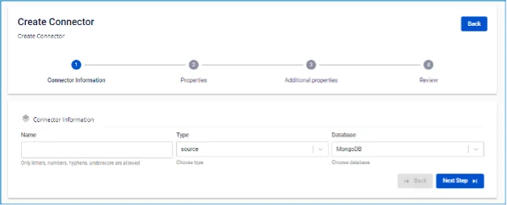
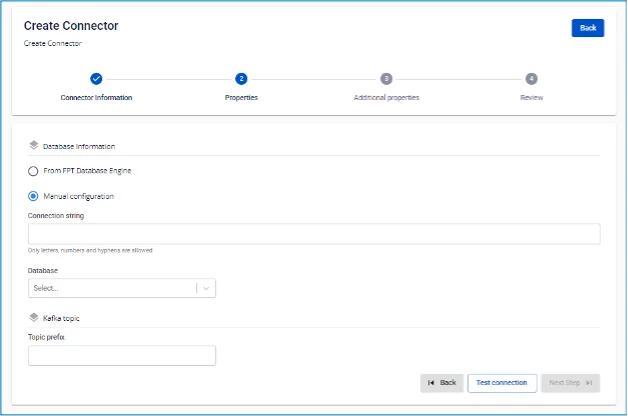

# MongoDB Source Connector

**Type が source、Database が MongoDB の connector を作成します**

**前提条件:** CDC service のステータスが _Healthy_ であること

## MongoDB の設定

**1\. oplogs を有効にする:** MongoDB サーバーで oplogs を有効にする必要があります（スタンドアロンにのみ適用されます。クラスターではデフォルトで有効です）。

**2\. パーミッション:** MongoDB Connector は、設定された database で find および changeStream 操作を実行するパーミッションをユーザーが持っている必要があります。

  * これらのパーミッションを持つユーザーを作成するには、以下のコマンドを使用します:

```
db.createUser({
            user: "<USERNAME>",
            pwd: "<PASSWORD>",
            roles: [
                { role: "readWrite", db: "<DATABASE>" }
                    ]
            })
```

  * またはすべての database に対して:

```
db.createUser({
            user: "<USERNAME>",
            pwd: "<PASSWORD>",
            roles: [
                { role: "readWrite", db: "" }
                ]
        })
```

## connector 作成手順:

connector を作成するには、以下の手順を実行します:

**ステップ 1:** メニューバーから **Data Platform** を選択 > **Workspace Management** を選択 > **Workspace name** を選択

**ステップ 2:** **My services** セクションで **CDC service** を選択

**ステップ 3:** **CDC service** の詳細画面 > **Connectors** タブを選択 > **Create a connector** をクリック 

**ステップ 4:** **Connector Information** 画面に情報を入力します:

  * **Name (必須):** connector 名。注意: connector 名には半角英小文字 a-z または数字 0-9 を使用できます。スペースは使用できません。スペースの代わりに「-」を使用してください。

    * **Type (必須):** source を選択

    * **Database (必須):** MongoDB を選択 

**ステップ 5:** 画面右上の **Next** をクリックして **Properties** 画面に進み、以下を入力します:

  * **From FPT Database Engine** を選択した場合 — 以下を入力:

    * **Database name (必須):** Database を選択

    * **Connection string (必須):** MongoDB connection uri

    * **Database:** connector が変更を監視する database

    * **Username (必須):** MongoDB への接続 Username

    * **Password (必須):** MongoDB への接続 Password

    * **Collection:** connector が変更を監視する Collection

    * **Topic prefix (必須):** topic 名のプレフィックス（.database.collection）


  * **Manual configuration** を選択した場合 — 以下を入力:

    * **Connection string (必須):** MongoDB connection uri

    * **Database:** connector が変更を監視する database

    * **Topic prefix (必須):** topic 名のプレフィックス（.database.collection） 

**ステップ 6:** Next をクリックして **Additional Properties** 画面に進みます

以下の情報を選択します:

  * **Snapshot:** 初期化後の connector の動作

    * **Latest:** Connector はデータ変更のみを監視します

    * **Copy_existing:** Connector は既存のすべてのデータをコピーしながら、変更も監視します。コピー中に collection が変更された場合、connector は同じレコードに対して 2 つの異なる操作（copyingData とそのレコードの操作: insert/update/delete）で 2 つのイベントを生成します。

  * **Error Tolerance:** 例外に対する connector の動作

    * **None:** connector は停止します

**ステップ 7:** **Next** をクリックして **Review** 画面に進みます

**ステップ 8:** 情報を確認し、**Create** ボタンをクリックして connector の作成を完了します。
