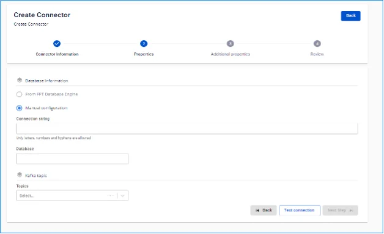
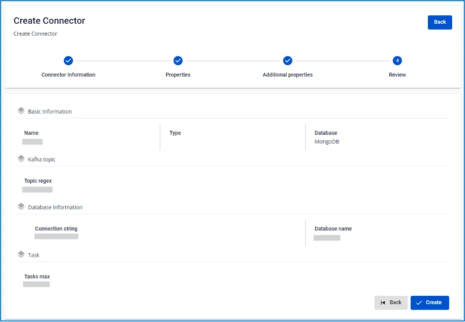
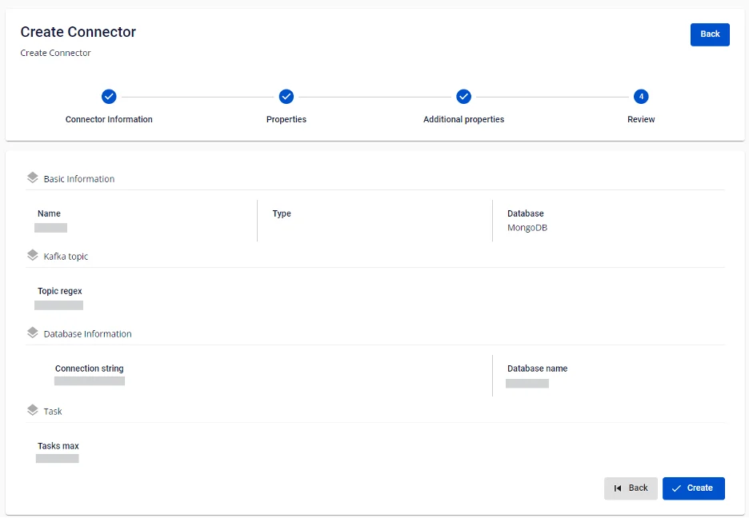

# MongoDB Sink Connector

**Type が sink、Database が MongoDB の connector を作成します**

**前提条件:** CDC service のステータスが healthy であること

## connector 作成手順:

**ステップ 1:** メニューバーから **Data Platform** を選択 > **Workspace Management** を選択 > **Workspace name** を選択

**ステップ 2:** **My services** セクションで **CDC service** を選択

**ステップ 3:** **CDC service** の詳細画面 > **Connectors** タブを選択 > **Create a connector** をクリック 

**ステップ 4:** **Connector Information** 画面に情報を入力します:

  * **Name (必須):** connector 名

注意: connector 名には半角英小文字 a-z または数字 0-9 を使用できます。スペースは使用できません。スペースの代わりに「-」を使用してください。

  * **Type (必須):** sink を選択

  * **Database (必須):** MongoDB を選択 

**ステップ 5:** **Next** をクリックして **Properties** 画面に進みます

**ステップ 6:** From FPT Database Engine と Manual configuration の 2 つのオプションがあります

  * **Manual configuration** を選択した場合 — 以下を入力:

    * **Connection string** (必須): MongoDB connection uri

    * **Database** (必須): database 名

注意: database 名には半角英小文字・大文字または数字 1-9 を使用できます。スペースは使用できません。スペースの代わりに「-」または「_」を使用してください。

    * **Topics** (必須): topic のリスト 
  * **From FPT Database Engine** を選択した場合 — 以下を入力:

    * **Connection string** (必須): MongoDB connection uri

    * **Database** (必須): database 名

注意: database 名には半角英小文字・大文字または数字 1-9 を使用できます。スペースは使用できません。スペースの代わりに「-」または「_」を使用してください。

    * **Topics** (必須): topic のリスト
  * **Converter**

    * **Converter key**: converter の key 値を選択

    * **Converter key schema enable**: Converter key で schema を使用するかどうかを選択

    * **Converter value**: converter の value を選択

    * **Converter value schema enable**: Converter value で schema を使用するかどうかを選択

**ステップ 7:** 画面右上の **Next** をクリックして **Additional Properties** 画面に進みます

**ステップ 8:** 以下の情報を入力します:

  * **Tasks max (必須):** topics のパーティション数が 1 より多い場合に connector が同時実行できるタスク数 

**ステップ 9**: **Next** をクリックして **Review** 画面に進みます 

**ステップ 10:** 情報を確認し、**Create** ボタンをクリックして connector の作成を完了します。 
