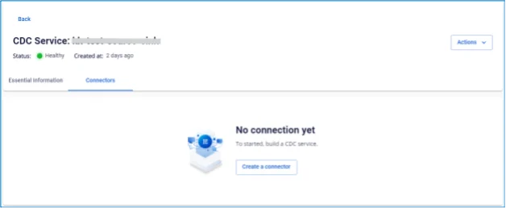
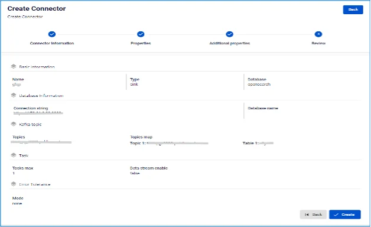
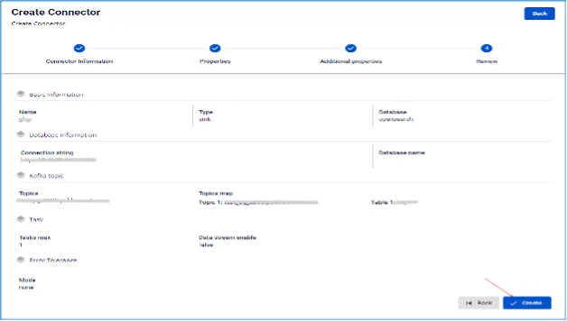

# OpenSearch Sink Connector

**コネクターの作成（Type: sink、Database: OpenSearch）**

## コネクターの作成手順:

**手順 1:** メニューバーから **Data Platform** > **Workspace Management** > **Workspace name** を選択します。

**手順 2:** **My services** セクションで **CDC service** を選択します。

**手順 3:** **CDC service** 詳細画面 > **Connectors** タブを選択 > **Create a connector** をクリックします。 

**手順 4:** **Connector Information** 画面に以下の情報を入力します:

  * **Name**（必須）: コネクター名

注意: コネクター名には小文字のアルファベット a〜z または数字 0〜9 を使用できます。スペースは使用できません。スペースの代わりに「-」を使用してください。

  * **Type**（必須）: **sink** を選択

  * **Database**（必須）: **OpenSearch** を選択 

**手順 5**: **Next** をクリックして **Properties** 画面に進みます。

以下の情報を入力します:

  * **From FPT Database Engine** を選択した場合 - 以下の項目を入力します:

    * **Database name**（必須）: データベースを選択

    * **Connection string**（必須）: OpenSearch のホスト名/ホストネーム

    * **Password**（必須）: OpenSearch への接続パスワード

    * **Topics**: トピックの一覧 

  * **From FPT Database Engine** を選択した場合 - 以下の項目を入力します:

    * **Connection string**（必須）: OpenSearch の接続 URI

    * **Username**（必須）: OpenSearch への接続ユーザー名

    * **Password**（必須）: OpenSearch への接続パスワード

    * **Topics**: トピックの一覧 

  * **Test connection** をクリックして、Workspace から入力したデータベースへの接続を確認します。

  * **Converter**

    * **Converter key**: コンバーターのキー値を選択

    * **Converter key schema enable**: Converter key でスキーマを使用するかどうかを選択

    * **Converter value**: コンバーターの値を選択

    * **Converter value schema enable**: Converter value でスキーマを使用するかどうかを選択

**手順 6:** **Next** をクリックして **Additional Properties** 画面に進みます。

以下の情報を入力します:

  * **Data streams enable:** デフォルトは無効（Disable）

  * **Task max:** コネクターが同時に実行できるタスク数。トピックのパーティション数が 1 より多い場合、task max > 1 に設定するとメッセージが順序どおりに処理されない場合があります（同じキーを持つメッセージが同一パーティションに送信されるよう、メッセージキーが正しく機能していることを確認してください）。

  * **Topic 1:** コネクターがデータを消費して OpenSearch にシンクする対象のトピック名

  * **Table 1:** PostgreSQL のデータ変更を監視するテーブル名

注意: 新しいテーブルを作成する場合は、「create new table」トグルを有効にしてください。

  * **Mode**（必須）: メッセージを処理できない場合のコネクターの動作

    * **None**: データベースにシンクできないメッセージはスキップされます。

    * **All**: エラーメッセージは指定のトピックに送信されます。 

**手順 7:** **Next** をクリックして **Review** 画面に進みます。 

**手順 8:** 情報を確認し、**Create** をクリックしてコネクターの作成を完了します。 
