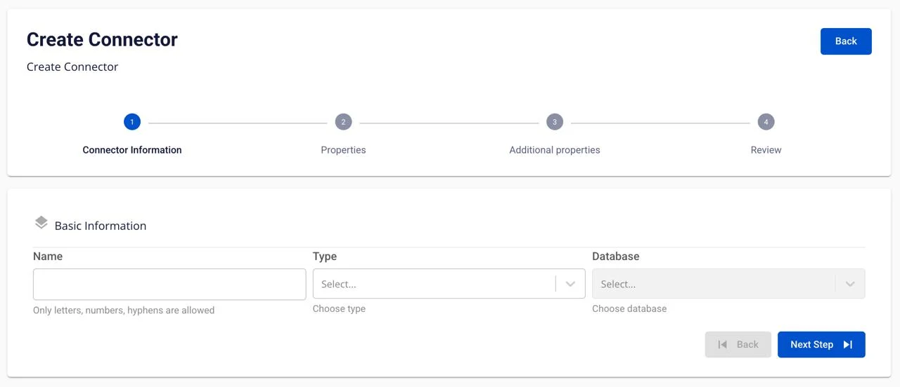

# Oracle Source Connector

### Oracle source connector の作成
**ユースケース:** Type は **source**、Database は **Oracle** です。

**前提条件:** CDC service のステータスが **healthy** であること。

Oracle Source connector は **Oracle LogMiner** を使用して redo ログを読み取り、データ変更（CDC）をキャプチャします。コネクターは 3 つの snapshot モードをサポートします:

  * **initial**: 既存のデータをすべて snapshot し、その後変更のキャプチャを継続します。
  * **initial_only**: 既存のデータのみ snapshot し、変更はキャプチャしません。
  * **no_data**: snapshot は行わず、コネクター起動時点からの変更のみキャプチャします。

#### Oracle Database の設定（コネクター作成前に必須）

**1\. CDC 用 Oracle ユーザーの作成:**

```
CREATE USER cdc_user IDENTIFIED BY <PASSWORD>;
```

**2\. Oracle source connector に必要な権限:**

```
GRANT CREATE SESSION TO cdc_user;
        GRANT SELECT ON V$DATABASE TO cdc_user;
        GRANT FLASHBACK ANY TABLE TO cdc_user;
        GRANT SELECT ANY TABLE TO cdc_user;
        GRANT SELECT_CATALOG_ROLE TO cdc_user;
        GRANT EXECUTE_CATALOG_ROLE TO cdc_user;
        GRANT SELECT ANY TRANSACTION TO cdc_user;
        GRANT LOGMINING TO cdc_user;
```

または特定のスキーマに権限を付与する場合:

```
GRANT SELECT ON <SCHEMA_NAME>.<TABLE_NAME> TO cdc_user;
```

**3\. Archive Log Mode の有効化:** Archive Log がすでに有効かどうかを確認します:

```
SELECT LOG_MODE FROM V$DATABASE;
```

結果は **ARCHIVELOG** である必要があります。結果が **NOARCHIVELOG** の場合は、Archive Log Mode を有効にします:

```
SHUTDOWN IMMEDIATE;
        STARTUP MOUNT;
        ALTER DATABASE ARCHIVELOG;
        ALTER DATABASE OPEN;
```

確認:

```
SELECT LOG_MODE FROM V$DATABASE;
```

**4\. Supplemental Logging の有効化:**

Oracle CDC は変更情報を完全にキャプチャするために Supplemental Logging が必要です。

データベースレベルで Supplemental Logging を有効にします:

```
ALTER DATABASE ADD SUPPLEMENTAL LOG DATA;
```

CDC が必要な各テーブルで Supplemental Logging を有効にします:

```
ALTER TABLE <SCHEMA_NAME>.<TABLE_NAME> ADD SUPPLEMENTAL LOG DATA (ALL) COLUMNS;
```

Supplemental Logging を確認します:

```
SELECT SUPPLEMENTAL_LOG_DATA_MIN, SUPPLEMENTAL_LOG_DATA_PK,
        SUPPLEMENTAL_LOG_DATA_UI, SUPPLEMENTAL_LOG_DATA_FK,
        SUPPLEMENTAL_LOG_DATA_ALL
        FROM V$DATABASE;
```

**5\. LogMiner 権限の確認:**

ユーザーが LogMiner へのアクセス権を持っているか確認します:

```
SELECT * FROM DBA_ROLE_PRIVS WHERE GRANTEE = 'CDC_USER';
```

LogMiner のテストクエリ:

```
SELECT * FROM V$LOGMNR_CONTENTS WHERE ROWNUM <= 10;
```

_**コネクターを作成するには、以下の手順を実行してください:**_ **手順 1:** メニューバーから **Data Platform** > **Workspace Management** > Workspace name を選択します。

**手順 2**: **My services** セクションで **CDC service** を選択します。

**手順 3:** **CDC service** 詳細画面 > **Connectors** タブを選択 > **Create a connector** をクリックします。

**手順 4:** **Connector Information** 画面に以下の情報を入力します:



  * **Name**（必須）: コネクター名

_注意:_ コネクター名には a-z、A-Z、0-9、ハイフン「-」を使用できます。特殊文字とスペースは使用できません。

  * **Type**（必須）: source を選択

  * **Database**（必須）: Oracle を選択

**手順 5:** **Next** をクリックして **Properties** 画面に進みます。

Properties 情報を入力します:

**Manual configuration を選択した場合**


以下の項目を入力します:

  * **Host name**（必須）: Oracle Database のホスト名または IP アドレス

  * **Port**（必須）: Oracle サーバーポート、デフォルト: '1521'

  * **Container database name**: コンテナデータベース名（CDB）- Oracle 12c 以降の Multitenant アーキテクチャに適用

  * **Pluggable database name**（必須）: プラガブルデータベース名（PDB）- データが格納されている実際のデータベース

  * **Username**（必須）: LogMiner 権限を持つユーザー名（例: cdc_user）

  * **Password**（必須）: ユーザーパスワード

  * **Archive log**（必須）: Archive Log モードを選択（ARCHIVELOG であること）

  * **Topic prefix**（必須）: Kafka トピックのプレフィックス。トピックのフォーマット:

```
<topic_prefix>.<schema>.<table>
```

**注意:** すべての情報を入力した後、必ず **Test connection** をクリックして接続を確認してください。接続テストが成功した場合のみ次のステップに進めます。

**手順 6:** **Next** をクリックして **Additional properties** 画面に進みます。

Additional properties 情報を入力します:

  * **Mode**（必須）: snapshot モードを選択

    * **initial**: コネクターはテーブル内の既存データをすべて snapshot し、その後 LogMiner を通じてデータ変更のキャプチャを継続します。

    * **initial_only**: コネクターはテーブル内の既存データのみ snapshot し、その後停止します（変更のキャプチャは行いません）。

    * **no_data**: コネクターは既存データの snapshot を行わず、起動時点からの変更のみキャプチャします。

  * **Schema**: データベースのスキーマを選択（複数選択可）

  * **Table**: CDC 対象のテーブルを選択（複数選択可）

  * **Column**: CDC 対象の列を選択（デフォルトはすべて: .*）

+ ボタンを使用してテーブルを CDC リストに追加します。削除アイコンを使用してテーブルをリストから削除します。**手順 7:** **Next** をクリックして **Review** 画面に進みます。


Review 画面には、前の手順で入力したすべての設定が表示されます。以下の情報を確認してください:

  * **Basic Information**: Name、Type、Database

  * **Database Information**: Host name、Port、Container database name、Pluggable database name、Username、Password

  * **Archive log**: Archive log モード

  * **Kafka topic**: Topic prefix

  * **Snapshot**: Mode

  * **Include**: Schema、Table、Column

変更が必要な場合は **Back** ボタンをクリックして前のステップに戻ってください。
