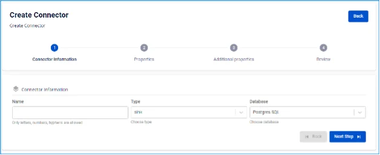
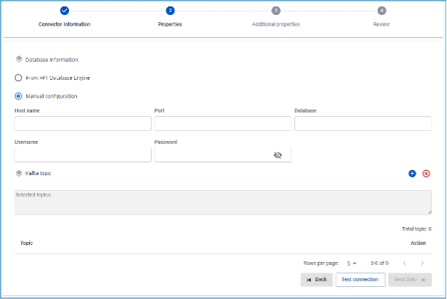
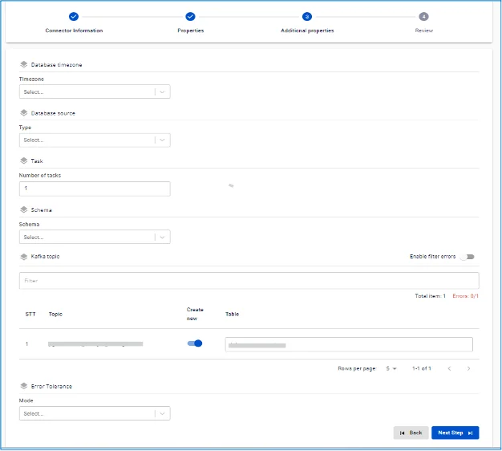
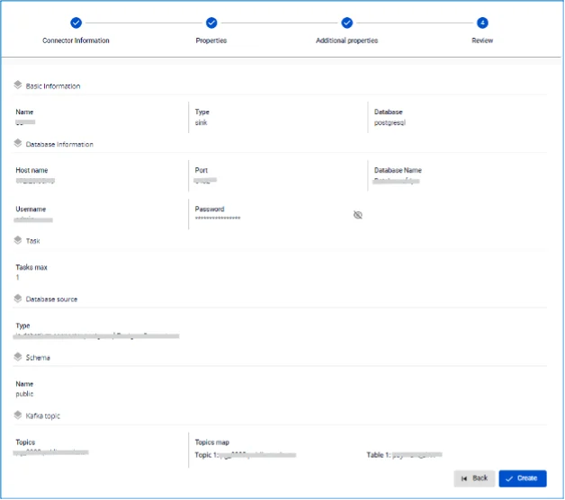

# PostgreSQL Sink Connector

コネクターの作成（Type: sink、Database: PostgreSQL）

**前提条件:** CDC service のステータスが healthy であること

## PostgreSQL 設定 - スキーマへの権限付与

```
GRANT USAGE ON SCHEMA public TO username;
    GRANT CREATE ON SCHEMA public TO username;
```

## コネクターの作成手順:

**手順 1:** メニューバーから **Data Platform** > **Workspace Management** > Workspace name を選択します。

**手順 2:** **My services** セクションで **CDC service** を選択します。

**手順 3:** **CDC service** 詳細画面 > **Connectors** タブを選択 > **Create a connector** をクリックします。 

**手順 4:** **Connector Information** 画面に以下の情報を入力します:

  * **Name**（必須）: コネクター名

注意: コネクター名には小文字のアルファベット a〜z または数字 0〜9 を使用できます。スペースは使用できません。スペースの代わりに「-」を使用してください。

  * **Type**（必須）: sink を選択

  * **Database**（必須）: PostgreSQL を選択 

**手順 5**: **Next** をクリックして **Properties** 画面に進みます。

Properties 情報を入力します:

  * **Manual configuration** を選択した場合 - 以下の項目を入力します:

    * **Database name**（必須）: データベースを選択

    * **Host Name**（必須）: PostgreSQL のホスト名または IP アドレス

    * **Port**（必須）: PostgreSQL サーバーポート、デフォルト: `5432`

    * **Database name**（必須）: コネクターがデータをシンクする対象データベース

    * **Username**（必須）: コネクターが使用するユーザー名

    * **Password**（必須）: コネクターが使用するパスワード

    * `(+)` ボタンをクリックして、コネクターが消費してターゲットデータベースにシンクするトピックの一覧を取得します（カンマ「,」区切り）。

注意: 取得できるトピックは最大 100 件です。 

  * **From Database Engine** を選択した場合 - 以下の項目を入力します:

    * **Host Name**（必須）: PostgreSQL のホスト名または IP アドレス

    * **Port**（必須）: PostgreSQL サーバーポート、デフォルト: `5432`

    * **Database name**（必須）: コネクターがデータをシンクする対象データベース

    * **Username**（必須）: コネクターが使用するユーザー名

    * **Password**（必須）: コネクターが使用するパスワード

    * (+) ボタンをクリックして、コネクターが消費してターゲットデータベースにシンクするトピックの一覧を取得します（カンマ「,」区切り）。

注意: 取得できるトピックは最大 100 件です。 

  * **Test connection** をクリックして、Workspace から入力したデータベースへの接続を確認します。

  * **Converter**

    * **Converter key**: コンバーターのキー値を選択

    * **Converter key schema enable**: Converter key でスキーマを使用するかどうかを選択

    * **Converter value**: コンバーターの値を選択

    * **Converter value schema enable**: Converter value でスキーマを使用するかどうかを選択

**手順 6:** **Next** をクリックして **Additional Properties** 画面に進みます。

以下の情報を入力します:

  * **Timezone:** ソースデータベースのデータに適したタイムゾーンを選択

  * **Task max:** 同時に処理するタスク数

  * **Type:** ソースデータベースの種類を選択

  * **Name**: スキーマ名

  * **Create new table**: デフォルトは ON

  * **Enable filter errors**: デフォルトは OFF

注意: エラーのあるテーブル名をフィルタリングするには、Enable filter error にチェックを入れてください。

  * **Mode**（必須）: メッセージを処理できない場合のコネクターの動作

    * **None**: データベースにシンクできないメッセージはスキップされます。

    * **All**: エラーメッセージは指定のトピックに送信されます。 

**手順 7**: **Next** をクリックして **Review** 画面に進みます。 

**手順 8:** 情報を確認し、**Create** をクリックしてコネクターの作成を完了します。
