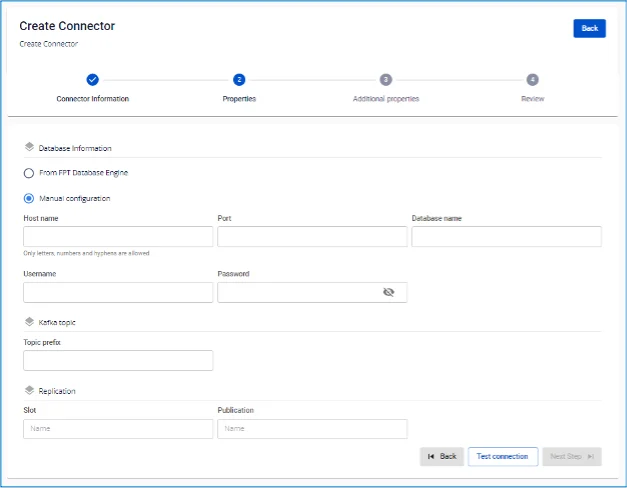

# PostgreSQL Source Connector

**コネクターの作成: Type は source、Database は PostgreSQL**

**前提条件:** CDC service のステータスが Healthy であること。

## PostgreSQL 設定

**1**. _pgoutput_ は Postgres クラスターの _wal_level_ 設定を logical に変更する必要があります。また、_hot_ または _warm_ レプリカではなく、_プライマリで CDC を実行する必要があります_。

  * 設定を確認するには:

```
SHOW wal_level;
```

  * 設定を変更するには、Postgres で以下のコマンドを実行し、設定変更後にサービスを再起動してください:

```
ALTER SYSTEM SET wal_level = 'logical';
```

**2**. **PostgreSQL source connector には最低限 REPLICATION ロールが必要です。**

  * SuperUser を使用する場合は、手順 5 に進んでください。
  * ユーザーが SuperUser かどうかを確認するには:

```
SELECT rolsuper FROM pg_roles WHERE rolname = '<USER_NAME>';
```

  * そうでない場合は、REPLICATION ロールを持つユーザーを作成できます:

```
CREATE USER <USER_NAME> WITH REPLICATION LOGIN PASSWORD '<PASSWORD>';
```

  3. **Publication の作成:**

     * **注意:** 以下の操作は superuser 権限で実行してください。`<PUBLICATION_NAME>` の値として、FPTCloud は小文字のアルファベットのみを含む文字列を受け付けます。
     * すべてのテーブルに対して Publication を作成します:

```
CREATE PUBLICATION <PUBLICATION_NAME> FOR ALL TABLES;
```

     * 既存の Publication を確認します:

```
SELECT * FROM pg_publication;
```

     * 特定のテーブルに対して Publication を作成します:

```
CREATE PUBLICATION <PUBLICATION_NAME> FOR TABLE <SCHEMA1>.<TABLE1>, <SCHEMA2>.<TABLE2>, ...;
```

     * Publication にテーブルを追加します:

```
ALTER PUBLICATION <PUBLICATION_NAME> ADD TABLE <SCHEMA1>.<TABLE1>, <SCHEMA2>.<TABLE2>, ...;
```

     * Publication からテーブルを削除します:

```
ALTER PUBLICATION <PUBLICATION_NAME> DROP TABLE <SCHEMA1>.<TABLE1>, <SCHEMA2>.<TABLE2>, ...;
```

     * Publication を削除します:

```
DROP PUBLICATION <PUBLICATION_NAME>;
```

  4. **使用するユーザーにテーブルの SELECT 権限を付与します:**

     * 1 つのテーブルに SELECT 権限を付与します:

```
GRANT SELECT ON TABLE '<SCHEMA_NAME>.<TABLE_NAME>' TO <USER_NAME>;
```

     * またはスキーマ内のすべてのテーブルに権限を付与します:

```
DO $$
           DECLARE
            table_record RECORD;
           BEGIN
            FOR table_record IN
                SELECT table_name
                FROM information_schema.tables
                WHERE table_schema = '<SCHEMA_NAME>' AND table_type = 'BASE TABLE'
            LOOP
                EXECUTE 'GRANT SELECT ON TABLE <SCHEMA_NAME>."' || table_record.table_name || '" TO <USER_NAME>;';
            END LOOP;
           END $$;
```

  5. **Capture Data Change が必要なテーブルの REPLICA IDENTITY レベルを変更します。**

     * この設定変更により、データ変更イベントに変更前後の完全な情報が含まれるようになります:

```
ALTER TABLE your_schema_name.your_table_name REPLICA IDENTITY FULL;
```

     * またはスキーマ内のすべてのテーブルに適用します:

```
DO $$
           DECLARE
            table_record RECORD;
           BEGIN
            FOR table_record IN
                SELECT table_name
                FROM information_schema.tables
                WHERE table_schema = '<SCHEMA_NAME>' AND table_type = 'BASE TABLE'
            LOOP
                EXECUTE 'ALTER TABLE <SCHEMA_NAME>."' || table_record.table_name || '" REPLICA IDENTITY FULL;';
            END LOOP;
           END $$;
```

  6. **コネクターは、UI から入力された slot.name の値を持つ replication_slot を自動作成またはで再利用します**。これにより、wal_log（write-ahead log）の変更を監視します。

     * replication_slot の最大数を確認します:

```
show max_replication_slots;
```

     * 現在の replication_slot を確認します:

```
SELECT slot_name, plugin, slot_type, database, active FROM pg_replication_slots;
```

     * 非アクティブな replication_slot を削除するには:

```
SELECT pg_drop_replication_slot('<REPLICATION_SLOT_NAME>');
```

  7. **コネクターを削除するときは、replication_slot と publication を削除してください:**

     * replication_slot を削除します:

```
SELECT pg_drop_replication_slot('<REPLICATION_SLOT_NAME>');
```

     * publication を削除します:

```
DROP PUBLICATION <PUBLICATION_NAME>;
```

  8. **max_replication_slots の設定を変更する場合**は、_postgres.conf_ ファイルでこの設定を変更してください。

* * *

## コネクターの作成手順:

コネクターを作成するには、以下の手順を実行してください:

**手順 1:** メニューバーから **Data Platform > Workspace Management > Workspace name** を選択します。

**手順 2:** **My services** セクションで **CDC service** を選択します。

**手順 3**. **CDC service** 詳細画面で、_Connectors_ タブを選択して _Create a connector_ をクリックします。 

**手順 4** **Connector Information** 画面に以下の情報を入力します:

  * **Name（必須）:** コネクター名。注意: コネクター名には小文字のアルファベット a〜z または数字 0〜9 を使用できます。スペースは使用できません。スペースの代わりに「-」を使用してください。

  * **Type（必須）:** _source_ を選択。

  * **Database（必須）:** _PostgreSQL_ を選択。 

**手順 5:** **Next をクリックして Properties 画面に進み**、以下の情報を入力します:

  * **From FPT Database Engine** を選択した場合: - 以下の項目を入力します:

    * **Database（必須）:** データベースを選択。

    * **Host Name（必須）:** Postgres サーバーのホスト名または IP アドレス。

    * **Port（必須）:** Postgres サーバーポート、デフォルトは 5432。

    * **Database name（必須）:** コネクターがデータ変更を監視するデータベース。

    * **Username（必須）:** コネクターが使用する Postgres ユーザー。

    * **Password（必須）:** パスワード。

    * **Topic prefix（必須）:** データが変更されると、変更イベントが Kafka トピックに produce されます。トピック名は [topic.prefix].[schema_name].[table_name] の形式になります。

例: topic prefix: syncdata、schema: inventory、テーブル: customer、order、item。コネクターはデータ変更を Kafka トピック syncdata.inventory.customer、syncdata.inventory.order、syncdata.inventory.item に記録します。)

    * **Slot（必須）:** コネクターが使用する replication slot。値は小文字のアルファベットのみを受け付けます。

    * **Publication（必須）:** コネクターが使用する publication。値は小文字のアルファベットのみを受け付けます。

  * **Manual configuration** を選択した場合 - 以下の項目を入力します:

    * **Host Name（必須）:** Postgres サーバーのホスト名または IP アドレス

    * **Port（必須）:** Postgres サーバーポート、デフォルトは 5432

    * **Database name（必須）:** コネクターがデータ変更を監視するデータベース

    * **Username（必須）:** コネクターが使用する Postgres ユーザー

    * **Password（必須）:** パスワード

    * **Topic prefix（必須）:** データが変更されると、変更イベントが Kafka トピックに produce されます。トピック名は [topic.prefix].[schema_name].[table_name] の形式になります。例: topic prefix: syncdata、schema: inventory、テーブル: customer、order、item。コネクターはデータ変更を Kafka トピック syncdata.inventory.customer、syncdata.inventory.order、syncdata.inventory.item に記録します。)

    * **Slot（必須）:** コネクターが使用する replication slot。値は小文字のアルファベットのみを受け付けます。

    * **Publication（必須）:** コネクターが使用する publication。値は小文字のアルファベットのみを受け付けます。 

    * **Enable incremental snapshot**（任意）: コネクターの incremental snapshot 機能を有効にするチェックボックス

      * source connector のみに表示されます: **MySQL、MariaDB、PostgreSQL**
        * このチェックボックスにチェックを入れて「Test connection」をクリックすると、システムは以下を確認します:
        * データベースに snapshot を実行するための十分な権限があるか（PostgreSQL/MySQL では INSERT、CREATE TABLE 権限が必要）
        * 権限が不足している場合、詳細なエラーメッセージが表示されます
        * 権限が十分な場合、「Test connection successfully」が表示されます
        * このチェックボックスにチェックを入れてコネクターが正常に作成された後:
        * コネクターには incremental snapshot 管理機能が追加されます
        * List Connector 画面に「Snapshot Status」列が表示されます
        * Actions メニューから Execute、Pause、Resume、Stop snapshot の操作が可能になります

**Test connection** をクリックして **Workspace** から入力したデータベースへの接続を確認します。

**手順 6:** Next をクリックして **Additional Properties** 画面に進み、以下の情報を入力します:

  * **Mode（必須）:** コネクターの動作。以下のモードから選択します:

    * **Initial（デフォルト）:** コネクターはテーブル内の既存データをすべて snapshot し、その後これらのテーブルでのデータ変更のキャプチャを継続します。

    * **Initial_only:** コネクターはテーブル内の既存データのみ snapshot し、その後テーブルのデータ変更イベントを監視しません。

    * **No_data:** コネクターはテーブルの既存データを snapshot せず、テーブルのデータ変更イベントのみを監視します。 

「+」をクリックしてスキーマとテーブルの情報を取得します。 

:::warning
最大選択数は 100 テーブルです
:::

**手順 7:** **Next をクリックして Review 画面に進み**、情報を確認します。 

**手順 8:** 情報を確認し、**Create** をクリックしてコネクターの作成を完了します。
