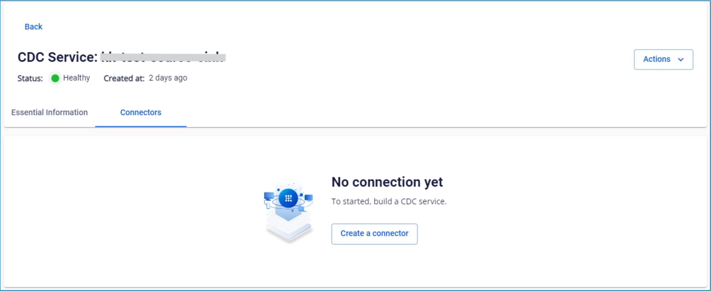
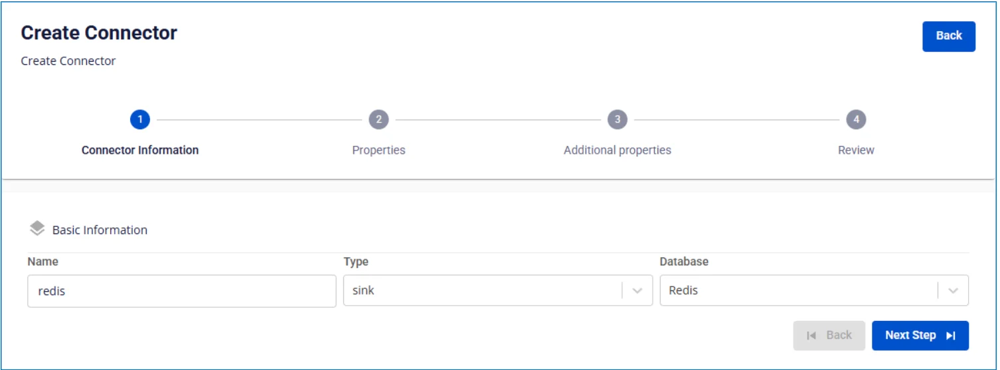

# Redis Sink Connector

コネクターの作成（Type: sink、Database: Redis）

前提条件: CDC service のステータスが healthy であること

**手順 1:** メニューバーから **Data Platform** > **Workspace Management** > **Workspace name** を選択します。

**手順 2:** **My services** セクションで **CDC service** を選択します。

**手順 3:** **CDC service** 詳細画面 > **Connectors** タブを選択 > **Create a connector** をクリックします。

**手順 4:** **Connector Information** 画面に以下の情報を入力します:

  * **Name**（必須）: コネクター名

注意: コネクター名には小文字のアルファベット a〜z または数字 0〜9 を使用できます。スペースは使用できません。スペースの代わりに「-」を使用してください。

  * **Type**（必須）: **sink** を選択

  * **Database**（必須）: **Redis** を選択

**手順 5**: **Next** をクリックして **Properties** 画面に進みます。

以下の情報を入力します:

  * **Database information**

    * **URL**（必須）: データベース接続アドレスを入力

    * **Username**（必須）: ユーザー名

    * **Password**（必須）: パスワード

**Test connection** をクリックして、Workspace から入力したデータベースへの接続を確認します。

  * **Converter**

    * **Converter key**: コンバーターのキー値を選択

    * **Converter key schema enable**: Converter key でスキーマを使用するかどうかを選択

    * **Converter value**: コンバーターの値を選択

    * **Converter value schema enable**: Converter value でスキーマを使用するかどうかを選択

  * **Kafka topic**

    * **Topics**（必須）: source connector からデータが送信されるトピックを選択

**手順 6:** **Next** をクリックして **Additional Properties** 画面に進みます。

以下の情報を入力します:

  * **Number of tasks**: 並列実行できるタスクの最大数

  * **Command**: データを保存するコマンドを選択

  * **Mode**: メッセージを処理できない場合のコネクターの動作

  * **None**: エラーが発生した場合、コネクターは処理を停止します。

**手順 7:** **Next** をクリックして **Review** 画面に進みます。

**手順 8:** 情報を確認し、**Create** をクリックしてコネクターの作成を完了します。
