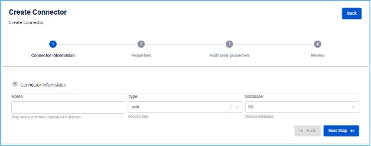

# S3 Sink Connector

コネクターの作成（Type: sink、Database: S3）

**前提条件:** CDC service のステータスが Healthy であること

## コネクターの作成手順:

**手順 1:** メニューバーから **Data Platform** > **Workspace Management** > **Workspace name** を選択します。

**手順 2:** **My services** セクションで **CDC service** を選択します。

**手順 3:** **CDC service** 詳細画面 > **Connectors** タブを選択 > **Create a connector** をクリックします。

**手順 4:** **Connector Information** 画面に以下の情報を入力します:

  * **Name**（必須）: コネクター名

注意: コネクター名には小文字のアルファベット a〜z または数字 0〜9 を使用できます。スペースは使用できません。スペースの代わりに「-」を使用してください。

  * **Type**（必須）: **sink** を選択

  * **Database**（必須）: **S3** を選択 

**手順 5:** 画面右上の **Next** をクリックして **Properties** 画面に進みます。

  * **S3 Storage**

**S3 storage** の情報を入力します:

    * **Endpoint:** S3 storage のアクセスアドレス

    * **Access key:** アクセスキー

    * **Secret:** アクセスシークレット

    * **Bucket name:** バケット名

    * **Path prefix:** ストレージ内のフォルダへのパス

**Test Connection** をクリックして、Workspace から入力した S3 への接続を確認します。

  * **Converter**

    * **Converter key**: コンバーターのキー値を選択

    * **Converter key schema enable**: Converter key でスキーマを使用するかどうかを選択

    * **Converter value**: コンバーターの値を選択

    * **Converter value schema enable**: Converter value でスキーマを使用するかどうかを選択

  * **Kafka topic**

    * 「+」ボタンをクリックしてトピック情報を取得します。

    * 注意: 取得できるトピックは最大 100 件です。 

**手順 6**: **Next** をクリックして **Additional Properties** 画面に進みます。

  * **Number of tasks**: 並列実行できるタスクの最大数

  * **Database type**: ソースデータベースの種類を選択

  * **Timezone**: タイムゾーンを選択

  * **File format**: ファイル形式を選択

  * **Mode**: モードを選択 

**手順 7**: 画面右上の **Next** をクリックして **Review** 画面に進みます。 

**手順 8**: 情報を確認し、**Create** をクリックしてコネクターの作成を完了します。
