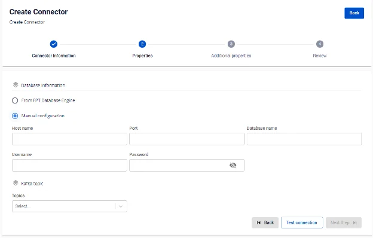
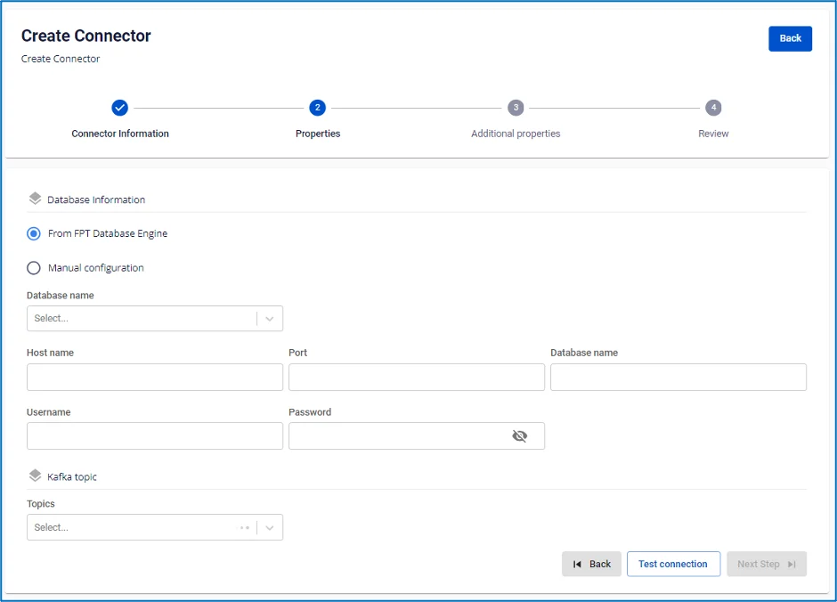

# SQL Server Sink Connector

**コネクターの作成（Type: sink、Database: SQL Server）**

**前提条件:** CDC service のステータスが healthy であること

## コネクターの作成手順:

**手順 1:** メニューバーから **Data Platform** > **Workspace Management** > **Workspace name** を選択します。

**手順 2:** **My services** セクションで **CDC service** を選択します。

**手順 3:** **CDC service** 詳細画面 > **Connectors** タブを選択 > **Create a connector** をクリックします。 

**手順 4:** **Connector Information** 画面に以下の情報を入力します:

  * **Name（必須）:** コネクター名

注意: コネクター名には小文字のアルファベット a〜z または数字 0〜9 を使用できます。スペースは使用できません。スペースの代わりに「-」を使用してください。

  * **Type**（**必須**）: sink を選択

  * **Database（必須）:** **SQL server** を選択 

**手順 5**: **Next** をクリックして **Properties** 画面に進みます。

**Properties** 情報を入力します:

  * **Manual configuration** を選択した場合 - 以下の項目を入力します:

    * **Host Name**（必須）: SQL Server のホスト名または IP アドレス

    * **Port**（必須）: SQL Server ポート、デフォルト: `1433`

    * **Database name**（必須）: コネクターがデータをシンクする対象データベース

    * **Username**（必須）: コネクターが使用するユーザー名

    * **Password**（必須）: コネクターが使用するパスワード

    * **Topics**（必須）: コネクターが消費してターゲットデータベースにシンクするトピックの一覧（カンマ「,」区切り） 

  * **From Database Engine** を選択した場合 - 以下の項目を入力します:

    * **Database name**（必須）: データベース名

    * **Host Name（必須）:** SQL Server のホスト名または IP アドレス

    * **Port（必須）:** SQL Server ポート、デフォルト: `1433`

    * **Database name（必須）:** コネクターがデータをシンクする対象データベース

    * **Username（必須）:** コネクターが使用するユーザー名

    * **Password（必須）:** コネクターが使用するパスワード

    * **Topics（必須）:** コネクターが消費してターゲットデータベースにシンクするトピックの一覧（カンマ「,」区切り） 

  * **Test connection** をクリックして、Workspace から入力したデータベースへの接続を確認します。

  * **Converter**

    * **Converter key**: コンバーターのキー値を選択

    * **Converter key schema enable**: Converter key でスキーマを使用するかどうかを選択

    * **Converter value**: コンバーターの値を選択

    * **Converter value schema enable**: Converter value でスキーマを使用するかどうかを選択

**手順 6:** **Next** をクリックして **Additional Properties** 画面に進みます。

以下の情報を入力します:

  * **Timezone:** ソースデータベースのデータに適したタイムゾーンを選択

  * **Task max**: 同時に処理するタスク数

  * **Type**: ソースデータベースの種類を選択

  * **Name**: スキーマ名

  * **Topic 1**: source connector から監視するトピック名

  * **Table 1:** source connector からデータ変更を監視するテーブル名

  * **Mode**（必須）**:** メッセージを処理できない場合のコネクターの動作

    * **None**: データベースにシンクできないメッセージはスキップされます。

    * **All**: エラーメッセージは指定のトピックに送信されます。 

**手順 7**: **Next** をクリックして **Review** 画面に進みます。 

**手順 8:** 情報を確認し、**Create** をクリックしてコネクターの作成を完了します。
