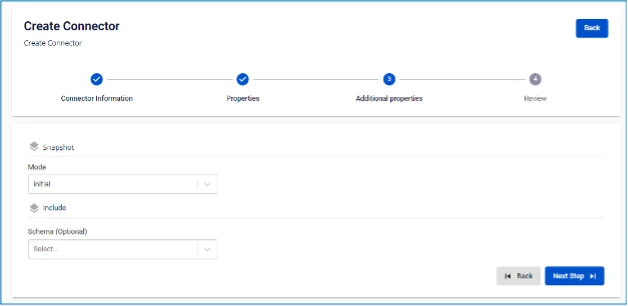

# SQL Server Source Connector

**コネクターの作成（Type: source、Database: SQL Server）**

**前提条件:** CDC service のステータスが healthy であること

**SQL Server source connector** は、SQL Server 2016 以降の Standard または Enterprise エディションの change data capture 機能に基づいています。

## SQL Server の設定

**前提条件:**

  * sysadmin 権限でタスクを実行してください。

  * db_owner 権限でデータベースのタスクを実行してください。

**1.** **SQL Server で CDC を実行する**には、まず **SQL Server Agent** を _有効にする_ 必要があります。

  * 詳細については、[Configure SQL Server Agent](<https://learn.microsoft.com/en-us/sql/ssms/agent/configure-sql-server-agent?view=sql-server-ver16#to-configure-sql-server-agent>) および [Install SQL Server Agent](<https://learn.microsoft.com/en-us/sql/linux/sql-server-linux-setup-sql-agent?view=sql-server-ver16&tabs=rhel>) を参照してください。

  * FPTCloud のサービスをご利用の場合は、サポートにお問い合わせください。

**2.** SQL Server ユーザーを作成します:

```
CREATE LOGIN <YOUR_USERNAME> WITH PASSWORD = '<YOUR_PASSWORD>';
        CREATE USER <YOUR_USERNAME> FOR LOGIN <YOUR_USERNAME>;
```

**3.** 任意 - CDC 用のロールを作成します:

  * コネクターは sysadmin または dbowner を使用できます。ただし、より高いセキュリティレベルを望む場合は、このユーザー用に新しいロールを作成できます。

```
CREATE ROLE <YOUR_ROLE_NAME>;
```

  * ユーザーをロールに追加します:

```
ALTER ROLE <YOUR_ROLE_NAME> ADD MEMBER <YOUR_USERNAME>;
```

**4.** SQL Server データベースで CDC を設定します:

```
USE <YOUR_DATABASE_NAME>
        GO
        EXEC sys.sp_cdc_enable_db
        GO
```

**5.** 変更を監視するテーブルで CDC を設定します:

  * 作成したロールを使用する場合:

```
USE <YOUR_DATABASE_NAME>
        GO
        EXEC sys.sp_cdc_enable_table
        @source_schema = N'dbo',
        @source_name   = N'<YOUR_TABLE>',
        @role_name     = N'<YOUR_ROLE_NAME>',
        @supports_net_changes = 0;
        GO
```

  * sysadmin または db_owner ロールのみを使用する場合:

```
USE <YOUR_DATABASE_NAME>
        GO
        EXEC sys.sp_cdc_enable_table
        @source_schema = N'dbo',
        @source_name   = N'<YOUR_TABLE>',
        @role_name     = NULL,
        @supports_net_changes = 0;
        GO
```

**6.** CDC ユーザーの権限を確認します。注意: この操作は上記で作成したユーザーで実行してください。

```
USE <YOUR_DATABASE_NAME>
        EXEC sys.sp_cdc_help_change_data_capture;
        GO
```

## コネクターの作成手順:

コネクターを作成するには、以下の手順を実行してください。 **手順 1:** メニューバーから **Data Platform** > **Workspace Management** > **Workspace name** を選択します。

**手順 2:** **My services** セクションで **CDC service** を選択します。

**手順 3:** **CDC service** 詳細画面 > **Connectors** タブを選択 > **Create a connector** をクリックします。 

**手順 4:** **Connector Information** 画面に以下の情報を入力します:

  * **Name（必須）:** コネクター名

_注意: コネクター名には小文字のアルファベット a〜z または数字 0〜9 を使用できます。スペースは使用できません。スペースの代わりに「-」を使用してください。_

  * **Type（必須）:** source を選択

  * **Database（必須）:** SQL Server を選択 

**手順 5:** Next をクリックして **Properties** 画面に進みます。

**Properties** 情報を入力します:

  * **Manual configuration** を選択した場合 - 以下の項目を入力します:

    * **Host name（必須）:** SQL Server のホスト名または IP アドレス

    * **Port（必須）:** SQL Server ポート、デフォルト: `1433`

    * **Database name（必須）:** コネクターがデータ変更を監視するデータベース

    * **Username（必須）:** コネクターが使用するユーザー名

    * **Password（必須）:** コネクターが使用するパスワード

    * **Topics（必須）:** コネクターが消費してターゲットデータベースにシンクするトピックの一覧（カンマ「,」区切り） 

  * **From Database Engine** を選択した場合 - 以下の項目を入力します:

    * **Database name（必須）:** データベース名

    * **Host name（必須）:** SQL Server のホスト名または IP アドレス

    * **Port（必須）:** SQL Server ポート、デフォルト: `1433`

    * **Database name（必須）:** コネクターがデータ変更を監視するデータベース

    * **Username（必須）:** コネクターが使用するユーザー名

    * **Password（必須）:** コネクターが使用するパスワード

    * **Topics（必須）:** コネクターが消費してターゲットデータベースにシンクするトピックの一覧（カンマ「,」区切り） 

**Test connection** をクリックして、**Workspace** から入力したデータベースへの接続を確認します。

**手順 6:** **Next** をクリックして **Additional Properties** 画面に進みます。

  * 以下の情報を入力します:

    * **Mode（必須）:** **コネクター**の動作 - 以下のモードから選択します:

    * **Initial（デフォルト）:** コネクターはテーブル内の既存データをすべて snapshot し、その後これらのテーブルでのデータ変更のキャプチャを継続します。

    * **Initial_only:** コネクターはテーブル内の既存データのみ snapshot し、その後テーブルのデータ変更イベントを監視しません。

    * **Never:** コネクターはテーブルの既存データを snapshot せず、テーブルのデータ変更イベントのみを監視します。

    * **Schema（任意）:** 共通の特性を持つテーブルをグループ化して管理しやすくするための名前空間。

    * **Table（任意）:** スキーマ内のテーブル名

    * **Column（任意）:** テーブルから取得するデータの列名 

**手順 7:** **Next** をクリックして **Review** 画面に進みます。 

**手順 8:** 情報を確認し、**Create** をクリックしてコネクターの作成を完了します。
