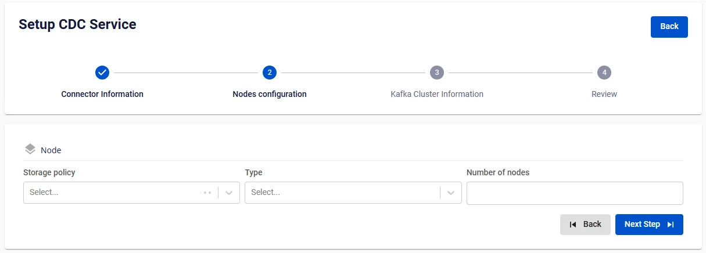
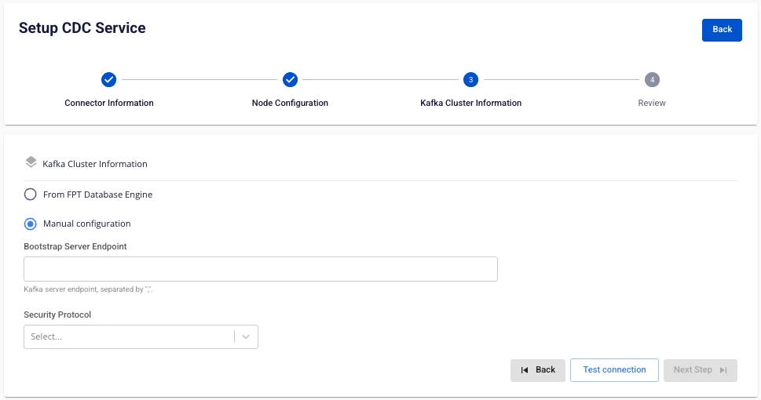
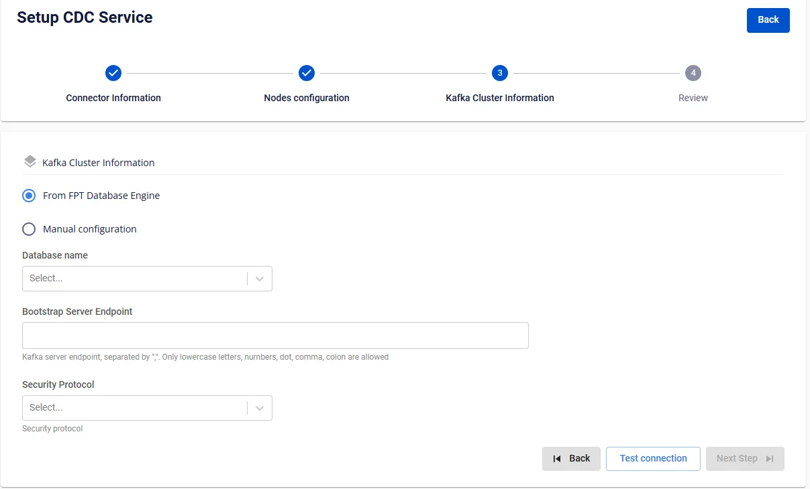
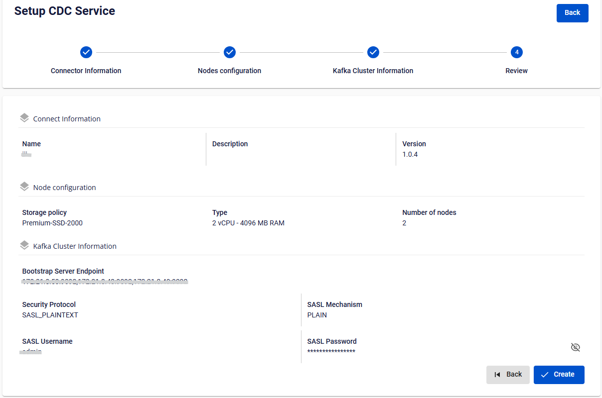

# CDC Serviceの作成

**CDC Service** は、Apache Kafkaと他のデータシステム間で大量データを低遅延、柔軟かつ信頼性高く転送するためのツールです。ユーザーはConnectorを定義することで、さまざまなデータベースとKafka間のデータ統合を簡単に行うことができます。

CDC Serviceを作成するには、以下の手順に従ってください。

**ステップ 1:** メニューバーで **Data Platform** > **Workspace Management** > **Workspace name** を選択します

**ステップ 2:** **My services** セクションで **Create** をクリック > New serviceポップアップが表示されます > **CDC service** を選択 > **Create Services** をクリック

**ステップ 3.** CDC Service作成フォームで、connector informationを入力します：

 * **Name** (必須): CDC Serviceの名前

 * 
:::warning
CDC Serviceの名前は1〜30文字で指定してください。小文字のa-z、大文字のA-Z、または数字の0-9を使用できます。Kafka connectの名前は重複して使用できません。スペースは使用できません。スペースの代わりに「-」または「_」を使用してください。
:::

 * **Description** (任意): CDC Serviceの説明

 * **Version** (必須): CDC Serviceのバージョン

**ステップ 4.** **Next Step** をクリックしてNode configurationに進みます

以下の情報を選択します：

 * **Storage policy** (必須): storage policyを選択

 * **Type** (必須): 設定タイプを選択

 * **Number of nodes**: ノード数を入力

:::warning
ノード数は2以上10以下で入力してください。
:::

**ステップ 5:** **Next** をクリックして **Kafka Cluster Information** 画面に進みます

**2つのオプションがあります：**

 * From FPT Database Engine
 * Manual configuration

**Manual configurationを選択した場合：**

以下の情報を入力・選択してください：

 * **Bootstrap server endpoint**: Bootstrap server endpointのアドレスを入力

 * **Security protocol**: 以下のセキュリティプロトコルから選択：

 * **SASL_PLAINTEXT**: UsernameとPasswordによるシンプルな認証メカニズム

 * SASL Mechanism

 * SASL Username

 * SASL Password

 * **SASL_SSL**: UsernameとPasswordによる包括的なセキュリティ層を提供し、認証とデータ暗号化を行います

 * SASL Mechanism

 * SASL Username

 * SASL Password

 * **PLAINTEXT**: ネットワーク上のデータが暗号化されずに送信されます。_使用は推奨されません_

 * **SSL**: インターネット上でのデータ転送を保護するために使用されるネットワークセキュリティプロトコル 

**From FPT Database Engineを選択した場合：**

以下の情報を入力・選択してください：

 * **Database Name (必須)**: Databaseを選択

 * **Bootstrap server endpoint**: Bootstrap server endpointのアドレスを入力

 * **Security protocol**: 以下のセキュリティプロトコルから選択：

 * **SASL_PLAINTEXT**: UsernameとPasswordによるシンプルな認証メカニズム

 * SASL Mechanism

 * SASL Username

 * SASL Password

 * **SASL_SSL**: UsernameとPasswordによる包括的なセキュリティ層を提供し、認証とデータ暗号化を行います

 * SASL Mechanism

 * SASL Username

 * SASL Password

 * **PLAINTEXT**: ネットワーク上のデータが暗号化されずに送信されます。_使用は推奨されません_

 * **SSL**: インターネット上でのデータ転送を保護するために使用されるネットワークセキュリティプロトコル 

**ステップ 6.** **Test connection** ボタンをクリックして接続を確認し、Next Stepをクリックしてreview画面に進みます

**ステップ 7.** 入力した情報を確認し、**Create** をクリックして完了します。
