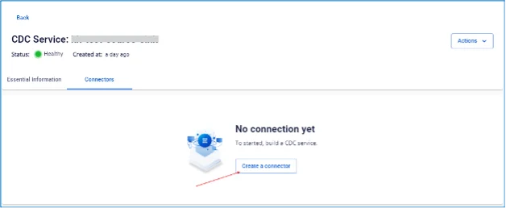

# Create connector source S3

Amazon S3 または S3 互換ストレージ（例: MinIO、FPT Object Storage など）に保存されたファイルをデータソースとして接続します。

バケット内のファイル（CSV、TSV、AVRO、XML など）からデータを自動的に読み取り、スキャンして、ストリーミングシステムまたはデータパイプラインにインジェストします。

**ユースケース: Type が source、Database が S3 のコネクターを作成します。**

**前提条件:** CDC service のステータスが **Healthy** であること

コネクターを作成するには、以下の手順を実行してください:

**手順 1:** メニューバーから **Data Platform** > **Workspace Management** > Workspace name を選択します。

**手順 2:** **My services** セクションで **CDC service** を選択します。

**手順 3:** **CDC service** 詳細画面 > **Connectors** タブを選択 > **Create a connector** をクリックします。

**手順 4:** コネクター情報を入力します:

  * **Name**（必須）: コネクター名

注意: コネクター名には小文字のアルファベット a〜z または数字 0〜9 を使用できます。スペースは使用できません。スペースの代わりに「-」を使用してください。

  * **Type**（必須）: source を選択

  * **Database**（必須）: S3 を選択

**手順 5:** **Next** をクリックして **Properties** 画面に進みます。

**Properties** 情報を入力します:

  * **URL**（必須）: アクセスアドレス

  * **Bucket name**（必須）: バケット名

  * **Access key**（必須）: アクセスキー

  * **Secret**（必須）: アクセスシークレット

  * **Path**（必須）: ソースファイルが格納されているディレクトリ

**S3 Information** をすべて入力した後、**Test connection** をクリックして **Connector** から入力した **S3** への接続を確認します。

  * **Topic prefix（必須）:** データが変更されると、変更イベントが Kafka トピックに produce されます。

**手順 6:** **Next** をクリックして **Additional properties** 画面に進みます。

**Additional properties** 情報を入力します:

  * **Type（必須）**: コネクターが読み取るファイル形式を選択します。一般的な選択肢: ROW（CSV、TSV）、XML、Avro

  * **File filter regex pattern（必須）**: ソースをスキャンする際にファイル名でフィルタリングする正規表現を入力します（例: .*.csv$ は .csv で終わるファイルのみを受け付けます）。

  * **Mode（必須）**: データ処理時のエラー許容モードを選択します。

    * None: エラーをスキップせず、エラー発生時に停止します。

    * All: すべてのエラーをスキップし、ログに記録します。

  * **Header definition（必須）**:

入力データの列名を決定する方法を選択します。

    * **From file（必須）:** ファイルの最初の行から列名を取得します。

    * **Autogenerated（必須）:** 列名を自動生成します（通常 column1、column2 など）。

    * **User provided（必須）:** 下の「Column name」セクションに列名の一覧を手動で入力します。

  * **Delimiter（必須）**: 列の区切り文字。通常のデフォルトはカンマ「,」ですが、別の文字（例: タブ、セミコロンなど）に変更できます。

  * **Trim value（必須）**: 各列の値の先頭・末尾の余分な空白を削除するかどうかを Yes/No で選択します。

  * **Column name（必須）:**

    * Header definition = User provided を選択した場合のみ表示されます。

    * データ列名の一覧を入力・作成します（各列名はカンマまたは改行で区切ります。「+」または「Tag」ボタンを使って 1 つずつ追加することもできます）。

**手順 7:** **Next** をクリックして **Review** 画面に進みます。

**手順 8:** 情報を確認し、**Create** をクリックしてコネクターの作成を完了します。
