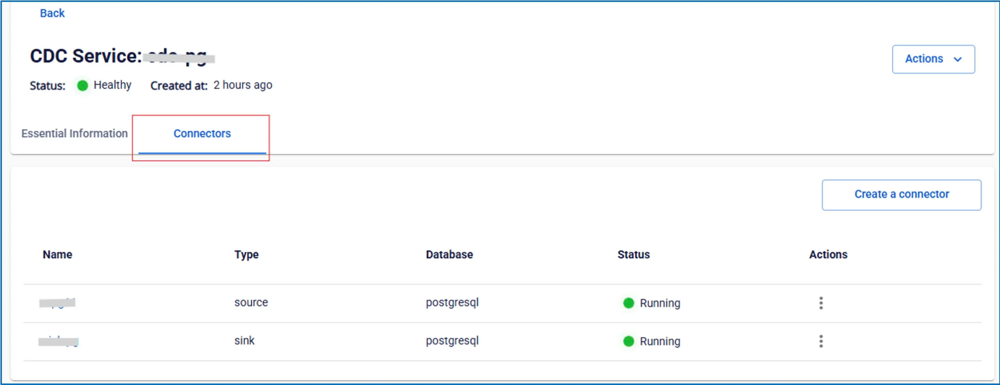

# CDC Service詳細の表示

**CDC Serviceの詳細を表示するには、以下の手順に従ってください：**

 * **ステップ 1:** メニューバーで **Data Platform** > **Workspace Management** > **Workspace name** を選択します

 * **ステップ 2:** **My services** セクションで **CDC service** をクリックします

 * **ステップ 3:** 画面に以下の一般情報が表示されます：

 * **Status**: サービスのステータス

 * **Created at**: サービスの作成日時

画面には2つのタブが表示されます：**Essential Information**、**Connectors**

 * **Essential Informationタブ**

CDC serviceの詳細情報を表示します 

 * **Connectorsタブ**

sourceからデータを取得するか、sinkにデータを書き込むために設定されたconnectorのリストを表示します 
