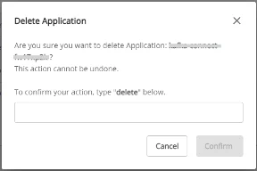

# CDC Serviceの削除

**CDC Serviceを削除するには、以下の手順に従ってください：**

 * **ステップ 1:** メニューバーで **Data Platform** > **Workspace Management** > **Workspace name** を選択します

 * **ステップ 2:** **My services** セクションで **CDC service** を選択します

または、CDC serviceに直接アクセスすることもできます：

メニューバーで **Data Platform** > **CDC service** を選択 > **CDC service name** をクリック

 * **ステップ 3:** **Detail CDC service** 画面で **CDC service name** を選択 > **Action** を選択 > **Delete** をクリックします 

 * **ステップ 4:** **Delete Application** ダイアログが表示されます

→ **delete** と入力 > **Confirm** をクリックしてワークスペースからサービスを削除します

→ **Cancel** をクリックして操作をキャンセルします 
