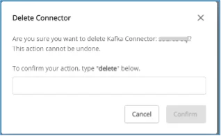

# Delete connector

**前提条件: コネクターが STOPPED 状態であること**

コネクターを削除するには、以下の手順を実行してください:

  * **手順 1:** メニューバーから **Data Platform** > **Workspace Management** > **Workspace name** を選択します。

  * **手順 2:** **My services** セクションで **CDC service** を選択します。

  * **手順 3:** **CDC service** 詳細画面 > **Connectors** タブを選択 > コネクター名を選択 > Action を選択 > **Delete** を選択します。 

  * **手順 4:** **Delete connector** ダイアログが表示されます > **Delete** と入力 > **Confirm** をクリックしてコネクターを削除します > **Cancel** を選択して操作をキャンセルします。 
