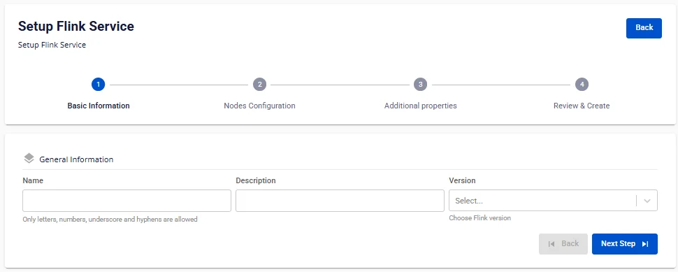
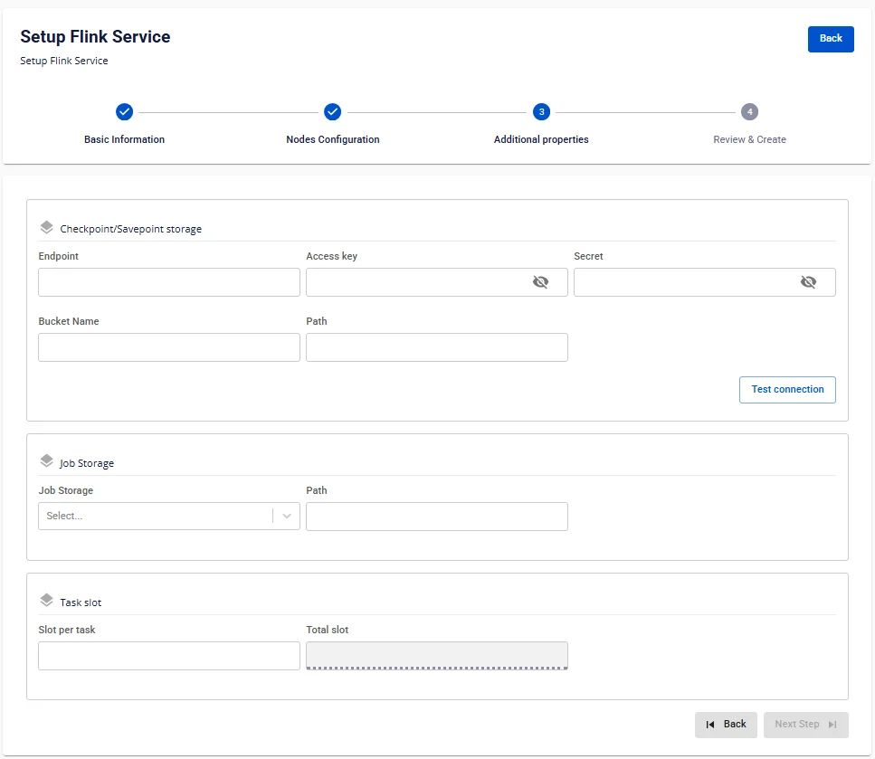

# Apache Flinkの作成

**Flink** を作成するには、以下の手順に従ってください。

**ステップ 1：** メニューバーで **Data Platform** > **Workspace Management** を選択し、**Workspace name** を選択します。

**ステップ 2：** **Create** をクリック > **New Service** ポップアップが表示されたら **Flink** を選択し、**Create** をクリックします。

**ステップ 3：** **Flink** 作成フォームで **Basic Information** を入力します。

 * **Name**（必須）：サービス名

注意：Apache サービス名は英小文字 a-z、英大文字 A-Z、数字 0-9 を使用できます。スペースは使用できません。代わりに「-」または「_」を使用してください。

 * **Description**（任意）：説明

 * **Version**（必須）：バージョンを選択します。

**ステップ 4：** **Next Step** をクリックして **Nodes Configuration** 情報入力画面に進みます。

以下の情報を入力します。

**Job manager**

 * **Storage policy**（必須）：Storage Policy を選択します。

 * **Type**：デフォルトは Medium-4（2 CPU – 4 GB RAM）

 * **Number of nodes**：デフォルト値は 2

**Task manager**

 * **Storage policy**（必須）：Storage Policy を選択します。

 * **Type**（必須）：設定を選択します。

 * **Number of nodes**：ノード数を入力します。

:::warning
ノード数は 1 以上 10 以下である必要があります。
:::

**Flink** の **Worker** 設定を自動的にスケールさせたい場合は、**Enable worker auto scaling** をチェックし、**Worker** の最大ノード数を入力します。

:::warning
最大ノード数は **Number of nodes** より大きく、10 以下である必要があります。
:::

**ステップ 5：** **Next Step** をクリックして **Additional Properties** 画面に進みます。

以下の情報を入力します。

**Checkpoint/Savepoint storage**（ストリーミングアプリケーションの状態を保存）：

 * **Endpoint：** エンドポイント情報を入力します。

 * **Access key：** アクセスキーを入力します。

 * **Secret：** シークレットキーを入力します。

 * **Bucket name：** バケット名を入力します。

 * **Path：** パスを入力します。

**Test Connection** をクリックして **Workspace** から **Storage** への接続を確認します。

**Job Storage**（*.jar ジョブファイルを格納。S3 に直接ジョブをアップロードできます）：

 * **Job Storage**：Workspace にマウントされた Storage を選択します。

 * **Path**：ファイルのパスを入力します。

**Task slot**

 * **Slot per task**：Slot per task 数を入力します。

:::warning
**Slot per task** 数は 1 以上 4 以下である必要があります。
:::

 * **Total slot：** Total slot 数は Slot per task 数に依存します。

 * **Custom Domain**

   * **目的：** サービスへのアクセスにカスタムドメインを設定できます。

   * **Public Workspace の場合：** TLS の有効/無効を切り替えることなく、ドメインと証明書を割り当てるために使用します（HTTPS は常に利用可能）。

   * **Private Workspace の場合：** ドメインと証明書に加え、TLS/SSL を有効または無効にして HTTPS か HTTP かを選択できます。

   * **Public Workspace**

     * **Custom domain**：カスタムドメインを有効にするにはチェックを入れます。

     * **Domain**：ドメイン名を入力します（例：abc.local、jupyter.example.com）。

     * **Certificate name**：**Certificate Manager** でインポートした証明書リストから選択します。

     * **ボタン**：

     * **Manage certificate**：証明書管理画面を開きます。

     * **Validate**：ドメインに対して証明書が有効かどうかを確認します。

:::note
Public Workspace では **TLS/SSL certificate** オプションは**表示されません** — システムはデフォルトで HTTPS をサポートします。
:::

   * **Private Workspace**

     * **Custom domain**：カスタムドメインを有効にするにはチェックを入れます。

     * **Domain**：ドメイン名を入力します。

     * **TLS/SSL certificate**：サービスの HTTPS を有効にするにはチェックを入れます。

     * **Certificate name**：証明書リストから選択します。

     * **ボタン**：

     * **Manage certificate**：証明書管理を開きます。

     * **Validate**：証明書を確認します。

:::note
**TLS/SSL certificate** のチェックを外すと、サービスは HTTP で動作し、証明書は不要です。
:::

**ステップ 6：** **Next Step** をクリックして **Review & Create** 画面に進みます。

**ステップ 7.** 入力情報を確認し、**Create** をクリックして **Apache Flink** の初期化を完了します。

**Worker Status** が **Succeeded** かつ **Flink** の **Status** が **Healthy** になれば、**Apache Flink** の初期化は完了です（約 10 分）。
