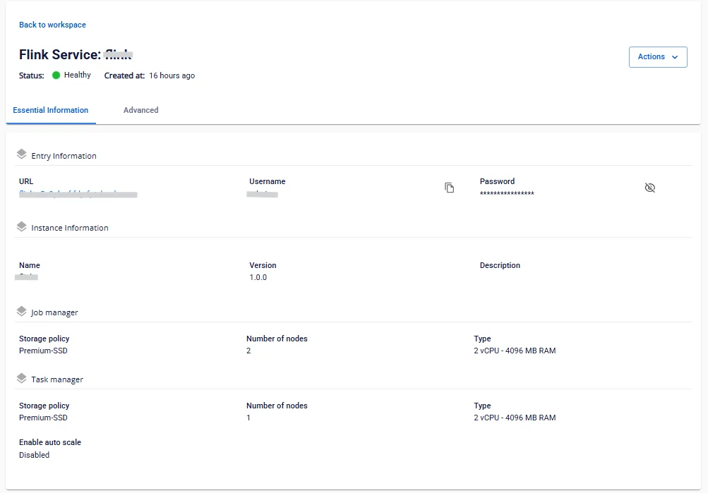

# Apache Flink情報の確認

**Flink** の情報を確認するには、以下の手順に従ってください。

**ステップ 1：** メニューバーで **Data Platform** > **Workspace Management** を選択し、**Workspace name** を選択します。

**ステップ 2：** **My Service** セクションで **Flink** を選択します。

**Essential Information** タブ

Flink の基本情報が表示されます：**Entry Information、Instance Information、Job manager、Task manager**

表示された **URL**、**Username**、**Password** を使用して **Apache Flink** にアクセスします。

**Advanced**

**Checkpoint/Savepoint storage**、**Job Storage**、**Task slot** の情報が表示されます。
