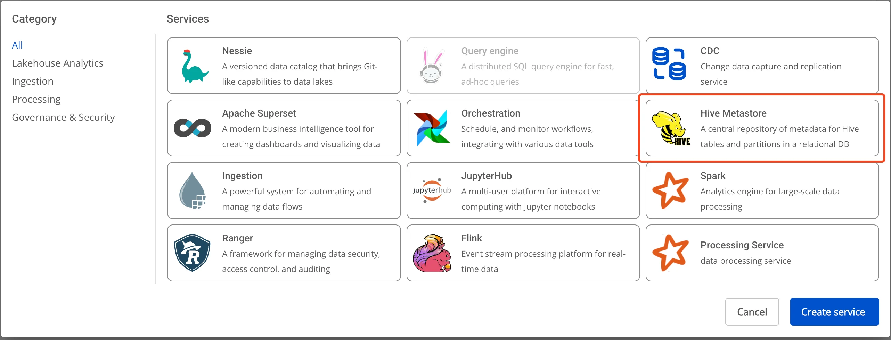
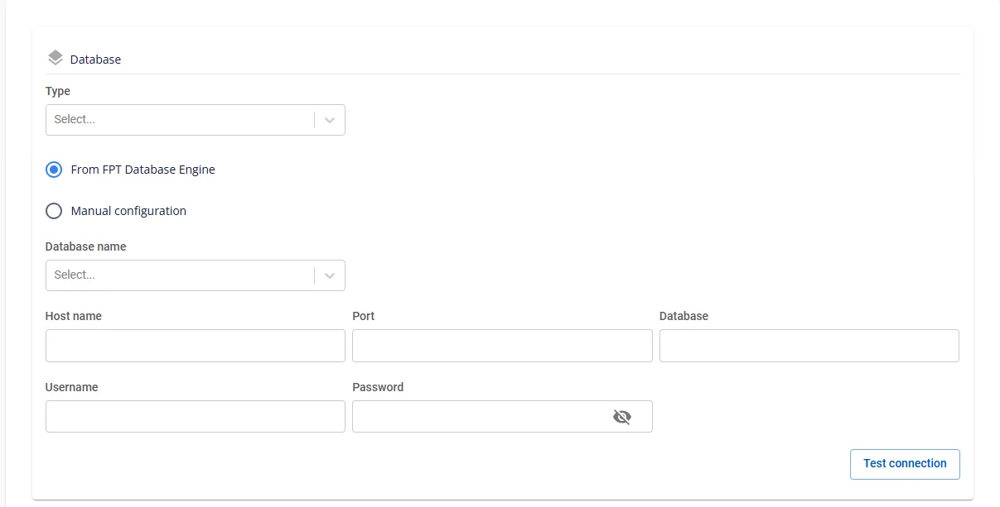

# Hive Metastoreの作成

**Hive Metastore** は、Lakehouse アーキテクチャにおいてメタデータを保存するためのコアコンポーネントです。テーブル、スキーマ、パーティション、およびデータの場所に関する情報を提供し、**Apache Spark**、**Trino**、**Presto** などのツールがデータを効率的に理解・アクセスできるようにします。

**Hive Metastore** を作成するには、以下の手順に従ってください。

**ステップ 1：** メニューバーで **Data Platform** > **Workspace Management** を選択し、**Workspace name** を選択します。

**ステップ 2：** **My services** セクションで **Create** をクリック > **New Service** ポップアップが表示されたら **Hive Metastore** を選択し、**Create** をクリックします。

**ステップ 3：** **Hive Metastore** 作成フォームで **Basic Information** を入力します。

 * **Name**（必須）：サービス名

注意：サービス名は 1〜30 文字である必要があります。英小文字 a-z、英大文字 A-Z、数字 0-9 を使用できます。

 * **Description**（任意）：説明

 * **Version**（必須）：バージョンを選択します。

**ステップ 4.** **Next** をクリックして **Node configuration** 画面に進みます。

以下の情報を入力します。

 * **Storage policy**（必須）：**Storage Policy** を選択します。

 * **Type**（必須）：リソース設定を選択します。

**ステップ 5.** **Next** をクリックして **Additional properties** 画面に進みます。

 * **Database**（Hive Metastore のデータ保存用 Database 情報。**FPT Database Engine** サービスで作成した Database または他のユーザー管理 Database を使用できます。）

   * **type** が **PostgreSQL** の場合：

     * **Host name（必須）**：**Postgres** サーバーのホスト名または IP

     * **Port（必須）**：接続ポート（デフォルトは 5432）

     * **Database name（必須）**：データベース名

     * **Username（必須）**：ユーザー名

     * **Password（必須）**：パスワード

   * **type** が **MySQL** の場合：

     * **Host name（必須）**：**MySQL** サーバーのホスト名または IP

     * **Port（必須）**：接続ポート（デフォルトは 3306）

     * **Database name（必須）**：データベース名

     * **Username（必須）**：ユーザー名

     * **Password（必須）**：パスワード

**Database** 情報を入力した後、**Test connection** をクリックして **Workspace** から入力した **Database** への接続を確認します。

 * **Storage** 情報を入力します。

   * **Bucket name（必須）**：バケット名

   * **Endpoint（必須）**：エンドポイントアドレス

   * **Access key（必須）**：アクセスキー

   * **Secret（必須）**：シークレットキー

   * **Path（必須）**：データ保存ディレクトリ

**Test connection** をクリックして **Workspace** から **Storage** への接続を確認します。

**ステップ 6：** **Next** をクリックして **Review & Create** 画面に進みます。

**ステップ 7.** 情報を確認し、**Create** をクリックして **Hive Metastore** の初期化を完了します。

**Worker Status** が **Succeeded** かつ **Hive Metastore** の **Status** が **Healthy** になれば、**Hive Metastore** の初期化は完了です（約 10 分）。

