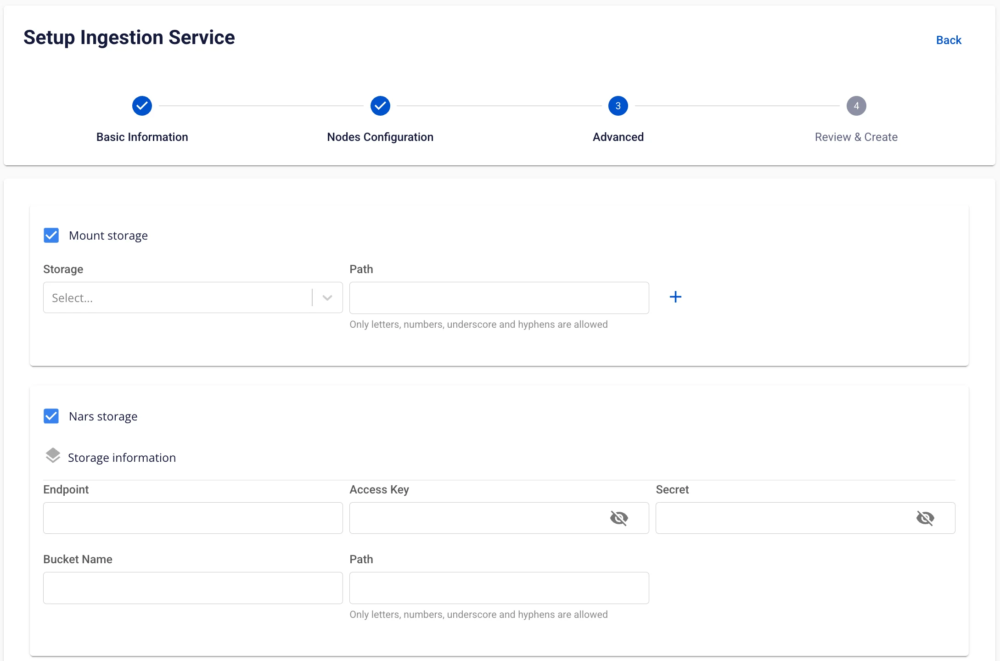
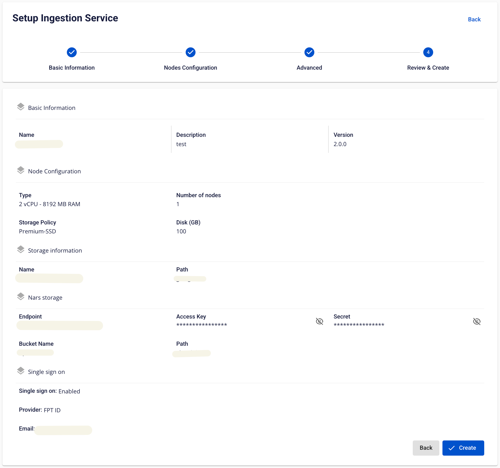

# Ingestion の作成

**Ingestion service** は、システム間のデータフローを自動化するために構築されたサービスです。異なるシステム間でのデータ移動を簡単かつ効率的に管理・調整・自動化し、データフローの監視・監督・管理機能を提供します。

**Ingestion service** を作成するには、以下の手順に従ってください。

**ステップ 1:** メニューバーで **Data Platform** > **Workspace Management** > **Workspace name** を選択します。

注意: メニューバーで Data Platform > Ingestion service を選択することで、Ingestion service に直接アクセスすることもできます。

**ステップ 2:** **My Services** セクションで **Create** をクリックし、**New service** ポップアップが表示されたら **Ingestion service** を選択して **Create** をクリックします。

**ステップ 3:** **Ingestion service** 作成フォームで **Basic Information** を入力します。

  * **Name**（必須）: サービス名

注意: サービス名は 1〜30 文字である必要があります。小文字 a-z、大文字 A-Z、数字 0-9 を使用できます。

  * **Description**（任意）: サービスの説明

  * **Version**（必須）: バージョンを選択します。

**ステップ 4:** **Next Step** をクリックして **Node Configuration** 画面に進みます。

  * **Type**: サービスの設定タイプを選択します。

  * **Number of node:** 適切なノード数を選択します。

:::warning
ノード数は 1 以上 10 以下である必要があります。
:::

  * **Storage policy**: ストレージポリシーを選択します。

  * **Disk (GB)**: ディスクサイズを入力します。

:::warning
ディスクサイズは 100 以上 1000 以下である必要があります。
:::

**ステップ 5:** **Next Step** をクリックして **Advanced** 画面に進みます。

  * **Mount storage** 情報を入力します。

    * **Name**: ストレージ名
    * **Path**: ストレージ内のフォルダへのパス

「+」ボタンをクリックすることで **Mount storage** を追加できます。

:::warning
**Mount storage** は最大 **5 件** まで追加できます。
:::

  * **Nars storage** 情報を入力します。

    * **Bucket name**（必須）: バケット名

    * **Endpoint**（必須）: アクセスアドレス

    * **Access key**（必須）: アクセスキー

    * **Secret**（必須）: アクセスパスワード

    * **Path**（必須）: ストレージのフォルダパス

  * **Single Sign On**

    * Single Sign On を有効にしない場合、サービスは **Basic 認証** で初期化されます。

    * **Single Sign On** を有効にする場合:

    * **Provider: FPT ID**

      * 以下の情報を入力します。

      * **Username**: ユーザー名

      * **Email**: FPT メールアドレス

    * **Provider: Google**

      * 以下の情報を入力します。

      * **Client ID**: Google との認証に使用するクライアント ID

      * **Client Secret**: Google との認証に使用するパスワード

      * **Email**: メールアドレス

    * **Provider: Keycloak**

      * 以下の情報を入力します。

      * **Auth Provider name**: プロバイダー名

      * **Realm**: すべてのユーザー、グループ、ロール、クライアント、その他のオブジェクトが独立して管理・保護される管理スペース

      * **Auth server url**: Keycloak サーバーのベース URL（クライアントが認証に使用）

      * **Client ID**: Keycloak との認証に使用するクライアント ID

      * **Client Secret**: Keycloak との認証に使用するパスワード

      * **Username**: Keycloak 内のユーザー名

      * **Email**: Keycloak 内のメールアドレス

**ステップ 6:** **Next Step** をクリックして **Review & Create** 画面に進みます。

  * **Custom Domain**

    * **目的:** サービスにアクセスするためのカスタムドメインを設定できます。

      * **Public Workspace の場合:** TLS の有効/無効を設定せずにドメインと証明書を割り当てることができます（HTTPS は常に利用可能）。

      * **Private Workspace の場合:** ドメインと証明書に加え、TLS/SSL を有効または無効にして HTTPS または HTTP を選択できます。

    * **Public Workspace**

      * **Custom domain**: チェックしてカスタムドメインを有効にします。

      * **Domain**: ドメイン名を入力します（例: abc.local, jupyter.example.com）。

      * **Certificate name**: **Certificate Manager** でインポートした証明書リストから選択します。

      * **ボタン**:

      * **Manage certificate**: 証明書管理画面を開きます。

      * **Validate**: 証明書がドメインに対して有効であることを確認します。

      * 
:::note
Public Workspace では **TLS/SSL certificate** オプションは**表示されません** — システムはデフォルトで HTTPS をサポートします。
:::

    * **Private Workspace**

      * **Custom domain**: チェックしてカスタムドメインを有効にします。

      * **Domain**: ドメイン名を入力します。

      * **TLS/SSL certificate**: チェックしてサービスの HTTPS を有効にします。

      * **Certificate name**: 証明書リストから選択します。

      * **ボタン**:

      * **Manage certificate**: 証明書管理を開きます。

      * **Validate**: 証明書を確認します。

      * 
:::note
**TLS/SSL certificate** のチェックを外すと、サービスは HTTP で動作し、証明書は不要です。
:::

**ステップ 7.** 入力した情報を確認し、**Create** をクリックして Ingestion service の初期化を完了します。

**Ingestion service** の初期化は、**Worker Status** が **Succeeded** になり、**Ingestion service** の **Status** が **Healthy** になった時点で完了です（約 10 分）。
