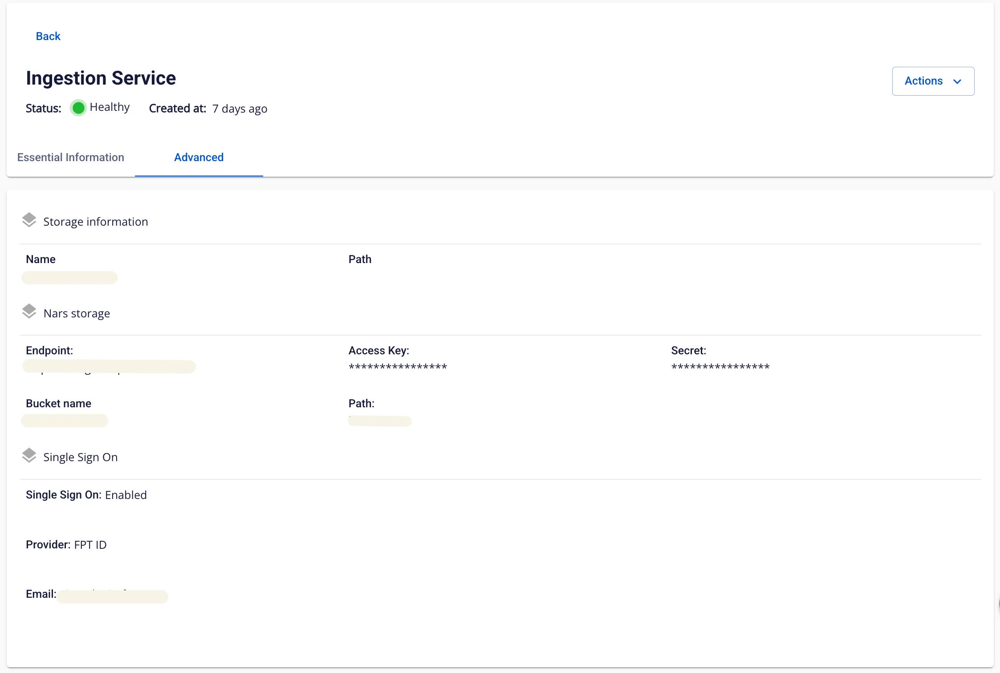

# Ingestion 詳細表示

**Ingestion service** の情報を確認するには、以下の手順に従ってください。

**ステップ 1:** メニューバーで **Data Platform** > **Workspace Management** > **Workspace name** を選択します。

注意: メニューバーで Data Platform > Ingestion service を選択することで、Ingestion service に直接アクセスすることもできます。

**ステップ 2:** **My Service** セクションで **Ingestion service** を選択します。

**Essential Information** と **Advanced** の 2 つのタブが表示されます。

**「Essential Information」タブ**

**Ingestion service** の詳細情報が表示されます。

**「Advanced」タブ**

**Single Sign On** の情報が表示されます。

