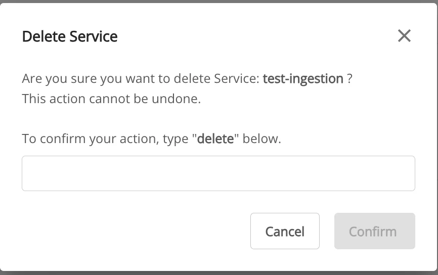

# Ingestion の削除

**Ingestion service** を削除するには、以下の手順に従ってください。

**ステップ 1:** メニューバーで **Data Platform** > **Workspace Management** > **Workspace name** を選択します。

注意: メニューバーで Data Platform > Ingestion service を選択することで、Ingestion service に直接アクセスすることもできます。

**ステップ 2:** **My services** セクションで **Ingestion service** を選択し、**Action** をクリックして **Delete** を選択します。

**ステップ 3.** **Delete Application** ダイアログが表示されます。「**delete**」と入力し、**confirm** をクリックして、ワークスペースから **Ingestion service** の削除を完了します。

