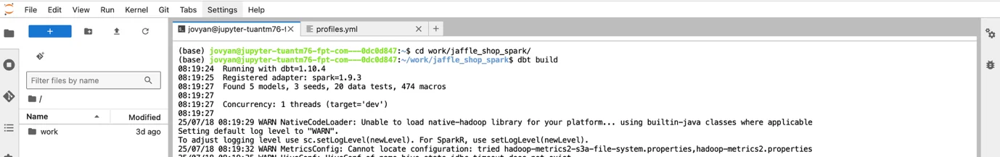

# JupyterHubでdbtプロジェクトを実行する

notebooks 環境で dbt プロジェクトを実行するには、以下の手順に従ってください。

**ステップ 1.** JupyterHub 上のユーザーの Workspace に属するディレクトリで dbt GIT プロジェクトを初期化します（Orchestration service ドキュメントのセクション 5.3.3 を参照してください）。

Spark セッションで実行するには、dbt プロジェクト内の profiles.yml ファイルを以下のように設定します。

```
<PROJECT-NAME>:

  target: dev

  outputs:

    dev:

      type: spark

      method: session

      schema: <SCHEMA-NAME>

      database: <DATABASE-NAME>

      catalog: iceberg

      host: NA

      server_side_parameters:

        spark.jars: /opt/spark/jars/iceberg-spark-runtime-3.5_2.12-1.5.0.jar,/opt/spark/jars/iceberg-aws-bundle-1.5.0.jar,/opt/spark/jars/hadoop-auth-3.3.4.jar,/opt/spark/jars/hadoop-aws-3.3.4.jar,/opt/spark/jars/nessie-spark-extensions-3.5_2.12-0.104.2.jar,/opt/spark/jars/hadoop-common-3.3.4.jar,/opt/spark/jars/aws-java-sdk-bundle-1.12.787.jar,/opt/spark/jars/openmetadata-spark-agent-1.0-beta.jar
```

**ステップ 2:** Jupyter Notebooks の作業画面で **Other** / **Terminal** を選択します。


**ステップ 3:** Terminal 画面で dbt プロジェクトのコンテンツが含まれるディレクトリに移動し、dbt コマンドを使用して実行します。


