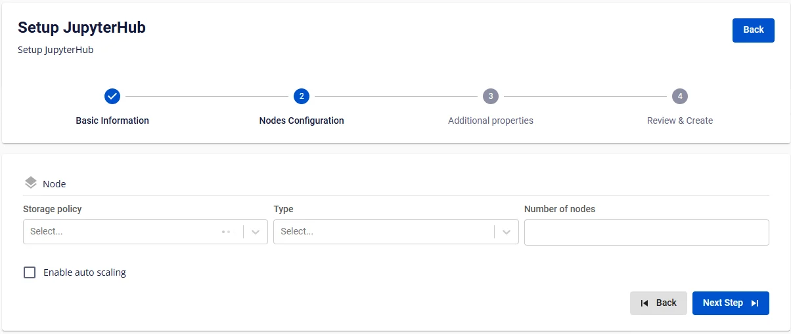
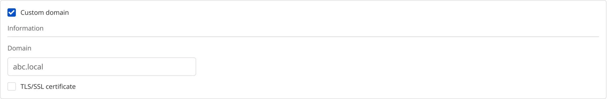

# JupyterHub の作成

**JupyterHub** を作成するには、以下の手順に従ってください。

**ステップ 1:** メニューバーで **Data Platform** > **Workspace Management** > **Workspace name** を選択します。

**ステップ 2:** **Workspace Details** セクションで **Create** をクリックします。**Services** ポップアップが表示されたら、**JupyterHub service** を選択し > **Create Service** をクリックします。

**ステップ 3.** **JupyterHub** 作成フォームで、**Basic Information** に以下の情報を入力します。

 * **Name**（必須）: サービス名

注意: 名前には小文字 a-z、大文字 A-Z、または数字 0-9 を使用できます。スペースは使用できません。スペースの代わりに「-」または「_」を使用してください。

 * **Description**（任意）: 説明

 * **Version**（必須）: JupyterHub のバージョンを選択します。

**ステップ 4:** **Next Step** をクリックして **Nodes Configuration** 画面に進みます。

以下の情報を入力します。

 * **Storage policy**: ストレージポリシーを選択します。

 * **Type**: フレーバータイプを選択します。

 * **Number of nodes**: JupyterHub に設定するノード数を入力します。

:::warning
ノード数は 2 以上 10 以下である必要があります。
:::

**ステップ 5:** **Next Step** をクリックして **Advanced Properties** 画面に進みます。

以下の設定を行います。

**Custom workspace**: チェックするとユーザーデータを S3 に保存します。

**Mount S3 storage**（ユーザーの Workspace コードを保存するディレクトリ）

 * **Storage name**: ストレージ名を選択します。

 * **S3 workspace path**: ストレージパスを入力します。

**Database**

 * **Type**: デフォルトは PostgreSQL です。

 * **Host name**（必須）: Postgres のホスト名または IP アドレス

 * **Port**（必須）: 接続ポート。デフォルトは 5432 です。

 * **Database name**（必須）: データベース名

 * **Username**（必須）: アクセスアカウントのユーザー名

 * **Password**（必須）: アクセスパスワード

**Data encryption**

 * **Keystore name:** Workspace の Keystore カタログから選択し、JupyterHub と Database を使用する際に機密データを暗号化します。

**Single Sign On**: チェックすると JupyterHub の SSO 認証を有効にします。

 * **Provider: FPT ID**

   * **Username**: ユーザー名

   * **Email**: FPT メールアドレス

 * **Provider: Google**

   * **Client ID**: Client ID 情報

   * **Client Secret**: シークレット情報

   * **Email**: メールアドレス

 * **Provider: Keycloak**

   * **Auth Provider name**: プロバイダー名

   * **Realm**: Realm 情報

   * **Auth server url**: 認証 URL アドレス

   * **Client ID**: Client ID 情報

   * **Client Secret**: シークレット情報

   * **Username**: アカウントのユーザー名

   * **Email**: メールアドレス

 * **Custom Domain**

   * **目的:** サービスにアクセスするためのカスタムドメインを設定できます。

     * **パブリック Workspace の場合:** TLS の有効化/無効化なしにドメインと証明書を割り当てるために使用します（HTTPS は常に利用可能）。

     * **プライベート Workspace の場合:** ドメインと証明書に加えて、TLS/SSL を任意で有効化または無効化し、HTTPS か HTTP かを選択できます。

   * **Workspace がパブリックの場合**

     * **Custom domain**: チェックするとカスタムドメインを有効にします。

     * **Domain**: ドメイン名を入力します（例: abc.local、jupyter.example.com）。

     * **Certificate name**: **Certificate Manager** にインポートされた証明書の一覧から選択します。

     * **ボタン**:

     * **Manage certificate**: 証明書管理画面を開きます。

     * **Validate**: ドメインに対する証明書の有効性を確認します。

:::note
パブリック Workspace では **TLS/SSL certificate** オプションは**表示されません**。システムはデフォルトで HTTPS をサポートしています。
:::

   * **Workspace がプライベートの場合**

     * **Custom domain**: チェックするとカスタムドメインを有効にします。

     * **Domain**: ドメイン名を入力します。

     * **TLS/SSL certificate**: チェックするとサービスの HTTPS を有効にします。

     * **Certificate name**: 証明書の一覧から選択します。

     * **ボタン**:

     * **Manage certificate**: 証明書管理を開きます。

     * **Validate**: 証明書を確認します。

:::note
**TLS/SSL certificate** のチェックを外すと、サービスは HTTP で動作し、証明書は不要です。
:::

**ステップ 6.** **Next Step** をクリックして **Review & Create** 画面に進みます。

**ステップ 7.** 情報を確認した後、**Create** をクリックして JupyterHub の作成を完了します。

**JupyterHub** の初期化は、**Worker Status** が **Succeeded** になり、JupyterHub の **Status** が **Healthy** になると完了です（約 10 分）。
