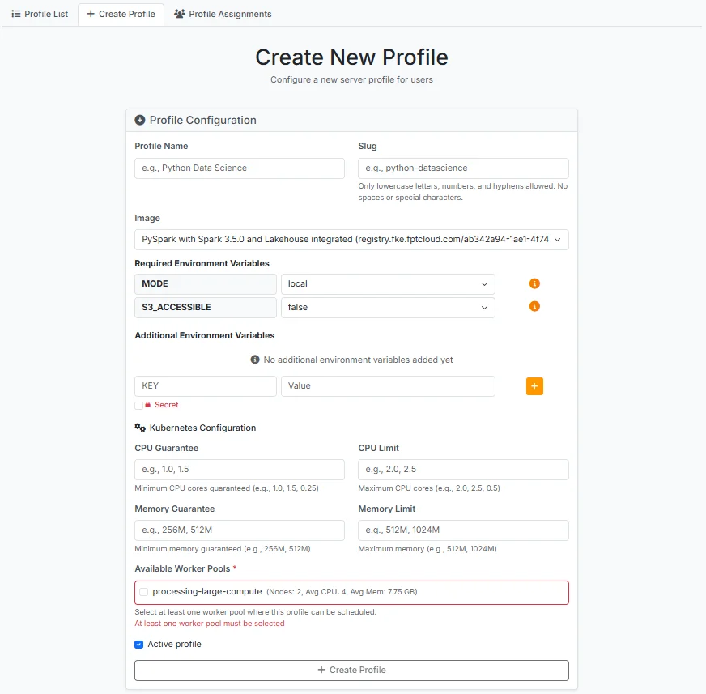
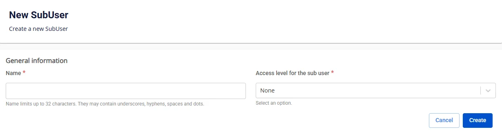
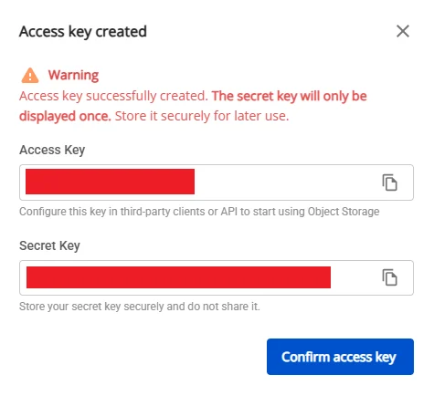
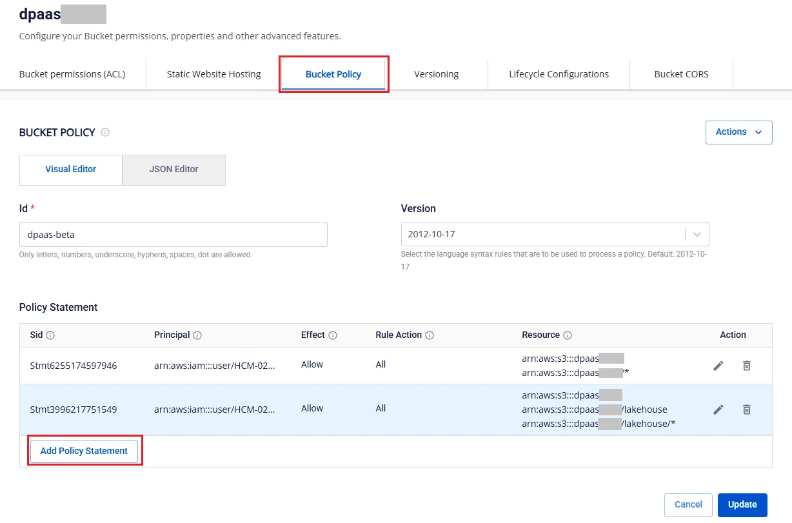
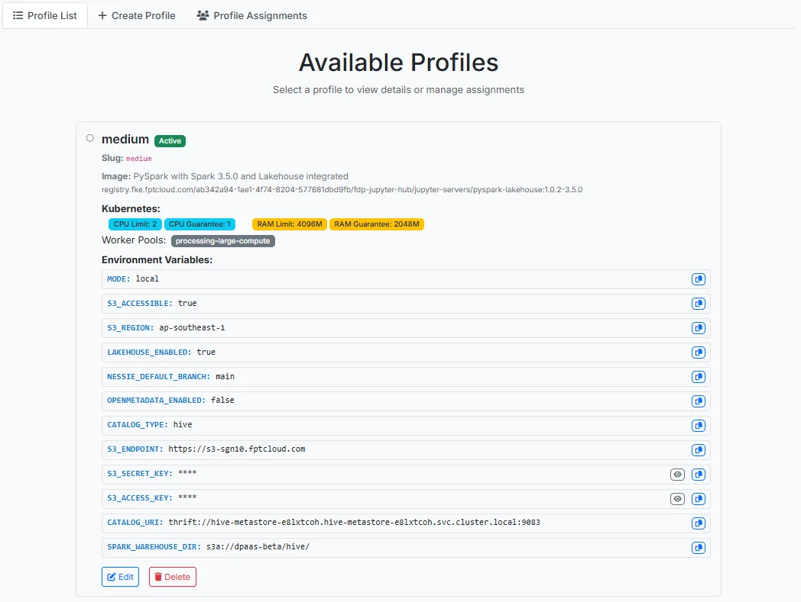

# Profile の作成

JupyterHub にログイン後、**Admin** ロールを持つユーザーは **Service** > **Profile** メニューを選択し、**Create Profile** タブをクリックします。

 * **Profile Name**: プロファイル名

 * **Slug**: サーバーのスポーン時に使用するライブラリ名を入力します。

 * **Image**: 一覧からプロファイル実行時に使用するイメージを選択します。

 * **MODE**: **local** を選択します。

 * **S3_ACCESSIBLE**: **S3** を使用しない場合は **false** を選択し、**S3** を使用する場合は **true** を選択して以下の情報を入力します。

   * **S3_ENDPOINT**: S3 サービスの URL エンドポイント

   * **S3_ACCESS_KEY**: S3 サービスとの認証に使用するアクセスキー ID

   * **S3_SECRET_KEY**: S3 サービスとの認証に使用するシークレットアクセスキー

 * **LAKEHOUSE_ENABLED**: **lakehouse** 接続を使用しない場合は **false** を選択し、**lakehouse** を使用する場合は **true** を選択して以下の情報を入力します。

   * **CATALOG_TYPE**: 使用するメタデータカタログの種類 — Hive または Nessie を選択します。

   * **CATALOG_URI**: メタデータカタログへの接続 URI

   * **SPARK_WAREHOUSE_DIR**: Apache Spark のウェアハウスディレクトリパス

 * **Additional Environment Variables**

   * KEY: 環境変数名を入力します。

   * Value: 対応する環境変数の値を入力します。

 * **CPU Guarantee**: 初期化時のプロファイルに保証する CPU 量を入力します。

 * **CPU Limit**: プロファイル使用時の最大 CPU 閾値を入力します。

 * **Memory Guarantee**: 初期化時のプロファイルに保証する RAM 量を入力します。

 * **Memory Limit**: プロファイル使用時の最大 RAM 閾値を入力します。

 * **Available Worker Pools**: プロファイルのスポーン環境を選択するために、**Processing service** の **Worker Pool** リストから選択します。

 * **Active profile**: チェックすると、作成後のプロファイルが **Active** 状態になります。

すべての情報を入力したら、**Create Profile** をクリックして作成を完了します。

lakehouse カタログへのユーザーアクセスを確保するために、FPT Cloud Storage でディレクトリのアクセス権を設定します。

 * **ステップ 1.** <https://console.fptcloud.com/> にアクセスし、**Object Storage** メニューを選択します。

 * **ステップ 2.** **Object Storage Management** 画面で **Sub user** タブを選択し、**Create SubUser** をクリックします。

 * **ステップ 3.** **Subuser** の **Name** を入力し、**Access level for sub user** を **Full** に設定します。

 * **ステップ 4.** **Sub User** リスト画面で詳細表示をクリックし、**Generate Key** をクリックして **Access Key** と **Secret Key** の情報を保存します。

 * **ステップ 5.** **Object Storage Management** 画面に戻り、**Buckets** タブを選択します。Subuser に権限を付与するバケットで **Config** アクションを選択します。

 * **ステップ 6.** バケット詳細画面で **Bucket Policy** タブを選択し、**Add Policy Statement** をクリックします。

 * **ステップ 7.** **Add Policy Statement** 画面で以下を設定します。

   * **Sid**: ステートメント ID を入力します。

   * **Effect**: **Allow** を選択します。

   * **Principal**: Subuser リストを選択します。

   * **Action**: **Action** にチェックを入れ、**All S3 Actions (s3.\*)** にチェックを入れます。

   * **Resource (ARN)**: 指定された形式でリソース情報を入力し、Subuser が権限を持つ **catalog** を含む正確なディレクトリを指定します。

**Add** をクリックして **Policy Statement** の設定を完了します。

作成後、プロファイル情報は **Profile List** タブに表示されます。

