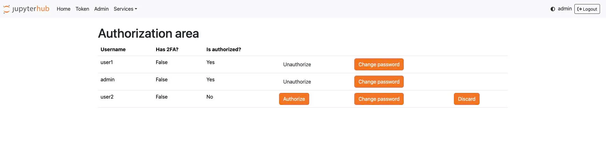

# ユーザーの追加

**_JupyterHub へのアクセスと最初のアカウント作成のガイド_**

（JupyterHub がベーシック認証で作成された場合）

 1. ブラウザを開き、提供された JupyterHub の URL にアクセスします。

 2. 表示された画面で **Create User** ボタンをクリックします。

 3. **Username**（ユーザー名）と **Password**（パスワード）を入力します。

**注意:** 最初に作成するアカウントのユーザー名は、システム管理者アカウントとして機能するように **admin** に設定する必要があります。

 4. 情報を確認してアカウント作成を完了します。

 5. 作成した **admin** アカウントでログインし、管理機能を実行します。

**_システムへのユーザー追加_**

 1. JupyterHub にログイン後、**Admin** ロールを持つユーザーは **Admin** メニューを選択し、**Add Users** をクリックしてシステムに新しいユーザーを追加します。

 2. **Add Users** 画面でユーザー名を入力します（1 行に 1 つのユーザー名を入力することで、複数のユーザーを一度に追加できます）。

 3. **Admin** にチェックを入れると、そのユーザーに **Admin** ロールが付与されます。チェックしない場合、ユーザーはデフォルトで **User** ロールになります。

**_JupyterHub がベーシック認証で作成された場合 — ユーザーの自己登録 — 管理者がアクセスを許可する_**

場合によっては、ユーザーが自ら **Create User** をクリックして先にアカウントを作成することがあります。

この場合、アカウントは作成されますが、管理者が承認するまで **JupyterHub へのアクセス権がありません**。

アクセスを付与するには、管理者は以下の手順を実行します。

 1. **admin** アカウントでログインします。

 2. **/hub/authorize** のパスにアクセスします。

 3. この画面には、作成されたすべてのユーザーのリストと管理アクションが表示されます。

   * **Authorize**

     * ユーザーが JupyterHub にアクセスできるようにします。

     * Authorize されていない場合、ユーザーはインターフェースにログインできません。

   * **Unauthorize**

     * 以前に付与したアクセス権を取り消します。

     * ユーザーはシステムに存在したままですが、ログインできなくなります。

   * **Change password**

     * 管理者がユーザーのパスワードをリセットできます。

     * ユーザーがパスワードを忘れた場合やリセットが必要な場合に使用します。

   * **Discard**

     * ユーザーを管理リストから削除します。

     * Discard 後、ユーザーが引き続き使用したい場合は、自分でアカウントを再作成するか、管理者に再追加してもらう必要があります。
