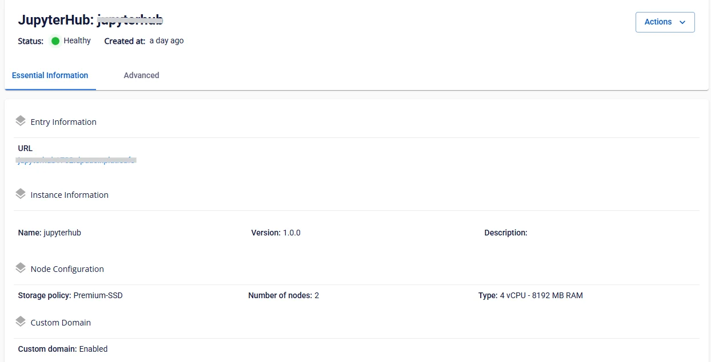

# JupyterHub の詳細表示

**ステップ 1:** メニューバーで **Data Platform** > **Workspace Management** > **Workspace name** を選択します。

**ステップ 2:** **My service** セクションで JupyterHub を選択します。

 * **Essential information タブ**

**JupyterHub** の詳細情報および設定情報が表示されます。

   * **JupyterHub へのアクセスと管理者アカウント作成のガイド**

     1. ブラウザを開き、提供された JupyterHub の URL にアクセスします。

     2. 表示されたページで **Create User** ボタンをクリックします。

     3. ログイン名（Username = admin）とパスワード（Password）を必要に応じて入力します。

     4. 情報を確認してアカウント作成を完了します。

     5. 作成したアカウントを使用して JupyterHub にログインし、使用を開始します。

 * **Advanced タブ**

**Profile list** および **SSO** の情報が表示されます。

